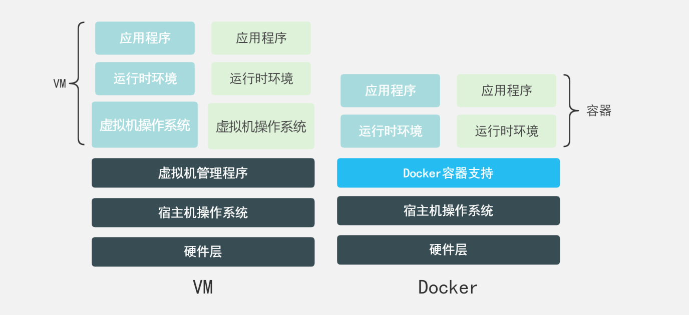
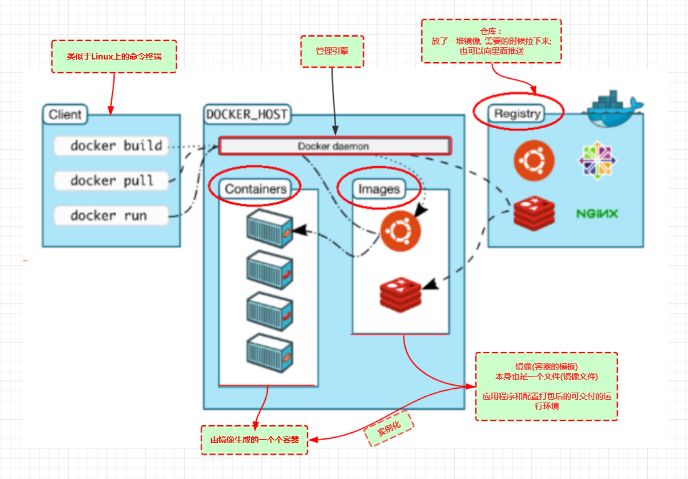

# Docker 概述

## 为什么会有 Docker

软件开发最麻烦的事情之一，就是环境配置。例如我们会遇到以下问题：

- 在开发完 node 应用后，要想服务能够在生产环境运行，需要先安装、配置 node 解释器，mysql 数据库，redis 数据库 等环境，比较费时费力。
- 偶尔出现服务能够在自己的电脑上运行，但是却在其他电脑环境中运行失败的情况。
- 当更换一台电脑时，之前配置的开发环境需要重新再来安装、配置一次。

因此，能不能从根本上解决这些问题？能不能在软件安装时把软件所需的环境也一并安装好？

Docker 就是解决上述问题的一个产物，它提供一个纯净、统一的运行（容器）环境，让我们的项目可以顺利运行到任何电脑上。

我们可以使用 docker 将项目代码和项目运行环境打包到一起，然后发布到 docker 仓库中，当别人想要使用的时候，直接下载该打包镜像，然后一键运行。

## 虚拟机

> 虚拟机是一个可以在电脑上虚拟出一台或者多台电脑的软件。虚拟电脑有自己独立的硬盘，内存，网络等资源，它看上去和一台运行着的电脑没有区别。

虚拟机可以解决带环境安装的问题。但是它存在以下缺点：

- 资源占用多（运行时独占一部分硬盘和内存资源）
- 启动慢（就像我们启动一台操作系统花费的时间）
- 体积大（加载了与项目运行无关的功能）

## Linux 容器

虚拟机存在这些缺点，Linux 发展出了另一种虚拟化技术：Linux 容器（Linux Containers，缩写为 LXC）。

**Linux 容器不是模拟一个完整的操作系统，而是对进程进行隔离。**对于容器里面的进程来说，它接触到的各种资源都是虚拟的，从而实现与底层系统的隔离。

由于容器是进程级别的，相比虚拟机有很多优势。

- 启动快（启动容器就相当于启动了一个进程，而不是一个操作系统）
- 资源占用少（容器只占用需要的资源，不占用那些没有用到的资源，同时容器可以共享资源）
- 体积小（容器只包含用到的组件）

## Docker

**Docker 属于 Linux 容器的一种封装，提供简单易用的容器使用接口**。它是目前最流行的 Linux 容器解决方案。

Docker 将应用程序与该程序的依赖，打包在一个文件里面。运行这个文件，就会生成一个虚拟容器。程序在这个虚拟容器里运行，就好像在真实的物理机上运行一样。有了 Docker，就不用担心环境问题。

## Docker 为什么比 VM 快

- Docker 有着比虚拟机更少的抽象层
- Docker 利用宿主机的内核，VM 需要虚拟一个操作系统

> [docker 中是否包含内核或者是整个操作系统？](https://www.zhihu.com/question/366527646/answer/2513851320)
>
> 结论：docker 中不包含内核，使用的是宿主机的内核，但是它可以包含部分操作系统发行版提供的文件（工具）

## Docker 的用途

1. **更快的交付、部署应用**（从以前一堆帮助手册到现在打包镜像，发布，测试，一键运行）
2. **更便捷的升级和扩缩容**（升级环境只需要一个镜像包，通过一个镜像包可以方便部署多个应用，实现水平扩容）
3. **更简单的系统运维**（使用容器化后，可以让开发，测试环境高度一致）
4. **更高效的计算资源利用** docker 容器运行是进程级别的，并且占用资源较少，可以在物理机上运行更多的容器实例）
5. **更方便的微服务环境搭建**（通过多个容器，一台机器可以跑多个服务，因此在本机就可以模拟出微服务架构）

## Docker 架构

docker 主要由客户端，服务器，镜像仓库三部分组成，采用 c/s 架构。

docker 服务器接收到 docker 客户端的指令，然后执行这个命令。

- **客户端：** 用于向服务器发送操作指令
- **服务器：** 通过守护进程接受用户指令并处理（下载镜像，创建容器，执行代码等）
- **镜像仓库** 提供镜像管理仓库，可以发布，更新，下载

在这个架构中，有几个核心概念解释一下：

- **镜像：** docker 镜像就好比是一个模版，可以通过这个模版来创建容器
- **容器：** 运行应用的地方，通过经常来创建，可以简单理解为一个简易的 linux 系统
- **仓库：** 存放镜像的地方，分为公有仓库（docker hub，阿里云等）和私有仓库
