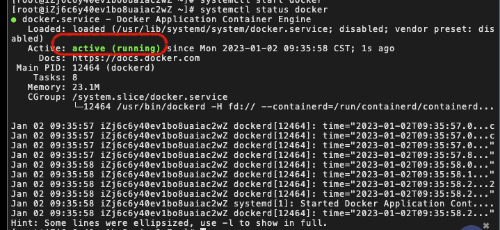

# Docker 安装 & 卸载

## 环境准备

1. 会一点 linux 基础，会使用基本的 linux 命令
2. 一台 linux 服务器（下面将以 centos 7 系统说明）

## 安装

> 参考[官方文档地址](https://docs.docker.com/engine/install/centos/)

1. 卸载旧的版本

```bash
sudo yum remove docker \
                  docker-client \
                  docker-client-latest \
                  docker-common \
                  docker-latest \
                  docker-latest-logrotate \
                  docker-logrotate \
                  docker-engine
```

2. 安装需要的依赖包

```bash
sudo yum install -y yum-utils
```

3. 设置镜像仓库

```bash
sudo yum-config-manager \
    --add-repo \
    https://download.docker.com/linux/centos/docker-ce.repo
```

> 仓库地址默认是国外的，安装比较慢，可以替换为国内阿里云的镜像地址：https://mirrors.aliyun.com/docker-ce/linux/centos/docker-ce.repo

4. 安装 docker 相关的包

```bash
sudo yum install docker-ce docker-ce-cli containerd.io docker-compose-plugin
```

> docker-ce 是社区版本（官方推荐），docker-ee 为企业版（有一些付费的功能）
> 使用 `docker version` 命令查看是否安装成功

5. 启动 docker

```bash
systemctl start docker
```

> 使用 `systemctl start docker`命令查看是否启动成功
>
> 

6. 运行 hello-world 验证 docker 正确安装

```bash
 sudo docker run hello-world
```

> 使用 `docker images`命令查看安装的所有镜像

## 卸载

```bash
# 卸载安装的依赖包
sudo yum remove docker-ce docker-ce-cli containerd.io docker-compose-plugin

# 卸载docker相关资源
sudo rm -rf /var/lib/docker
sudo rm -rf /var/lib/containerd
```

## 配置阿里云镜像加速

使用 docker 官方的镜像仓库下载比较慢，可以切换为国内阿里云 docker 镜像来提升下载速度。

1. 前往阿里云工作台 -> 容器镜像服务 -> 镜像加速器


2. 配置并使用

```bash
sudo mkdir -p /etc/docker
sudo tee /etc/docker/daemon.json <<-'EOF'
{
  "registry-mirrors": ["https://c7h1a2h2.mirror.aliyuncs.com"]
}
EOF
sudo systemctl daemon-reload
sudo systemctl restart docker
```
