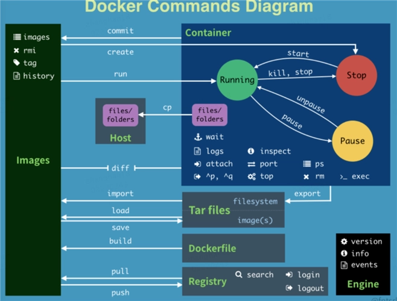

# Docker 常用命令

## 基础命令

```bash
# 显示docker的版本信息
docker version
# 显示docker的系统信息，包括镜像和容器的数量
docker info
# 帮助命令
docker [cmd] --help
```

> 官方帮助文档地址：https://docs.docker.com/engine/reference/commandline/cli/

## 镜像命令

- `docker images`：查看所有本地主机上的镜像。

```bash
$ docker images
REPOSITORY    TAG       IMAGE ID       CREATED         SIZE
hello-world   latest    feb5d9fea6a5   15 months ago   13.3kB

# 解释
REPOSITORY 镜像的仓库源
TAG 镜像的标签
Image ID 镜像的ID
CREATED 镜像的创建时间

# 可选项
-a --all  # 列出所有的镜像
-q --quiet  # 只显示镜像的ID
```

- `docker search  镜像名称关键字`: 根据名称搜索 docker 镜像仓库，列出与名称匹配的镜像。

```bash
$ docker search mysql
NAME                            DESCRIPTION                                     STARS     OFFICIAL   AUTOMATED
mysql                           MySQL is a widely used, open-source relation…   13643     [OK]
mariadb                         MariaDB Server is a high performing open sou…   5214      [OK]
phpmyadmin                      phpMyAdmin - A web interface for MySQL and M…   716       [OK]

# 可选项
-f, --filter filter   根据条件筛选输出结果

# 筛选stars大于10000的mysql镜像
$ docker search mysql --filter stars=10000
NAME      DESCRIPTION                                     STARS     OFFICIAL   AUTOMATED
mysql     MySQL is a widely used, open-source relation…   13643     [OK]
```

- `docker pull 镜像名[:标签名]`：下载镜像，标签名不给，默认下载 latest 标签

```bash
$ docker pull mysql
Using default tag: latest  # 没有指定tag，默认为latest
latest: Pulling from library/mysql
0ed027b72ddc: Pull complete # 分层下载，不同版本之间可以复用
0296159747f1: Pull complete
3d2f9b664bd3: Pull complete
df6519f81c26: Pull complete
36bb5e56d458: Pull complete
054e8fde88d0: Pull complete
f2b494c50c7f: Pull complete
132bc0d471b8: Pull complete
135ec7033a05: Pull complete
5961f0272472: Pull complete
75b5f7a3d3a4: Pull complete
Digest: sha256:3d7ae561cf6095f6aca8eb7830e1d14734227b1fb4748092f2be2cfbccf7d614 # 签名
Status: Downloaded newer image for mysql:latest
docker.io/library/mysql:latest # 镜像真实地址

# 以下命令等价
$ docker pull mysql
$ docker pull docker.io/library/mysql:latest

# 下载指定版本
$ docker pull mysql:5.7
```

- `docker rmi 镜像ID/镜像名[:标签]`： 删除镜像

```bash
# 删除镜像指定版本
$ docker rmi mysql:5.7
# 删除全部的镜像 $() 中可以传入参数
$ docker rmi $(docker images -aq)
```

## 容器命令

创建容器必须要有镜像。下面在介绍容器之前先下载一个 centos 镜像。

```bash
docker pull centos
```

### 新建容器并启动

```bash
docker run [可选参数] image

# 参数说明
--name="Name"  容器名字
-d             后台方式运行
-p             指定容器端口
    -p 主机端口:容器端口（常用）
    -p 容器端口
-P             随机指定端口
-it            使用交互方式运行，进入容器查看内容

# 测试

$ docker run -it centos

[root@iZj6c6y40ev1bo8uaiac2wZ ~]$  docker run -it centos # 启动并进入centos
[root@d7667cfa0a30 /]$ ls # 查看容器内的centos系统
bin  etc   lib    lost+found  mnt  proc  run   srv  tmp  var
dev  home  lib64  media       opt  root  sbin  sys  usr
[root@d7667cfa0a30 /]$ exit # 从容器中退回主机
exit

# 使用 exit 是退出容器
# 使用 ctrl + p + q 是返回进入容器之前的终端，容器不会停止
```

### 列出所有运行的容器

```bash
# 查看运行中的容器
docker ps
# 查看运行过的容器
docker ps -a
# 查看最近创建的容器
docker ps -n=1
# 只显示容器的编号
docker ps -q
```

### 删除容器

```bash
docker rm  容器ID  #删除指定的容器
docker rm $(docker ps -aq) # 删除所有的容器
```

### 启动和停止容器

```bash
docker start 容器ID   # 启动容器
docker restart 容器ID # 重启容器
docker stop 容器ID    # 停止当前正在运行的容器
docker kill 容器ID    # 强制停止当前容器
```

## 其它命令

### 后台启动容器

```bash
docker run -d 镜像名

[root@iZj6c6y40ev1bo8uaiac2wZ ~]$ docker run -d centos
eeaffcd923f77def94a8154a910b9a24d02e83e2984e396853e2d726ec97c09d
[root@iZj6c6y40ev1bo8uaiac2wZ ~]$ docker ps
CONTAINER ID   IMAGE     COMMAND   CREATED   STATUS    PORTS     NAMES

#  问题：docker ps centos并没有启动起来

#  这是一个常见的坑，并不是没有启动起来，而是停止了
#  docker使用后台运行就必须要有一个前台进程，docker发现没有挂起或者对外提供服务的应用，就会自动停止。
```

### 查看日志

```bash
docker logs 容器ID

# 示例

# 1. 先启动一个容器，使用shell脚本每隔1秒输出kuangshen
[root@iZj6c6y40ev1bo8uaiac2wZ ~]$ docker run -d centos /bin/sh -c "while true;do echo kuangshen;sleep 1;done"
c2738f2150c93e4d3d93a6ff41dc7d69416c8509bc33d88a4d19903a6f1c7e8d
# 2. 查看启动的容器
[root@iZj6c6y40ev1bo8uaiac2wZ ~]$ docker ps
CONTAINER ID   IMAGE     COMMAND                  CREATED         STATUS         PORTS     NAMES
c2738f2150c9   centos    "/bin/sh -c 'while t…"   4 seconds ago   Up 4 seconds             boring_rhodes
# 3. 查看输入日志
# -t 表示显示时间戳
# -f 表示跟随日志输出
# --tail string 表示输出多少条数，all表示全部
[root@iZj6c6y40ev1bo8uaiac2wZ ~]$ docker logs -f -t --tail all c2738f2150c9
```

### 查看容器内部进程信息

```bash
docker top 容器ID
```

### 查看容器的元数据

元数据比如：容器的 ID，容器启动的传递参数，容器生成使用的镜像，容器运行状态等信息

```bash
docker inspect 容器ID
```

### 进入当前正在运行的容器

我们通常使用后台的方式运行容器，当需要修改一些配置时，需要进入容器。

```bash
# 方式一： 进入容器后开启一个新的shell，可以在里面操作（常用方式）
docker exec -it 容器id shell
# 方式二： 进入容器正在执行的终端，不会启动新的进程
docker attach 容器ID

# 测试
[root@iZj6c6y40ev1bo8uaiac2wZ ~]$ docker ps
CONTAINER ID   IMAGE     COMMAND                  CREATED          STATUS          PORTS     NAMES
c2738f2150c9   centos    "/bin/sh -c 'while t…"   24 minutes ago   Up 11 minutes             boring_rhodes
[root@iZj6c6y40ev1bo8uaiac2wZ ~]$ docker exec -it c2738f2150c9 /bin/bash
[root@c2738f2150c9 /]$ ls
bin  dev  etc  home  lib  lib64  lost+found  media  mnt  opt  proc  root  run  sbin  srv  sys  tmp  usr  var
```

### 在容器和主机之间拷贝文件

```bash
docker cp 容器id:容器内源文件路径  目的主机路径
docker cp 主机源文件路径 目的容器id:容器内文件路径

## 测试
#查看当前目录下文件
[root@iZj6c6y40ev1bo8uaiac2wZ ~]$ ls
install.sh
# 查看运行的容器
[root@iZj6c6y40ev1bo8uaiac2wZ ~]$ docker ps
CONTAINER ID   IMAGE     COMMAND       CREATED         STATUS         PORTS     NAMES
087e367d0f99   centos    "/bin/bash"   8 minutes ago   Up 2 minutes             agitated_rubin
# 进入运行的容器
[root@iZj6c6y40ev1bo8uaiac2wZ ~]$ docker attach 087e367d0f99
# 进入容器内部的home目录，并创建一个test.js文件
[root@087e367d0f99 home]$ cd /home
[root@087e367d0f99 home]$ ls
[root@087e367d0f99 home]$ touch test.js
# 创建成功后退出容器
[root@087e367d0f99 home]$ exit
exit
# 查找到刚退出的容器ID
[root@iZj6c6y40ev1bo8uaiac2wZ ~]$ docker ps -a
CONTAINER ID   IMAGE     COMMAND       CREATED         STATUS                     PORTS     NAMES
087e367d0f99   centos    "/bin/bash"   9 minutes ago   Exited (0) 3 seconds ago             agitated_rubin
# 开始从容器中拷贝文件
[root@iZj6c6y40ev1bo8uaiac2wZ ~]$ docker cp 087e367d0f99:/home/test.js ./test.js
# 查看test.js文件是否被拷贝成功
[root@iZj6c6y40ev1bo8uaiac2wZ ~]$ ls
install.sh  test.js

# 拷贝现在是一个手动过程，未来可以使用 -v 卷的技术，实现容器与主机文件间的自动同步
```

## 总结



```bash
  attach      Attach local standard input, output, and error  streams to a running container #当前shell下 attach连接指定运行的镜像
  build       Build an image from a Dockerfile # 通过 Dockerfile 定制镜像
  commit      Create a new image from a container changes # 提交当前容器为新的镜像
  cp          Copy files/folders between a container and the local filesystem # 在容器和本机之前拷贝文件
  create      Create a new container # 创建一个新的容器，同run，但不启动容器
  diff        Inspect changes to files or directories on a container's filesystem # 查看docker容器的变化
  events      Get real time events from the server # 从服务获取容器实时事件
  exec        Run a command in a running container # 在运行中的容器上运行命令
  export      Export a container's filesystem as a tar archive # 导出容器文件系统作为一个tar归档文件[对应import]
  history     Show the history of an image # 展示一个镜像形成历史
  images      List images # 列出系统当前的镜像
  import      Import the contents from a tarball to create a filesystem image # 从tar包中导入内容创建一个文件系统镜像
  info        Display system-wide information # 显示系统相关信息
  inspect     Return low-level information on Docker objects #查看容器详细信息
  kill        Kill one or more running containers # kill指定docker容器
  load        Load an image from a tar archive or STDIN # 从一个tar包或标准输入中加载一个镜像[对应save]
  login       Log in to a Docker registry # 注册或者登录一个docker源服务器
  logout      Log out from a Docker registry # 从当前docker源服务器退出
  logs        Fetch the logs of a container # 查看当前容器的日志信息
  pause       Pause all processes within one or more containers # 暂停容器
  port        List port mappings or a specific mapping for the container # 查看映射端口对应的容器内部源端口
  ps          List containers # 列出端口容器列表
  pull        Pull an image or a repository from a registry # 从docker源服务器拉取指定镜像
  push        Push an image or a repository to a registry # 推送镜像到源服务器中
  rename      Rename a container # 重命名容器名称
  restart     Restart one or more containers # 重启一个或多个容器
  rm          Remove one or more containers # 删除一个或多个容器
  rmi         Remove one or more images # 删除一个或多个镜像
  run         Run a command in a new container # 创建一个新容器并运行命令
  save        Save one or more images to a tar archive (streamed to STDOUT by default) # 保存一个镜像为tar包（对应load）
  search      Search the Docker Hub for images # 在docker hub中搜索镜像
  start       Start one or more stopped containers # 启动一个或者多个停止的容器
  stats       Display a live stream of container(s) resource usage statistics # 显示容器资源使用统计数据的实时流
  stop        Stop one or more running containers # 停止一个或者多个容器
  tag         Create a tag TARGET_IMAGE that refers to SOURCE_IMAGE # 给源中镜像打标签
  top         Display the running processes of a container # 实时监控容器内部运行的进程信息
  unpause     Unpause all processes within one or more containers # 取消暂停容器
  update      Update configuration of one or more containers #
  version     Show the Docker version information # 查看docker版本号
  wait        Block until one or more containers stop, then print their exit codes # 截取容器停止时的退出状态值
```
