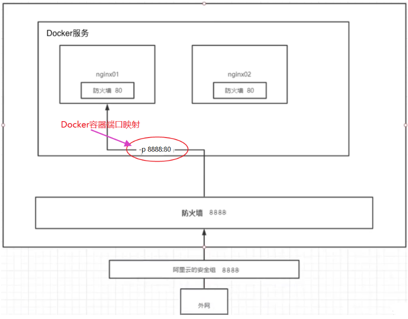

# Docker 实战

# 部署一个 Nginx 服务

```bash
# 搜索nignx关键字镜像
[root@iZj6c6y40ev1bo8uaiac2wZ ~]$ docker search nginx
NAME                                              DESCRIPTION                                     STARS     OFFICIAL   AUTOMATED
nginx                                             Official build of Nginx.                        17905     [OK]
linuxserver/nginx                                 An Nginx container, brought to you by LinuxS…   181
bitnami/nginx                                     Bitnami nginx Docker Image                      149                  [OK]

# 下载nginx镜像
[root@iZj6c6y40ev1bo8uaiac2wZ ~]$ docker pull nginx

# 运行nginx镜像
# -d 后台运行
# -p 设置主机与容器内部端口映射，主机7701映射容器80端口
[root@iZj6c6y40ev1bo8uaiac2wZ ~]$ docker run -d -p 7701:80 nginx
7902cd75437d2b32859661063220b78286884fb90fbbcd101a1d06884809fcb7

# 主机访问nginx，测试nginx是否启动成功，成功则输出nginx欢迎页面
[root@iZj6c6y40ev1bo8uaiac2wZ ~]$ curl localhost:7701
<!DOCTYPE html>
<html>
<head>
<title>Welcome to nginx!</title>
<style>
html { color-scheme: light dark; }
body { width: 35em; margin: 0 auto;
font-family: Tahoma, Verdana, Arial, sans-serif; }
</style>
</head>
<body>
<h1>Welcome to nginx!</h1>
<p>If you see this page, the nginx web server is successfully installed and
working. Further configuration is required.</p>

<p>For online documentation and support please refer to
<a href="http://nginx.org/">nginx.org</a>.<br/>
Commercial support is available at
<a href="http://nginx.com/">nginx.com</a>.</p>

<p><em>Thank you for using nginx.</em></p>
</body>
</html>
```

上面示例的核心就是端口映射的概念，要想通过宿主机访问到 docker 中的 nginx 应用，就需要在启动 docker 时设置`-p`参数完成端口映射。



## 部署一个 tomcat

```bash
# -d 后台运行
# -p 主机端口7703映射容器端口8080
$ docker run -d -p 7703:8080 tomcat

# 查看启动的tomcat容器ID
$ docker ps
[root@iZj6c6y40ev1bo8uaiac2wZ ~]# docker ps
CONTAINER ID   IMAGE                           COMMAND
4c9835a0fc10   tomcat                          "catalina.sh run"

# 打开服务器7703端口，并使用浏览器访问发现页面返回404，而不是tomcat欢迎界面

# 进入tomcat容器里面发现，有一些命令缺失，并且webapps目录下也没有默认页面
$ docker exec -it 4c9835a0fc10 /bin/bash
$ ll
bash: ll: command not found

# 原因是因为阿里云镜像默认是最小的镜像，所有不需要的都剔除了，保证最小的可运行环境

# 但是发现有一个webapp.dist目录中存在tomcat的默认页面,拷贝webapp.dist目录下的文件到webapp下

$ cp -r webapps.dist/* webapps

# 退出容器内部(ctrl + p + q)，再次访问localhost:7702发现进入了tomcat的欢迎页面了，部署完成
```

## 存在的问题

上面两个示例都存在着一个问题，当我们需要修改 nginx/tomcat 配置文件或者为 nginx/tomcat 服务器添加网站时都需要进入到容器内部。如果可以将主机上的文件自动同步到容器内部就好了。

docker 为提供了数据卷功能，可以解决上述问题，具体在后面来说。
