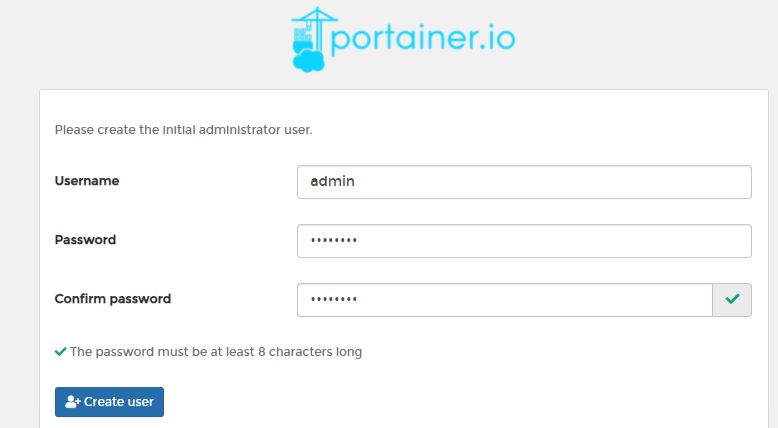
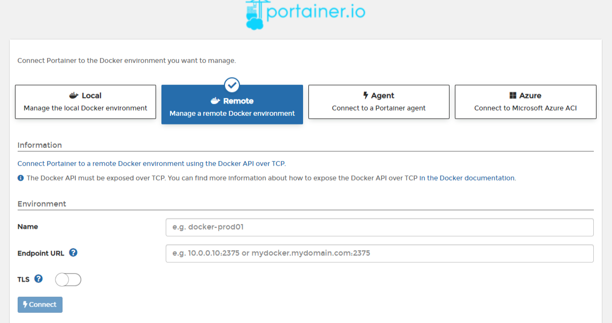
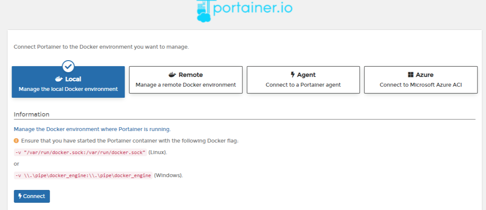
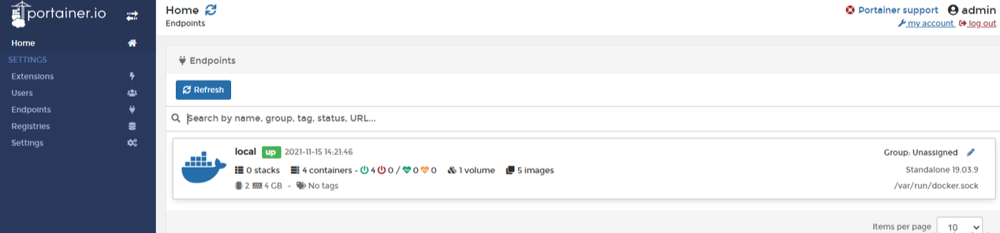
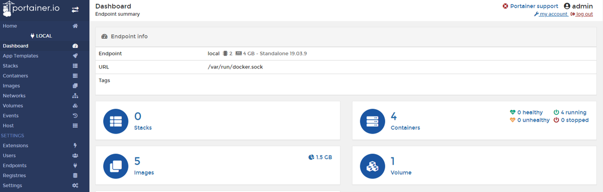
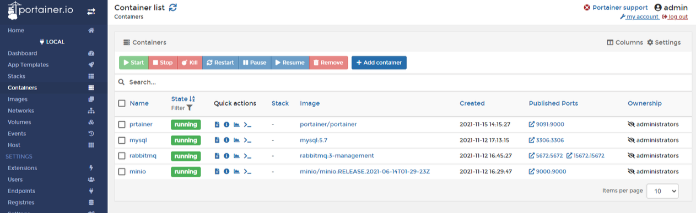
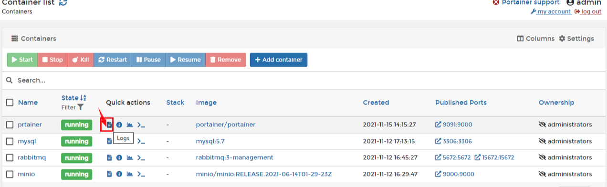

# portainer

porainer 是一个管理 docker 的图形化工具。

## 安装

```bash
# 创建一个portainer存储数据的数据卷
$ docker volume create portainer_data

$ docker run -d -p 8000:8000 -p 7792:9443 -p 7791:9000 --name portainer --restart=always -v /var/run/docker.sock:/var/run/docker.sock -v portainer_data:/data portainer/portainer-ce:latest

# -d 容器在后台运行
# -p 设置宿主机到容器的端口映射，9943是portainer的UI和API服务https接口，9000是portainer的UI和API服务http接口
# -name 设定容器名称
# --restart=always 设定docker重启后自动重启该容器
# -v 设置宿主机与容器之间文件映射
```

[官方地址](https://docs.portainer.io/start/install/server/docker/linux)

## 访问服务

> 注意，外网 https 访问需要打开服务器 7792 端口，外网 http 访问需要打开服务器 7791 端口.

```
https://服务器IP:7792  # 或者 http://服务器IP:7791
```

首次登录，需要创建管理员 admin 的密码:



密码创建好后，进入 docker 连接管理界面：



可以选择管理本地 Local 和远程 Remote 的 Docker 两个选项，我们安装在本机，直接选择 Local，然后 Connect 进入管理界面：



继续点击右边的 local 条目，进入容器管理界面：





点击左边菜单栏的 Containers，打开容器管理界面。



查看运行容器日志


