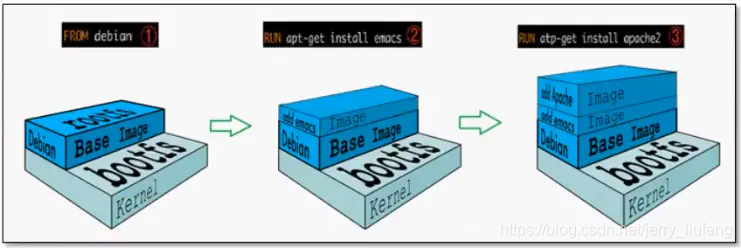
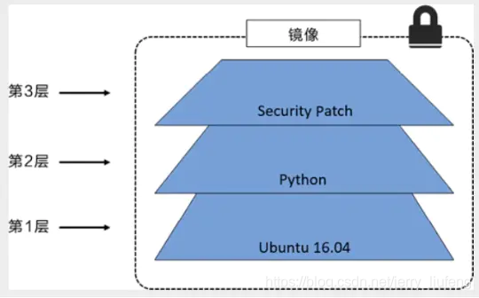
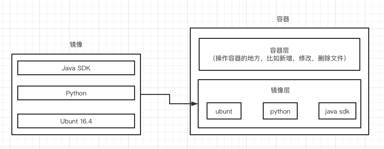

# Docker 镜像讲解

## 镜像是什么

**镜像是一种轻量级，可以执行的软件包**。用来打包软件以及软件运行所需要的环境（包括代码，运行时，库，环境变量和配置文件）。

所有的应用，直接打包 docker 镜像， 就可以运行起来。

## Docker 镜像加载原理

### UnionFS 联合文件系统

UnionFS 是一种分层，轻量级的文件系统，它支持对文件系统的修改作为一次提交来一层层的叠加（类似 git commit 的每次提交都记录基于之前的发生的变化）。UnionFS 是 Docker 镜像的基础，镜像可以通过分层来进行集成，基于基础镜像，可以制作各种具体的应用镜像。

### Docker 镜像加载原理

docker 的镜像实际上是由一层一层的文件系统组成的，这种层级文件系统叫做 UnionFS。



操作系统中包含两个最基础的文件系统：bootfs 和 rootfs。

**bootfs(boot file system)：**

主要包含 bootloader(加载器)和 kernel（内核，与硬件底层交互）。bootloader 的功能是引导加载 kernel。
linux 系统启动时会去加载 boots 文件系统，加载完成后，整个内核就存在内存中了。docker 运行时会基于宿主机的 boots 运行程序。而对于镜像来说，无论是什么镜像这部分内容都是公用的。

> [docker 中是否包含内核或者是整个操作系统？](https://www.zhihu.com/question/366527646/answer/2513851320)
>
> 结论：docker 中不包含内核，使用的是宿主机的内核，但是它可以包含部分操作系统发行版提供的文件（工具）

**rootfs（root file system）：**

rootfs 在 bootfs 之傻姑娘。包含的就是典型的 linux 系统中的/dev，/proc，/bin，/etc 等标准目录和文件。rootfs 就是各种不同的操作系统发型版，比如 Ubuntu,Centos 等。

镜像启动之后的一个小的底层系统，这就是我们所说的，容器就是一个小的虚拟机环境，比如 Ubuntu，Centos 等，这个小的虚拟机环境就相当于 rootfs。

> 平时我们安装进虚拟机的 CentOS 系统都是好几个 G，为什么 Docker 这里才 200M？

```bash
$ docker images
REPOSITORY            TAG       IMAGE ID       CREATED        SIZE
centos                latest    300e315adb2f   3 months ago   209MB
```

对于一个精简的操作系统来说，rootfs 可以很小，只需要包含最基本的命令、工具和程序库就可以了，因为底层直接用 Host（宿主机）的 kernel（也就是宿主机或者服务器的 boosfs+内核），自己只需要提供 rootfs 就可以了。

这也就之前说的，容器启动秒级的（因为加载的东西少了，不用加载系统内核等）

## 分层理解

我们去下载一个镜像时，观察日志的输出发现是一层一层下载的，有一些层甚至不用去下载（之前下载已经下载过了）。

```bash
[root@iZj6c6y40ev1bo8uaiac2wZ ~]$ docker pull redis
Using default tag: latest
latest: Pulling from library/redis
a2abf6c4d29d: Already exists  # 已经存在不用下载了
c7a4e4382001: Pull complete # 下面是一些redis相关新的东西
4044b9ba67c9: Pull complete
c8388a79482f: Pull complete
413c8bb60be2: Pull complete
1abfd3011519: Pull complete
Digest: sha256:db485f2e245b5b3329fdc7eff4eb00f913e09d8feb9ca720788059fdc2ed8339
Status: Downloaded newer image for redis:latest
docker.io/library/redis:latest
```

如果多个镜像都是从相同的 base 镜像构建的，宿主机只需要在硬盘上保留一份 base 镜像，同时内存也值需要加载一份 base 镜像，就可以在所有的容器服务中共用了。

### 查看镜像的每一层

```bash
docker inspect redis

#  在输出的内容中查找Layers，里面的每一条就代表着一层
# 比如第一层可能就是centos镜像的hash签名
 "RootFS": {
    "Type": "layers",
    "Layers": [
        "sha256:2edcec3590a4ec7f40cf0743c15d78fb39d8326bc029073b41ef9727da6c851f",
        "sha256:9b24afeb7c2f21e50a686ead025823cd2c6e9730c013ca77ad5f115c079b57cb",
        "sha256:4b8e2801e0f956a4220c32e2c8b0a590e6f9bd2420ec65453685246b82766ea1",
        "sha256:529cdb636f61e95ab91a62a51526a84fd7314d6aab0d414040796150b4522372",
        "sha256:9975392591f2777d6bf4d9919ad1b2c9afa12f9a9b4d260f45025ec3cc9b18ed",
        "sha256:8e5669d8329116b8444b9bbb1663dda568ede12d3dbcce950199b582f6e94952"
    ]
},
```

### 加深理解

所有的 docker 镜像都起始于一个基础镜像层（比如，空镜像，centos 镜像，ubuntu 镜像等），当进行修改或者增加新的内容时，就会在当前镜像层之上创建新的镜像层。

举例：假如基于 Ubuntu Linux 16.04 创建一个新的镜像，这就是新镜像的第一层；如果在该镜像中添加 Python 包，就会在基础镜像层之上创建第二个镜像层；如果继续添加一个安全补丁，就会创建第三个镜像层。



当我们在一个容器中操作时（添加，修改，删除文件）时，可以理解为在该容器的容器层操作，创建该容器的镜像层还是来源于镜像，没有发生改变。



最终通过这样一层层的叠加（文件的叠加），形成最终的镜像。


## 参考链接

- [【狂神说 Java】Docker 镜像原理](https://www.bilibili.com/video/BV1og4y1q7M4?p=18&vd_source=7b645b98515ccbf1eb6818e68d373871)

- [docker 镜像加载原理](https://blog.csdn.net/jerry_liufeng/article/details/119805287)
