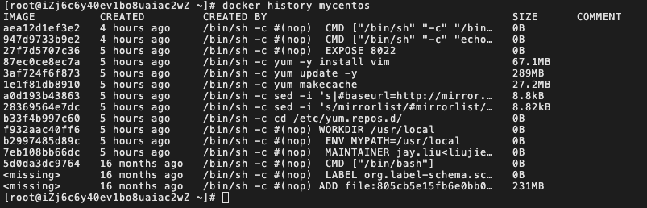
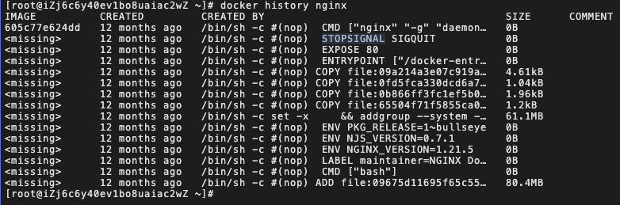

# DockerFile

## DockFile 介绍

dockerfile 是用来构建镜像的命令参数脚本文件。

使用 dockerfile 构建镜像通常有以下几个步骤：

1. 编写一个 dockerfile 文件
2. docker build 构建一个镜像
3. docker run 测试运行镜像
4. docker push 发布到镜像仓库（docker hub，阿里云镜像仓库）

## 分析 centos 官方镜像

[centos 镜像 gitub 仓库地址](https://github.com/CentOS/sig-cloud-instance-images/blob/b2d195220e1c5b181427c3172829c23ab9cd27eb/docker/Dockerfile)

```bash
# scratch为官方提供的一个空镜像，特别用于“从头开始”构建图像
FROM scratch

# 添加centos7的功能压缩包
ADD centos-7-x86_64-docker.tar.xz /

# 添加一些centos标签
LABEL \
    org.label-schema.schema-version="1.0" \
    org.label-schema.name="CentOS Base Image" \
    org.label-schema.vendor="CentOS" \
    org.label-schema.license="GPLv2" \
    org.label-schema.build-date="20201113" \
    org.opencontainers.image.title="CentOS Base Image" \
    org.opencontainers.image.vendor="CentOS" \
    org.opencontainers.image.licenses="GPL-2.0-only" \
    org.opencontainers.image.created="2020-11-13 00:00:00+00:00"
# 设置容器启动使用bash运行
CMD ["/bin/bash"]
```

很多官方的镜像都是基础包，很多功能没有，我们通常会自己搭建自己需要的镜像。

## Dockfile 脚本文件编写

### 前置知识

1. 每个指令（保留关键字）都必须是大写字母
2. 执行顺序从上到下
3. 符号 # 表示注释

### 常用指令

- `FROM`：指定基础镜像（例如 centos，scratch），一切从这里构建
- `MAINTAINER`： 指定镜像的维护者（姓名 + 邮箱）
- `RUN`： 镜像构建的时候要运行的命令
- `ADD`： 添加内容。比如要让镜像具备 nginx 功能，就需要先 add nginx 压缩包
- `WORKDIR`：设置镜像的工作目录
- `VOLUME`：设置容器的数据卷挂载目录
- `EXPOST`：指定对外的端口
- `CMD`：指定这个容器启动时需要运行的命令，只有最后一个生效，可被替代
- `ENTRYPOINT`：指定这个容器启动时需要运行的命令，可以追加命令
- `ONBUILD`：当构建一个被继承 DockerFile 时，就会运行这个指令
- `COPY`：将文件拷贝到镜像中
- `ENV`：构建的时候设置环境变量

## 实战：构建自己的 centos

官方提供的 centos 没有`vim`命令，这里我们制作一个包含 vim 命令的 centos 镜像

```bash
# 1. 编写自己的dockerfile（/home/dockfile/mycentos）
FROM centos

MAINTAINER jay.liu<liujie_2288@qq.com>

ENV MYPATH /usr/local
# 通过$使用设置的环境变量
WORKDIR $MYPATH
# 使用yum安装vim工具包
# centos官方停止维护的原因，直接安装会报错，需要进行一些配置：https://blog.csdn.net/weixin_43252521/article/details/124409151
RUN cd /etc/yum.repos.d/
RUN sed -i 's/mirrorlist/#mirrorlist/g' /etc/yum.repos.d/CentOS-*
RUN sed -i 's|#baseurl=http://mirror.centos.org|baseurl=http://vault.centos.org|g' /etc/yum.repos.d/CentOS-*
RUN yum makecache
RUN yum update -y
RUN yum -y install vim

EXPOSE 8022

CMD echo "--end--"
# 容器启动后新建一个终端链接，否则centos容器运行完会自动退出
CMD /bin/bash

# 2. 执行构建
$ docker build -f /home/dockerfile/mycentos -t mycentos .

# 3. 查看构建的镜像
$ docker ps

# 4. 使用新创建的镜像创建一个容器，输出--end--
[root@iZj6c6y40ev1bo8uaiac2wZ dockerfile]$ docker run -it mycentos
# 这里是镜像中CMD指定的输出，会在容器启动后执行
--end--

# 5. 进入之后工作目录默认就是制作镜像设置的/user/local
[root@198f00f09be2 local]$ pwd
/usr/local

# 6. 使用vim命令测试是否存在
[root@198f00f09be2 local]$ vim
```

## 查看本地镜像的变更历史

通过`docker history`来查看镜像是如何一步一步做出来的。

```bash
docker history 镜像名称
```





## CMD 对比 ENTRYPOINT

`CMD`和`ENTRYPOINT`都可以指定容器启动时需要运行的命令。但是
CMD 指定的命令会被覆盖，而 ENTRYPOINT 指定的命令则会被追加。

下面分别使用 CMD 和 ENTRYPOINT 来制作两个基础镜像，比对执行结果：

使用 CMD 来编写简单 dockerfile：

```bash
# 1. 编写dockerfile文件
FROM contos
CMD ls -a

# 2. 生成镜像
$ docker build -f ./cmd-test -t cmdtest .

# 3. 启动容器
$ docker run -it cmdtest
# 输出所有目录/文件信息
.   .dockerenv  dev  home  lib64       media  opt   root  sbin  sys  usr
# 4. 启动容器并追加命令-l，想要 ls -al的结果
$ docker run -it cmdtest -l
# 报错了，-l 替换了 CMD ls -a 命令，-l 不是命令所有报错
docker: Error response from daemon: failed to create shim task: OCI runtime create failed: runc create failed: unable to start container process: exec: "-l": executable file not found in $PATH: unknown.
```

使用 ENTRYPOINT 来编写简单 dockerfile：

```bash
# 1. 编写dockerfile文件
FROM contos
ENTRYPOINT ["ls","-a"]

# 2. 生成镜像
$ docker build -f ./entrypoint-test -t entrypoint-test .

# 3. 启动容器
$ docker run -it  entrypoint-test
# 同样也输出了所有目录/文件信息
.   .dockerenv  dev  home  lib64       media  opt   root  sbin  sys  usr
# 4. 启动容器并追加命令-l，想要 ls -al的结果，输出结果无误
$ docker run -it  entrypoint-test -l
```
