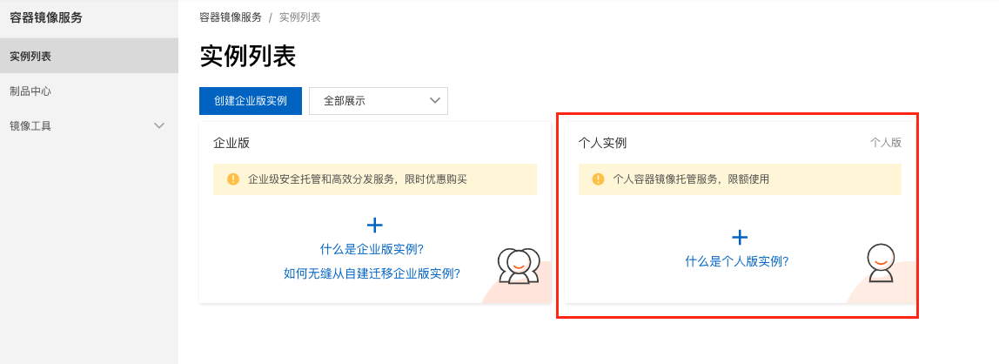
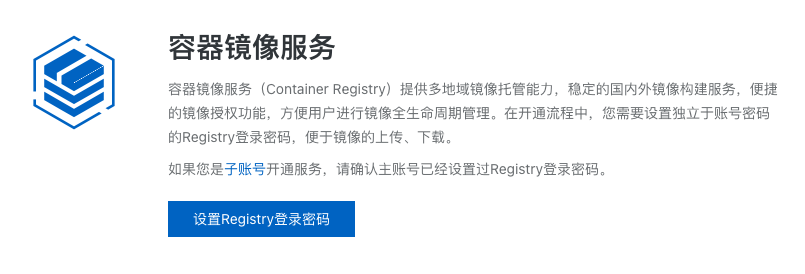
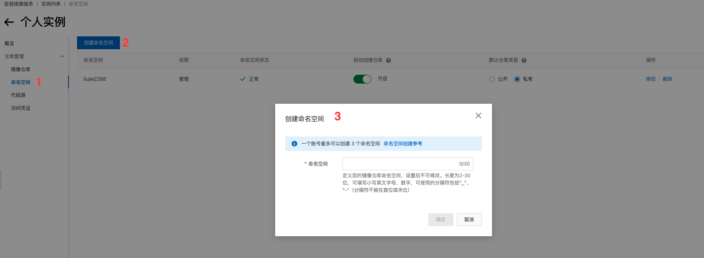
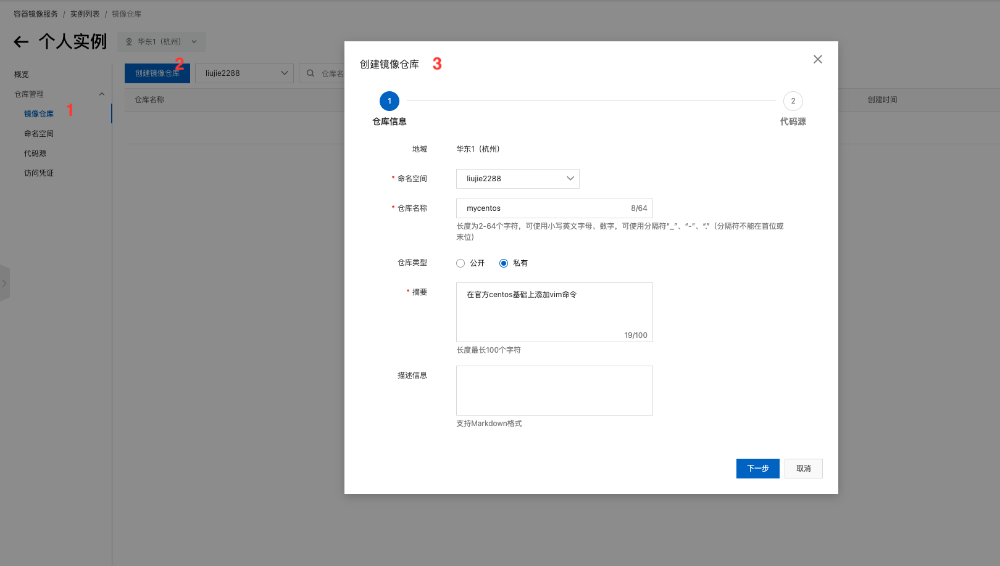
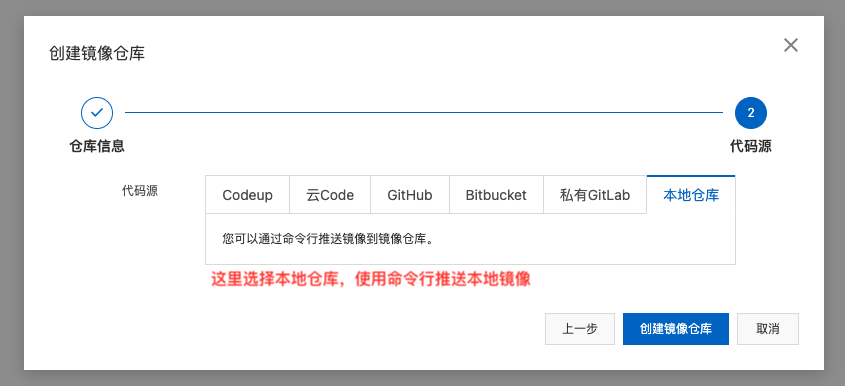
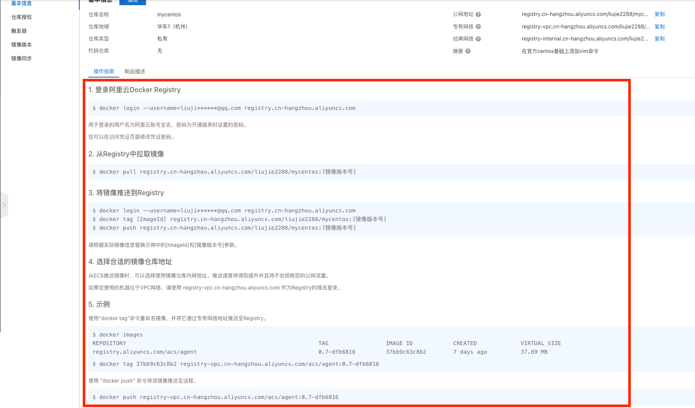
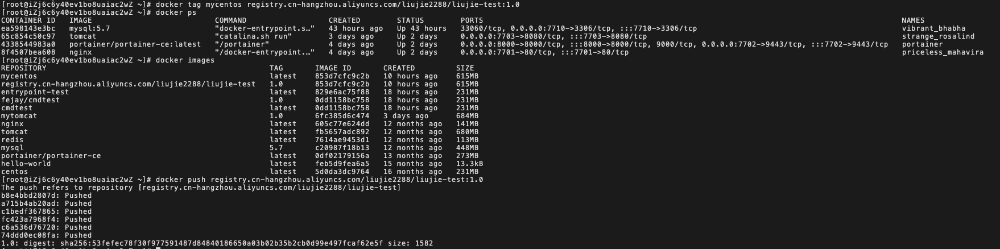

# 发布镜像

## 发布到 docker hub

1. 地址 [https://hub.docker.com/](https://hub.docker.com/) 注册自己的账号
2. 确定这个账号可以登录
3. 在我们服务器上提交自己的镜像

```bash
[root@iZj6c6y40ev1bo8uaiac2wZ dockerfile]$ docker login --help

Usage:  docker login [OPTIONS] [SERVER]

Log in to a Docker registry.
If no server is specified, the default is defined by the daemon.

Options:
  -p, --password string   Password
      --password-stdin    Take the password from stdin
  -u, --username string   Username

# 格式
docker login -u 用户名
```

4. 登录完毕后就可以提交镜像了(docker push)

```bash
# 1. 登录
# fejay 替换为你自己的用户名
$ docker login -u fejay
Password:
WARNING! Your password will be stored unencrypted in /root/.docker/config.json.
Configure a credential helper to remove this warning. See
https://docs.docker.com/engine/reference/commandline/login/#credentials-store

Login Succeeded

# docker push 镜像名[:tag]
# 直接push镜像会报错，参见https://www.biostars.org/p/9531985/
$ docker push mycentos
Docker denied: requested access to the resource is denied

# 2. 使用docker tag 标记一个版本
# docker tag ImageName[:tag] YOUR_DOCKERHUB_NAME/ImageName[:tag]
# mycentos 替换为你的ImageID或者ImageName
$ docker tag mycentos fejay/mycentos:1.0

# 3. 查看标记的版本是否存在
$ docker images

# 4. 然后在push标记的版本名称+版本号
$ docker push fejay/mycentos:1.0

# 5. 发布完成，登录 docker hub 查看发布镜像吧
```

## 发布到阿里云容器服务

1. 进入阿里云[容器镜像服务](https://www.aliyun.com/product/acr)首页
2. 登录管理控制台，创建个人版实例，设置仓库登录密码





3. 创建镜像命名空间



4. 创建镜像仓库





5. 根据官方提供的操作指南完成镜像发布



```bash
# 1. 登录
# 如果出现：unauthorized: authentication required 的错误，请参考：https://blog.csdn.net/Penguin_zlh/article/details/116133357

$ docker login --username=liujie_2288@qq.com registry.cn-hangzhou.aliyuncs.com
Password:
WARNING! Your password will be stored unencrypted in /root/.docker/config.json.
Configure a credential helper to remove this warning. See
https://docs.docker.com/engine/reference/commandline/login/#credentials-store
# 提示登录成功
Login Succeeded

# 2. 使用docker tag 标记一个版本
# docker tag ImageID[:tag] YOUR_DOCKERHUB_NAME/ImageID[:tag]
# mycentos 替换为你的ImageID或者ImageName
# registry.cn-hangzhou.aliyuncs.com/liujie2288/mycentos:1.0 替换为你的仓库地址
$ docker tag mycentos registry.cn-hangzhou.aliyuncs.com/liujie2288/mycentos:1.0

# 3.查看标记的版本是否存在
$ docker images

# 4. 然后在push标记的版本名称+版本号
# registry.cn-hangzhou.aliyuncs.com/liujie2288/mycentos:1.0 为上面tag目标镜像名称和版本号
$ docker push registry.cn-hangzhou.aliyuncs.com/liujie2288/mycentos:1.0

# 5. 发布完成，登录 阿里云镜像仓库 查看发布镜像
```


