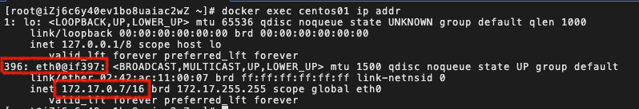

# docker 网络

在 docker 中，容器之间是相互隔离的，因此它们之间是不能直接通讯的。为了解决这个问题，docker 提供了几种方式：

- 通过网络桥接的方式实现容器之间的通讯
- 创建自定义网络，将一组容器添加到网络中实现容器之间的通讯

## docker 网络桥接实现通讯

docker 在安装时会自动创建一个虚拟网卡(docker0)用于容器之间的桥接通讯。可以在宿主机上通过`ip addr`查看该网卡：


发现该 docker0 的 ip 地址为：`172.17.0.1/16`（每台电脑可能不同）。

然后我们启动一个 centos 容器，查看容器内部网络：

```bash
[root@iZj6c6y40ev1bo8uaiac2wZ ~]$ docker run -d -P --name centos01 centos
[root@iZj6c6y40ev1bo8uaiac2wZ ~]$ docker exec centos01 ip addr
```



查看容器内部的网络地址`ip addr`，发现容器启动的时候会得到一个 eth0@if383 的网卡，这个是 docker 分配的！它的 ip 地址是：`172.17.0.7/16`。

因为，docker0 和容器创建的 ip 在同一个网段中，所以我们可以在直接 ping 通（连接）。

```bash
[root@iZj6c6y40ev1bo8uaiac2wZ ~]$ ping 172.17.0.7
PING 172.17.0.7 (172.17.0.7) 56(84) bytes of data.
64 bytes from 172.17.0.7: icmp_seq=1 ttl=64 time=0.108 ms
64 bytes from 172.17.0.7: icmp_seq=2 ttl=64 time=0.073 ms
64 bytes from 172.17.0.7: icmp_seq=3 ttl=64 time=0.079 ms
```

因此在 docker 中，宿主机可以直接和 docker 容器通信。

这是就是一种桥接模式，使用的 evth-pair 技术。
