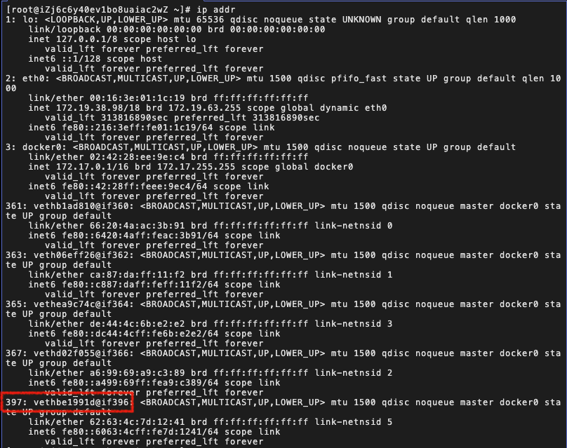
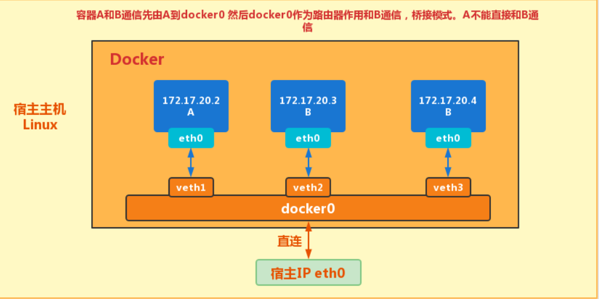
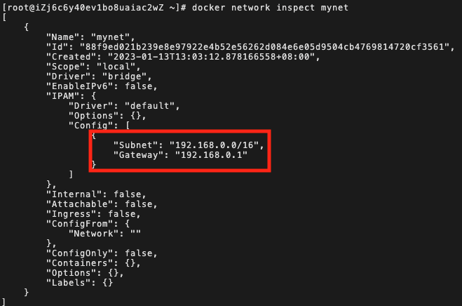
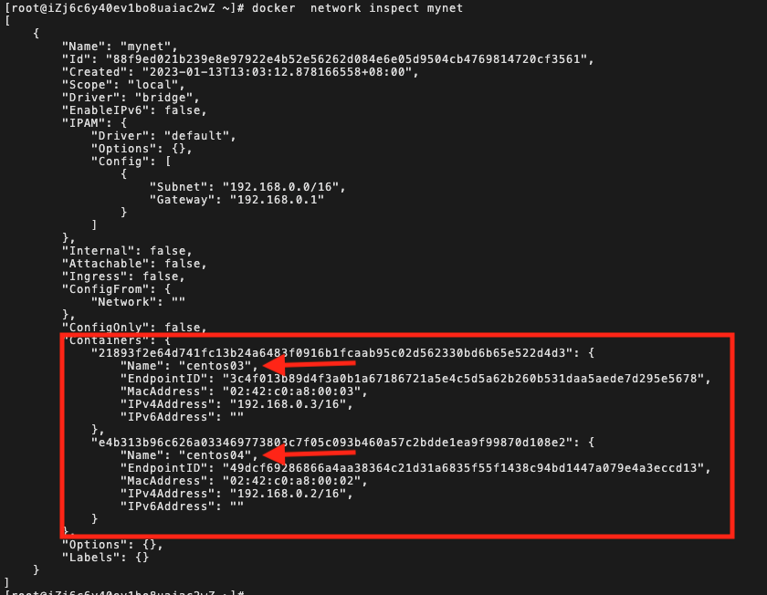
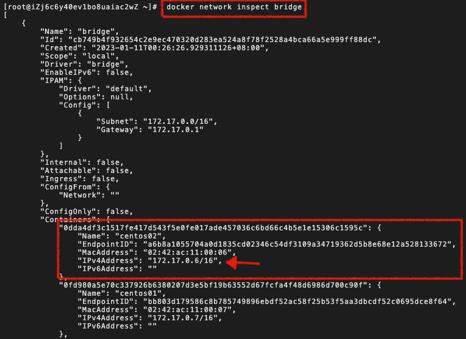
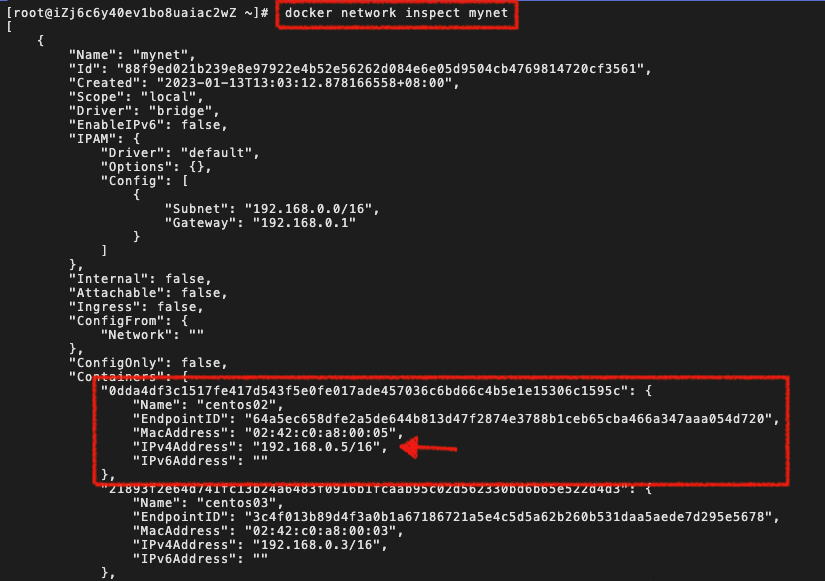

# docker 网络

在 docker 中，容器之间是相互隔离的，因此它们之间是不能直接通讯的。为了解决这个问题，docker 提供了几种方式：

- 通过网络桥接的方式实现通讯
- 通过--link 连接容器
- 创建自定义网络，将一组容器添加到网络中实现通讯

## docker 网络桥接实现通讯

### docker0

docker 在安装时会自动创建一个虚拟网卡(docker0)用于容器之间的桥接通讯。可以在宿主机上通过`ip addr`查看该网卡：


发现该 docker0 的 ip 地址为：`172.17.0.1/16`（每台电脑可能不同）。

### evth-pair 桥接通讯

现在我们启动一个 centos 容器，查看容器内部网络：

```bash
[root@iZj6c6y40ev1bo8uaiac2wZ ~]$ docker run -d -it --name centos01 centos
[root@iZj6c6y40ev1bo8uaiac2wZ ~]$ docker exec centos01 ip addr
```


查看容器内部的网络地址`ip addr`，发现容器启动的时候会得到一个 eth0@if383 的网卡，这个是 docker 分配的！它的 ip 地址是：`172.17.0.7/16`。

因为，docker0 和容器创建的 ip 在同一个网段中，所以宿主机和容器之间可以实现通信。

```bash
[root@iZj6c6y40ev1bo8uaiac2wZ ~]$ ping 172.17.0.7
PING 172.17.0.7 (172.17.0.7) 56(84) bytes of data.
64 bytes from 172.17.0.7: icmp_seq=1 ttl=64 time=0.108 ms
64 bytes from 172.17.0.7: icmp_seq=2 ttl=64 time=0.073 ms
64 bytes from 172.17.0.7: icmp_seq=3 ttl=64 time=0.079 ms
```

在创建容器之后，我们再次查看宿主机网络，发现了一个与容器网络匹配的网卡：



这就是一种桥接模式，使用的 evth-pair 通信技术。通过这种桥接的通信模式，以 docker0 作为路由，可以实现容器与容器之间的通信。

### 验证容器之间的通讯

新建一个 centos02 的容器，在容器内尝试 ping centos01 IP 地址。

```bash
$ docker run -d -it --name centos02 centos
$ docker exec centos02 ping 172.17.0.7
PING 172.17.0.7 (172.17.0.7) 56(84) bytes of data.
64 bytes from 172.17.0.7: icmp_seq=1 ttl=64 time=0.155 ms
64 bytes from 172.17.0.7: icmp_seq=2 ttl=64 time=0.079 ms
64 bytes from 172.17.0.7: icmp_seq=3 ttl=64 time=0.094 ms
64 bytes from 172.17.0.7: icmp_seq=4 ttl=64 time=0.099 ms
```

### 小结

容器之间相互隔离，不能直接通讯，借助 docker0 以及 evth-pair 桥接可以实现容器之间的相互通讯。



> 补充说明：
>
> - docker 中所有的网络接口都是虚拟的。虚拟的转发效率高
> - 容器删除，对应一对网卡也就删除了

## 通过--link 连接容器

docker 在重启时 ip 地址会发生变化，如果外部应用通过 ip 与容器连接，那么就会出现问题。 那么有没有一种固定的方式来访问容器呢？比如是容器名称或者服务名称。

docker 提供了`--link`来解决这个问题，它可以让容器之间不用通过 ip 地址就能相互访问。

验证通过容器名 centos02 是否能否 ping 通 centos01：

```bash
$ docker exec centos02 ping centos01
ping: centos01: Name or service not known
```

使用`--link 容器ID`创建容器，并验证是否能够通过容器名 ping 通：

```bash
$ docker run -d -it --name centos03 --link centos02 centos
$ docker exec centos03 ping centos02
PING centos02 (172.17.0.6) 56(84) bytes of data.
64 bytes from centos02 (172.17.0.6): icmp_seq=1 ttl=64 time=0.126 ms
64 bytes from centos02 (172.17.0.6): icmp_seq=2 ttl=64 time=0.078 ms
$ docker exec centos02 ping centos03
ping: centos03: Name or service not known
```

以上发现，通过--link 可以实现容器之间通过容器名来**单向连接**。

### 连接原理

进入 centos03 内部查看 host，发现 host 文件里配置了一条 centos02 容器的 ip 映射。

```bash
[root@iZj6c6y40ev1bo8uaiac2wZ ~]$ docker exec -it centos03 /bin/bash
[root@21893f2e64d7 /]$ cat /etc/hosts
127.0.0.1       localhost
::1     localhost ip6-localhost ip6-loopback
fe00::0 ip6-localnet
ff00::0 ip6-mcastprefix
ff02::1 ip6-allnodes
ff02::2 ip6-allrouters
172.17.0.6      centos02 0dda4df3c151  # 这里是centos02容器的IP映射
172.17.0.8      21893f2e64d7
```

## 自定义网络

以上两种方式在 docker 通讯中相对比较繁琐，也存在一些问题，docker 提供了更加灵活的方式来实现容器通讯，那就是自定义网络。首先创建一个虚拟网络环境， 然后将一组容器添加到这个网络中，形成一个局域网，实现容器与容器之间的相互访问。

在 docker 中可以通过`docker network`来查看网络相关命令：

```bash
$ docker network --help
Commands:
  connect     连接一个容器到一个网络
  create      创建一个网络
  disconnect  讲一个容器从网络中删除
  inspect     查看网络的详细信息
  ls          查看所有的网络
  prune       移除所有未使用的网络
  rm          删除一个网络
```

### 查看本地网络

```bash
$ docker network ls

NETWORK ID     NAME      DRIVER    SCOPE
cb749b4f9326   bridge    bridge    local
5636c8e772e8   host      host      local
218590df3410   none      null      local
```

网络模式（NAME）:

- bridge：桥接（默认，自己创建的也适用 bridge 模式）
- none： 不配置网络
- host：和宿主机共享网络
- container：容器网络联通（用得少，局限性大）

### 创建网络

```bash
# --driver 设置网络模式，默认为bridge
# --sunet 设置子网16位，可以容纳255 * 255个容器
# --gateway 设置网关（网络出口）
$ docker network create --driver bridge --subnet 192.168.0.0/16 --gateway 192.168.0.1 mynet

$  docker network ls
NETWORK ID     NAME      DRIVER    SCOPE
cb749b4f9326   bridge    bridge    local
5636c8e772e8   host      host      local
88f9ed021b23   mynet     bridge    local   # 创建的mynet网络
218590df3410   none      null      local
```



### 添加容器到网络中

- 启动容器时通过`--net`指定网络

  ```bash
  # 默认情况下，启动容器会自动添加参数 --net bridge 使用docker0桥接模式
  $ docker run -d -it --name centos04  --net mynet centos
  ```

- 添加容器到网络中

  ```bash
  $ docker network connect mynet centos03
  ```



### 测试容器连接

```bash
$ docker exec -it centos04 ping 192.168.0.3
PING 192.168.0.3 (192.168.0.3) 56(84) bytes of data.
64 bytes from 192.168.0.3: icmp_seq=1 ttl=64 time=0.096 ms
64 bytes from 192.168.0.3: icmp_seq=2 ttl=64 time=0.092 ms

# 使用自定义网络，现在不使用--link也可以ping容器名字了，并且是双向连接
$ docker exec -it centos04 ping centos03
$ docker exec -it centos03 ping centos04
```

## 自定义网络之间容器与网络的连通

实际应用中我们会有不同服务的集群，比如 mysql 集群，redis 集群，为了保证集群是安全和健康的，不同的集群会使用不同的网络。

网络与网络之间因为再不同的网段，它们之间无法直接通信，但是可以将一个网络中容器添加(`docker network connect`)另外一个网络中实现连接。连接后，容器会存在两个 ip 地址，可以理解为一个公网 ip，一个私网 ip。

### 测试

1. 创建一个属于 mynet 网络中 centos05 容器

```bash
$ docker run -d -it --name centos05  --net mynet centos
```

2. 尝试连接 bridge 网络中的 centos02，发现连接失败

```bash
$ docker exec centos05 ping centos02
ping: centos02: Name or service not known
```

3. 将 centos02 添加到 mynet 网络中

```bash
$ docker network connect  mynet centos02
```

4. 再次尝试连接，发现可以连接

```bash
$ docker exec centos05 ping centos02
```

5. 分别查看 birdge 网络和 mynet 网络中的容器，发现它们的网络里面都有 centos02 这个容器，但是他们的容器的 ip 不同，就可以理解为一个公网 ip，一个私网 ip。

```bash
$ docker network inspect bridge
$ docker network inspect mynet
```





## 总结

docker 容器之间是隔离的，默认情况下 docker 容器使用 docker0 + evth 网络桥接实现了容器的联通。我们可以通过 ip 来访问容器，但是，如果容器重启 ip 发生了变化，那么通过 ip 连接的容器将会出现找不到的情况。

docker 又为我们提供了`--link`来完成容器之间的绑定通讯，让我们可以使用容器名来访问容器服务，解决了 ip 变化的问题，但是绑定是单向的，并且如果需要实现多个容器的集群，需要配置多次，比较繁琐。

自定义网络很好的解决了上面的问题，使用方便，容易扩展，也是常用的使用方式。
