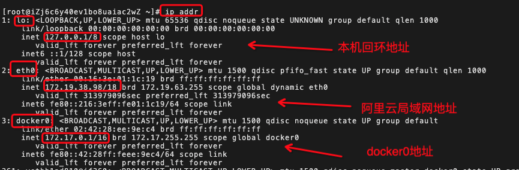

# docker 网络

在 docker 中，容器之间是相互隔离的，因此它们之间是不能直接通讯的。为了解决这个问题，docker 提供了几种方式：

- 通过网络桥接的方式实现容器之间的通讯
- 创建自定义网络，将一组容器添加到网络中实现容器之间的通讯

## docker 网络桥接实现通讯

docker 在安装时会自动创建一个虚拟网卡(docker0)用于容器之间的桥接通讯

在宿主机上通过`ip addr`查看网卡：



首先启动一个 tomcat 容器，查看内部网络：

```bash
$ docker run -P -d  --name tomcat01 tomcat ip addr
```
