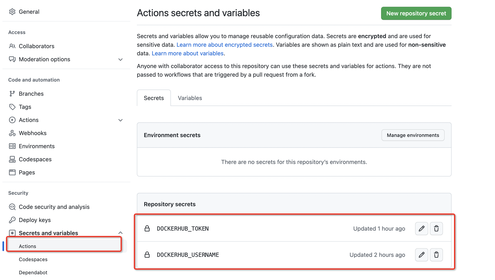

# Nodejs 应用容器化教程

> 本教程来自于[官方教程](https://docs.docker.com/language/nodejs/)，以下将以更为精简的笔记来完成对内容的记录和学习。其目的是为了：
>
> 1. 串联知识点、巩固对 docker 的学习；
> 2. 今后可以通过这篇文章快速回顾 docker 知识要点

文章主要内容：

- 构建镜像
- 运行容器
- 开发一个应用程序
- 运行单元测试
- 配置 CI/CD
- 部署应用

## 构建镜像

在构建镜像之前我们需要先编写一个 nodejs 应用。

首先创建一个项目`node-docker`，编写一个简单的服务脚本。

```js
// server.js
const express = require("express");

const app = express();
const port = process.env.SERVER_PORT || 7710;

app.use(function (req, res) {
  res.send("hello world");
});

app.listen(port, function () {
  console.log(`server at http://localhost:${port}`);
});
```

### 创建 dockerfile

```docker
# 基于node最新版本作为基础镜像，更多信息参考：https://docs.docker.com/build/building/base-images/
FROM node
# 设置容器内部工作目录，方便进入容器直接执行其他命令，而不需要每次都cd到该目录中
WORKDIR /app
# 将源代码拷贝到镜像中（如果文件是压缩包会自动解压）
COPY . .
# 安装生产环境依赖
RUN npm install
# 容器启动时，自动启动node服务
CMD node server.js
```

拷贝源代码时，不需要拷贝 node_modules 目录，创建 `.dockerignore` 文件，添加文件排除。

```docker
node_modules
```

### 构建镜像

```bash
$ docker build -t node-docker .
```

`docker build`命令用于构建镜像。`-t`参数指定镜像名称和版本号。更多参数通过`docker build --help`查看。

注意构建命令的最后有一个`.`，它表示构建上下文，它可以是本机路径或者 URL，用于在构建时查找文件。

### 查看的构建镜像

```bash
$ docker images

REPOSITORY    TAG       IMAGE ID       CREATED          SIZE
node-docker   latest    c0ecec69ac1f   12 minutes ago   922MB
```

### 其他镜像命令

```bash
# 为镜像打一个标签（新的版本）
$ docker tag 源镜像名  目标镜像名
# 删除镜像
$ docker rmi 镜像名称
```

## 运行容器

上面构建好镜像后，我们可以运行该镜像，运行时 docker 会创建一个容器。

> 容器是一个操作系统进程，这个进程是独立的，有自己独立的文件系统，网络以及进程。

运行容器使用`docker run  镜像名:镜像版本`命令。

> 不写镜像版本默认为 latest

```bash
$ docker run node-docker
server at http://localhost:7744
```

运行后发现会自动启动 node 服务，并提示运行在 7744 端口上的，但是当你访问 localhost:7744 时发现服务被拒绝，这是因为容器是被隔离的。

要想在外部访问到容器内部的服务，需要通过`-p`参数手动映射容器内部端口到宿主机上。

```bash
$ docker run -p 3310:7744 node-docker
```

以上通过 3310 端口向外提供容器内部 7744 端口上的服务。这样我们就可以通过 http://localhost:3310 来访问了。

### 后台运行

到现在我们的终端连接到容器来运行服务，docker 提供了`-d`方式后台运行服务。

```bash
$ docker run -d -p 3310:7744 node-docker
ce02b3179f0f10085db9edfccd731101868f58631bdf918ca490ff6fd223a93b
```

运行后，程序启动后台运行成功，并返回容器 ID。

### 命名容器

运行容器时，docker 会自动生成一个名称，我们可以通过`--name`指定一个名称。

```bash
$ docker run -d -p 3310:7744 --name node-docker node-docker
```

### 其它容器命令

```bash
# 列出运行中的容器信息（容器ID，使用的镜像，创建容器的时间，状态，端口映射等）
$ docker ps
# 列出所有的容器（包括已停止）
$ docker ps --all
# 停止容器
$ docker stop 容器id/容器名称
# 重启容器
$ docker restart 容器id/容器名称
# 删除容器
$ docker rm 容器名称或者容器ID
# 删除容器复合语法：删除所有容器
# -f 表示强制删除，包括运行中的容器
# $()内部允许其他查询
# -aq 表示查询所有容器，并返回所有容器的id，详细信息查看 docker ps --help
$ docker rm -f $(docker ps -aq)
```

## 开发一个应用程序

以下使用 express + mongodb 完成一个简单增删改查应用。

### 创建 Mongodb 服务容器

创建 Mongodb 数据卷和 Mongodb 配置卷，独立与容器管理数据（容器删除数据仍然存在）。

```bash
$ docker volume create mongodb
$ docker volume create mongodb_config
```

创建一个网络，方便应用程序和数据库通讯，使应用程序可以通过容器名称连接数据库。

```bash
$ docker network create mongodb
```

启动 Mongodb 容器，配置数据卷映射，配置容器网络环境，并对外暴露 7733 端口。

```bash
# -d 后台启动
# -v 配置数据卷映射
# -p 配置端口映射
# --name 设置容器名称
# --network 指定容器网络环境
$ docker run -d -v mongodb:/data/db -v mongodb_config:/data/configdb -p 7733:27017 --network mongodb --name mongodb mongo
```

### 完善应用程序

添加 db 模块：

```js
const { MongoClient } = require("mongodb");

// 优先使用环境变量提供的数据库连接字符串
// mongodb:27017中的mongodb代表的启动的mongodb容器的名称（--name 指定的容器名称）
// 当在同一个网络中时，可以直接通过容器的名称来访问服务，防止通过容器ip访问时ip变化问题
const MongoClientUrl =
  process.env.MONGO_CLIENT_URL || "mongodb://mongodb:27017";

let client,
  db,
  obj = {};

async function main() {
  client = new MongoClient(MongoClientUrl);
  await client.connect();
  console.log("Connected successfully to server");
  db = client.db("node-docker");
}

main();

Object.defineProperties(obj, {
  client: {
    get() {
      return client;
    },
  },
  db: {
    get() {
      return db;
    },
  },
});

module.exports = obj;
```

修改 server.js 入口文件

```js
const express = require("express");
const db = require("./db");

const app = express();
// 优先从环境变量中获取
const port = process.env.SERVER_PORT || 7744;

app.use(express.json());
app.use(express.urlencoded());

app.get("/", function (req, res) {
  res.end("hello world!");
});

app.post("/add", async function (req, res) {
  const collection = db.db.collection("notes");
  const data = await collection.insertOne(req.body);
  res.send(data);
});

app.get("/list", async function (req, res) {
  const collection = db.db.collection("notes");
  const doc = await collection.find().toArray();
  res.send(doc);
});

app.listen(port, function () {
  console.log(`server at http://localhost:${port}`);
});
```

### 重新构建镜像并重启容器

```bash
# 重新构建node-docker镜像
$ docker build --tag node-docker .
# 重新运行node-docker镜像
$ docker run -d -p 3310:7744 -e SERVER_PORT=7744 --network mongodb  --name rest-node-docker node-docker
```

测试访问：

1. 插入数据

```bash
$ curl --request POST \
  --url http://localhost:3310/add \
  --header 'content-type: application/json' \
  --data '{"title": "this is a note", "content": "this is a note that I wanted to take while I was working on writing a blog post."}'
```

2. 查询插入的数据

```bash
$ curl http://localhost:3310/list
```

### 使用 compose 同时启动多个容器

上面的应用我们需要先启动 mongodb 服务然后再启动 node 服务，为了本地开发方便，下面将使用 compose 来同时启动多个容器服务。

新建`docker-compose.dev.yml`描述文件，添加以下内容：

```yml
# 指定 docker compose 规范的版本
version: "3.8"

# 指定多个服务容器
services:
  # mongo服务容器
  mongo:
    # 设置容器基础镜像
    image: mongo
    # 设置容器端口映射
    ports:
      - 7733:27017
    # 设置容器数据卷挂载
    volumes:
      - mongodb:/data/db
      - mongodb_config:/data/configdb

  # 设置node服务容器
  node:
    # 设置node服务容器从源码构建镜像，指定构建的上下文为当前文件所在的文件夹
    build:
      context: .
    ports:
      # 暴露node-docker服务接口
      - 3310:7744
      # 暴露node调试接口
      - 3311:9229
    # 设置环境变量
    environment:
      - SERVER_PORT=7744
      # 这里mongo就代表的是上面mongo服务名称，使用服务名称解决了容器ip变化问题（在docker-net.md有详细说明）
      - MONGO_CLIENT_URL=mongodb://mongo:27017
    # 设置本地开发目录与容器内部/app目录关联映射，方便本地修改后同步到容器内部
    volumes:
      - ./:/app
      - ./node_modules:/app/node_modules

# 创建数据卷
volumes:
  mongodb:
  mongodb_config:
```

compose 文件在启动时会自动创建一个网络(可通过 `docker network ls` 查看)，并且会自动解析服务(service)名称，方便我们在容器之间通讯时可以直接使用该名称。（例如，直接使用 mongo 名称来连接服务 `mongodb://mongo:27017`）

启动程序：

```bash
# docker compose up 创建并启动容器
# -f 指定compose文件，不提供默认查找compose.yml docker-compose.yml文件
# --build 启动之前构建镜像
# 更多命令查看docker compose --help 和 docker compose up --help
$ docker compose -f docker-compose.dev.yml up --build
```

访问测试：http://localhost:3310

### node 调试

为了方便开发 node 应用程序，我们可以安装`nodemon`：

```bash
$ npm install --save-dev nodemon
```

在 package.json 文件中添加调试启动脚本:

```json
{
  // ...
  "scripts": {
    "debug": "nodemon --inspect=0.0.0.0:9229 server.js"
  }
  // ...
}
```

在 compose 文件 node 服务中添加容器启动脚本

```yaml
servers:
  node:
    # ...

    # 设置容器启动命令，以调试模式运行node服务
    command: npm run debug

    # ...
```

重启服务后，打开浏览器输入：`about:inspect`，然后创建一个`http://localhost:3311`的调试监听连接，开始调试。

> node 调试详细内容请参考[官方文档](https://nodejs.org/en/docs/guides/debugging-getting-started/)

## 运行单元测试

### 本地运行测试

安装 js 测试框架 mocha:

```bash
$ npm install --save-dev mocha
```

创建测试 `test` 文件夹，添加一下测试文件 `test.js`:

```js
// test/test.js
var assert = require("assert");
describe("Array", function () {
  describe("#indexOf()", function () {
    it("should return -1 when the value is not present", function () {
      assert.equal([1, 2, 3].indexOf(4), -1);
    });
  });
});
```

在 package.json 中添加测试脚本:

```json
{
  "scripts": {
    // ...
    "test": "mocha ./**/*.js"
  }
}
```

运行测试：

```bash
$ npm run test
```

### 构建测试

除了通过命令行运行测试外，还可以在构建镜像时运行测试，修改`Dockerfile`文件：

```docker
# 基于node最新版本作为基础镜像，更多信息参考：https://docs.docker.com/build/building/base-images/
# FROM代表一个构建阶段，一个Dockerfile文件中可以存在多个构建阶段
# as 给当前阶段打一个标签，方便其它阶段引用
FROM node as base
# 设置容器内部工作目录，方便进入容器直接执行其他命令，而不需要每次都cd到该目录中
WORKDIR /app
# 将源代码拷贝到镜像中（如果文件是压缩包会自动解压）
COPY . .

# 测试阶段
FROM base as test
# 安装环境依赖
RUN npm ci
# 运行测试
RUN npm run test

# 生产阶段
FROM base as prod
# 安装生产依赖
RUN npm ci --production
# 容器启动时，自动启动node服务
CMD node server.js
```

执行构建测试：

```bash
$ docker build -t node-docker --target test .
```

## 配置 CI/CD

使用 github Actions 完成镜像的构建与发布。

> 参考地址：https://docs.docker.com/language/nodejs/configure-ci-cd/

1. 在 github 创建一个仓库
2. 在仓库的 settings 面板中添加 dockerhub 的用户名以及令牌（需要前往 docker hub 个人中心申请）
   
3. 在仓库的 actions 面板中创建一个工作流文件。

   ```yaml
   # 当前工作流名称
   name: Docker Image CI

   # 指定此工作流应在列表中分支的每个推送事件上运行。
   on:
     push:
       branches: ["main"]

   # 工作流运行时的任务列表
   jobs:
     # 具体的每一个任务
     build:
       # 任务运行的的机器类型
       runs-on:
         ubuntu-latest
         # 任务执行的步骤
       steps:
         - uses: actions/checkout@v3
           name: Checkout
         - uses: docker/login-action@v2
           name: Login to Docker Hub
           with:
             #  上面添加的密钥
             username: ${{ secrets.DOCKERHUB_USERNAME }}
             password: ${{ secrets.DOCKERHUB_TOKEN }}
         - name: Set up Docker Buildx
           uses: docker/setup-buildx-action@v2
         - name: Build and push
           uses: docker/build-push-action@v3
           with:
             # 这里指定docker构建上下文
             context: ./Docker/node-docker
             # 指定构建的dockerfile文件位置
             file: ./Docker/node-docker/Dockerfile
             push: true
             tags: ${{ secrets.DOCKERHUB_USERNAME }}/node-docker:latest
   ```
