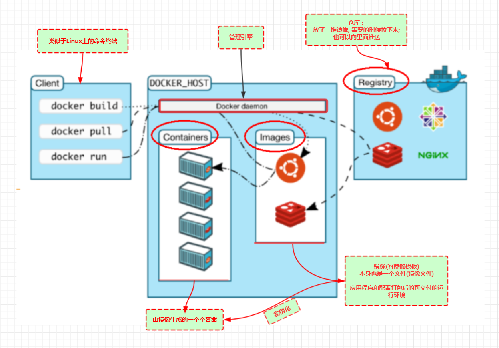

# docker 学习笔记

以下笔记主要参考狂神说提供的 docker 教程 [https://www.bilibili.com/video/BV1og4y1q7M4?p=2](https://www.bilibili.com/video/BV1og4y1q7M4?p=2)。

如果想要快速入门可以查看 阮一峰大神 提供的 [docker 入门教程](http://www.ruanyifeng.com/blog/2018/02/docker-tutorial.html)

## 学习建议

1. 按照顺序学习
2. 多用，多敲，否则很快就会忘
3. 官方提供非常详细并且容易理解的文档，也有[实战练习](https://docs.docker.com/language/nodejs/)教你快速学习 docker

## 目录

- Docker 基础
  - [docker 简述](./01-docker-intro.md)
  - [docker 安装 & 卸载](./02-docker-install.md)
  - [docker 运行流程](./03-docker-run-process.md)
  - [docker 常用命令](./04-docker-cmd.md)
  - [docker 实战练习](./05-docker-practice.md)
- Docker 进阶
  - [docker 可视化管理工具 - portainer](./06-portainer.md)
  - [docker 镜像理解](./07-docker-image.md)
  - [docker commit 镜像](./08-docker-commit.md)
  - [docker 数据卷](./09-docker-volume.md)
  - [docker DockerFile](./10-docker-dockerfile.md)
  - [docker 发布镜像](./11-docker-publish.md)
  - [docker 网络](./12-docker-net.md)
- Docker 高级
  - [docker Compose 容器编排](./13-docker-compose.md)
  - [docker Swarm 集群部署]
- Docker 实战
  - [Nodejs 应用容器化教程](./14-node-docker.md)

## docker 流程图

docker 整体工作流程图：

docker 整体工作流程 + 主要工作命令图：

## 参考资料

- [阮一峰 Docker 入门教程](http://www.ruanyifeng.com/blog/2018/02/docker-tutorial.html)
- [狂神说 Docker 教程](https://www.bilibili.com/video/BV1og4y1q7M4?p=2)
