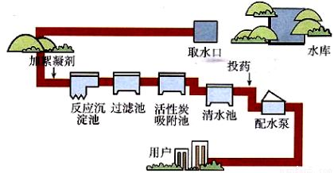

# Express 教程

## Express 是什么

[Express](expressjs.com) 是一个 nodejs 的 web 开发框架。它有着**快速**，**灵活**，**简单**的特点。通过它，可以轻松构建各种 web 应用。例如：

- 传统 web 网站（服务端渲染形式的网站）
- 接口服务
- 开发工具，比如 [webpack-dev-server](https://github.com/webpack/webpack-dev-server)
- [二次扩展开发应用框架](http://expressjs.com/en/resources/frameworks.html)，比如 NestJs
- ...

Express 本身是极简的，它仅仅是在 nodejs 的基础上封装了一层 web 开发的基础功能：

- 它的内容不还是使用 HTTP 模块
- 请求对象继承自[http.IncomingMessage](https://nodejs.org/dist/latest-v18.x/docs/api/http.html#class-httpincomingmessage);
- 响应对象继承自[http.ServerResponse](https://nodejs.org/dist/latest-v18.x/docs/api/http.html#class-httpserverresponse)
- ...

Express 提供了中间件（插件）的方式，可以集成许多插件来处理 HTTP 请求。常用的中间件有：

- body-parse： 解决 http 请求体
- cors： 处理跨域资源的请求
- cookie-parser：解析 cookie 数据
- ... 更多中间件参考[官方文档](https://expressjs.com/en/resources/middleware.html)

## Express 快速开始

1. 创建项目，并安装 Express

```bash
mkdir express-quick-start && cd express-quick-start
yarn init -y
yarn add express
```

2. 创建 index.js 文件，添加一下示例代码

```js
const express = require("express");
const app = express();
const port = 3000;

app.get("/", (req, res) => {
  res.send("Hello World!");
});

app.listen(port, () => {
  console.log(`server start at http://localhost:${port}`);
});
```

3. 打开终端，使用`node index.js`命令启动服务，然后通过浏览器访问 http://localhost:3010/ 页面，可以看到 Hello world 输出。

## 路由基础

路由是指：确定应用程序如何响应客户端对特定端点的请求，该特定端点是 URL（或路径）和特定 HTTP 请求方法（GET，POST 等）。
每个路由可以具有一个或多个处理程序函数，这些函数在路由匹配时执行。
路由定义采用以下结构：

```js
app.METHOD(PATH, HANDLER);
```

- app 是 Express 实例
- METHOD 是小写的 HTTP 请求方法，比如 GET，POST，PUT，DELETE 等
- PATH 是服务器上的路径
- HANDLER 是当路由匹配时执行的函数

下面是一些简单的示例：

在根路径上响应 Hello World：

```js
app.get("/", function (req, res) {
  res.send("Hello World");
});
```

在根路由响应`POST`请求：

```js
app.post("/", function (req, res) {
  res.send("Got a POST request");
});
```

响应对`/user`路径上的`PUT`请求

```js
app.put("/user", function (req, res) {
  res.send("Got a PUT request at /user");
});
```

响应对`/user`路径上的`DELETE`请求

```js
app.delete("/user", function (req, res) {
  res.send("Got a **DELETE** request at /user");
});
```

> 服务启动成功后，可以通过 postman 等 api 请求工具来发起请求测试。

## 请求和响应对象

Express 应用使用路由回调函数的参数：`request`和`response`对象来处理请求和响应数据。

```js
app.get("/", function (request, response) {
  // ...
});
```

`request`和`response`对象分别是`http.IncomingMessage`和`http.ServerResponse`的实例对象，express 只是在 nodejs 官方提供的对象上封装了一些开发中常用的属性和方法，实例对象原有的属性和方法还是可以直接访问。

`request`代表的是请求对象，里面包含了 HTTP 标头，请求参数，请求正文等信息。

express 扩展的`request`属性有：

- request.ip: 请求的远程 IP 地址
- request.host: 主机名
- request.body： 获取请求体内容
- request.query: 包含请求查询参数的对象
- request.cookie: 包含 cookie 信息的对象
- request.params: 包含路由参数的对象

更多属性和方法，请查看[官方文档](http://expressjs.com/en/4x/api.html#req)

`response`代表的是响应对象，表示应用在收到 HTTP 请求时发送的响应。
扩展的属性有：

- res.app 返回 express 实例对象
- res.headersSent 表示是否发送了 HTTP 响应头
- res.locals 向模板中暴露变量值，用于模版渲染时挂载变量

扩展的方法有：

- res.cookie() 设置 cookie 值
- res.append() 添加响应头
- res.download() 将文件作为附件发送到客户端
- res.json() 发送 JSON 数据
- res.redirect() 重定向

更多属性和方法，请查看[官方文档](http://expressjs.com/en/4x/api.html#res)

## 案例 - 创建一个简单的 CRUD 接口服务

1. **准备一个数据文件** data.json

```json
{
  "todos": [
    {
      "title": "吃饭",
      "id": 1
    },
    {
      "title": "睡觉",
      "id": 2
    }
  ]
}
```

2. 封装数据操作模块 model.js，提供增删改查数据操作方法。

```js
const fs = require("fs/promises");
const path = require("path");

async function getTodos() {
  const result = await fs.readFile(
    path.join(__dirname, "./data.json"),
    "utf-8"
  );
  return JSON.parse(result);
}

async function writeTodos(data) {
  await fs.writeFile(
    path.join(__dirname, "./data.json"),
    JSON.stringify(data, null, 2)
  );
}

async function getTodoById(id) {
  const todos = await getTodos();
  return todos.find((todo) => todo.id == id);
}

async function addTodo(todo) {
  const todos = await getTodos();
  todos.sort((a, b) => a.id - b.id);
  const addTodoItem = {
    id: todos[todos.length - 1].id + 1,
    todo,
  };
  todos.push(addTodoItem);
  await writeTodos(todos);
  return addTodoItem;
}

async function updateTodo(id, newTodo) {
  const todos = await getTodos();
  const index = todos.findIndex((todo) => todo.id == id);
  const newTodoItem = Object.assign(todos[index], { todo: newTodo });
  todos.splice(index, 1, newTodoItem);
  await writeTodos(todos);
  return newTodoItem;
}

async function deleteTodo(id) {
  const todos = await getTodos();
  const newTodos = todos.filter((todo) => todo.id != id);
  await writeTodos(newTodos);
}

module.exports = {
  getTodos,
  getTodoById,
  addTodo,
  updateTodo,
  deleteTodo,
};
```

3. 查询任务列表 GET /todos

```js
app.get("/todos", async function (req, res) {
  try {
    const todos = await model.getTodos();
    res.status(200).json({ data: todos });
  } catch (error) {
    res.status(500).json({ error: error.message });
  }
});
```

4. 根据 ID 查询单个任务

`req.params` 可以获取到请求路径中匹配的参数

```js
app.get("/todos/:id", async function (req, res) {
  const { id } = req.params;
  try {
    const todo = await model.getTodoById(id);
    if (todo) {
      res.status(200).json({ data: todo });
    } else {
      res.status(404).end();
    }
  } catch (error) {
    res.status(500).json({ error: error.message });
  }
});
```

5. 添加单个任务

`req.body`为客户端提交的请求参数，但是需要在在之前引入处理中间件。

```js
// 解析请求体中间件，设置后可以在`req.body`获取到请求参数
// 处理客户端提交的json数据
app.use(express.json());
// 处理客户端提交的form表单为x-www-form-urlencoded数据
app.use(express.urlencoded());
```

最好设置在所有请求之前，这样对所有请求都生效。

```js
app.post("/todos", async function (req, res) {
  const { todo } = req.body;
  try {
    if (!todo) {
      return res.status(422).json({ error: "缺少todo参数" });
    }
    const addTodoItem = await model.addTodo(todo);
    res.status(201).json({ data: addTodoItem });
  } catch (error) {
    res.status(500).json({ error: error.message });
  }
});
```

6. 修改任务

```js
app.patch("/todos/:id", async function (req, res) {
  const { id } = req.params;
  const { todo: newTodo } = req.body;
  try {
    const todo = await model.getTodoById(id);
    if (todo) {
      const result = await model.updateTodo(id, newTodo);
      res.status(200).json({ data: result });
    } else {
      res.status(404).end();
    }
  } catch (error) {
    res.status(500).json({ error: error.message });
  }
});
```

7. 修改任务

```js
app.delete("/todos/:id", async function (req, res) {
  const { id } = req.params;
  try {
    const todo = await model.getTodoById(id);
    if (todo) {
      await model.deleteTodo(id);
      res.status(204).end();
    } else {
      res.status(404).end();
    }
  } catch (error) {
    res.status(500).json({ error: error.message });
  }
});
```

## 中间件

中间件是指：在现有代码程序中，在程序生命周期中**加入/减去**一个或多个功能，不影响原有功能。

比如，我们想在一个应用程序中打印请求日志（输出每个请求的方法，路径以及时间），我们需要怎么做？

```js
app.get("/", (req, res) => {
  res.send("get /");
});

app.get("/about", (req, res) => {
  res.send("get /about");
});

app.post("/login", (req, res) => {
  res.send("post /login");
});
```

最简单的实现，是在每一个路由中，添加请求日志打印方法：

```js
app.get("/", (req, res) => {
  console.log(`${req.method} ${req.url} ${Date.now()}`);
  res.send("index");
});

app.get("/about", (req, res) => {
  console.log(`${req.method} ${req.url} ${Date.now()}`);
  res.send("about");
});

app.post("/login", (req, res) => {
  console.log(`${req.method} ${req.url} ${Date.now()}`);
  res.send("login");
});
```

针对上面的代码，我们很自然想到可以通过一个函数来抽离日志打印逻辑：

```js
function logger(req) {
  console.log(`${req.method} ${req.url} ${Date.now()}`);
}
app.get("/", (req, res) => {
  logger(req);
  res.send("index");
});

app.get("/about", (req, res) => {
  logger(req);
  res.send("about");
});

app.get("/login", (req, res) => {
  logger(req);
  res.send("login");
});
```

上面的方式确实能解决我们的问题的，但是如果我们后面再添加更多其他的路由，是不是每一个都要去添加一次呢？这样就会先非常麻烦。

通过中间件的机制，我们可以很轻松解决这个问题：

```js
function logger(req) {
  console.log(`${req.method} ${req.url} ${Date.now()}`);
}

app.use((req, res, next) => {
  console.log(`${req.method} ${req.url} ${Date.now()}`);
  next();
});

app.get("/", (req, res) => {
  res.send("index");
});

app.get("/about", (req, res) => {
  res.send("about");
});

app.get("/login", (req, res) => {
  res.send("login");
});
```

上面代码执行之后我们发现任何请求进来都会先在服务端打印请求日志，然后才会执行具体的业务处理函数。

通过`use`方法挂载一个函数，这个函数就是我们所说的**中间件**。这个函数接受三个参数`req`,`res`,`next`，req 和 res 同路由中参数一致，分别代表的是请求对象和响应对象。next 则是一个函数，是 express 内部传递的一个函数，这个函数代表是下一个与路由匹配的处理函数。

### 中间件概念

中间件类似与我们自来水厂从获取水源到净化处理后交给用户这一过程中的每个处理环节。



这里的每个环节都是一个独立功能，增加或者减少不会影响到流程中的其它节点的功能。

使用中间件的好处：

- 将日志记录，性能统计，安全控制，事务处理，异常处理等代码从业务逻辑中划分出来，通过对这些行为分离，可以减少甚至是取消对业务代码的影响
- 通过中间件的隔离机制，使得业务逻辑各部分之间的耦合度降低，提高的程序的可重用性，同时也提高了开发的效率和可维护性。


## Express 中的中间件

Express 的最大特色，也是最重要的设计，就是中间件。一个 Express 应用，就是由许多的中间件来完成的。**Express 的本质就是一系列中间件函数的调用**。

在 Express 中，中间件就是一个可以访问请求对象，响应对象和调用 next 方法的一个函数。


在中间件函数中可以执行以下任何任务：

- 执行任何代码
- 修改 request 或者 response 对象（比如挂载某个属性和方法）
- 结束请求响应（调用 end 方法或者 send 方法）
- 调用下一个中间件（把结束响应控制权交给下一个和当前请求匹配的中间件函数）

注意：

1. 中间件的顺序很重要，代码书写的顺序与路由匹配时的执行顺序相同。
2. 如果当前的中间件功能没有结束请求，则必须调用`next()`将控制权传递给下一个中间件函数，否则，该请求就会被挂起（浏览器加载一直转圈圈）。
3. 如果在最后一个匹配到的中间件中没有结束请求，但是调用了 next 函数则会响应 express 默认错误页内容。（不会被挂起）
4. 在已经结束了请求的中间件，调用 next 方法，还是会继续执行下一个中间件，但是该中间件内不能再有其它的内容响应，否则会报错。

## Express 中间件分类

- 应用程序级别中间件
- 路由级别中间件
- 错误处理中间件
- 内置中间件
- 第三方中间件

### 应用程序级别中间件

通过`app.use()`或者`app.METHOD()`方法，将中间件函数绑定到 express 实例对象上（app）。

#### 不关心请求路径和请求方法

以下示例不关心请求路径和请求方法，每次应用收到请求都会执行绑定的中间件函数

```js
const express = require("express");
const app = express();
// 应用程序中间件，不关心请求路径
app.use((req, res, next) => {
  console.log(`${req.method} ${req.url} ${Date.now()}`);
  next();
});
```

#### 限定请求路径

以下示例不限定请求方法，当匹配到`/user/:id`的请求时，执行绑定的中间件函数

```js
app.use("/user/:id", function (req, res, next) {
  console.log("Request Type:", req.method);
  next();
});
```

#### 限定请求方法 + 请求路径

以下示例将在应用收到 `get` 方式的`/user/:id`请求时，执行绑定的中间件函数

```js
app.get("/user/:id", function (req, res, next) {
  res.send("USER");
});
```

#### 多个处理函数

可以同时为路由挂载多个处理函数，形成一个中间件子堆栈。
子堆栈中的 `next` 函数代表的是堆栈中的下一个中间件函数。

```js
app.use(
  "/product/:id",
  function (req, res, next) {
    console.log("Request URL:", req.originalUrl);
    // 这里的next代表的是下面获取`Request Type`的中间件函数
    next();
  },
  function (req, res, next) {
    console.log("Request Type:", req.method);
    next();
  }
);
```

要跳过路由器中间件堆栈中的剩余中间件函数，可以调用`next('route')`将控制权传递给下一个路由。可以使用此机制在一条路由上设置先决条件，然后在没有理由继续当前路由的情况下将控制传递给后续路由。

> 注意：next('route') 仅在使用 app.METHOD() 或 router.METHOD() 函数加载的中间件函数中有效。

下面的示例挂载了一个中间件子堆栈，当请求为`/user/0`时，将跳过堆栈中剩余的中间件函数，结束请求并响应内容`special`，当请求为`/user/xxx`xxx 不为 0 时，结束请求并响应`regular`。

```js
app.get(
  "/user/:id",
  (req, res, next) => {
    //  如果userID为0,跳到下一个路由，也就是响应`special`
    if (req.params.id === "0") next("route");
    // 否则，将控制传递给此堆栈中的下一个中间件函数，也就是响应`regular`
    else next();
  },
  (req, res, next) => {
    res.send("regular");
  }
);

app.get("/user/:id", (req, res, next) => {
  res.send("special");
});
```

#### 使用数组定义多个处理函数

```js
function logOriginalUrl(req, res, next) {
  console.log("Request URL:", req.originalUrl);
  next();
}

function logMethod(req, res, next) {
  console.log("Request Type:", req.method);
  next();
}

const logStuff = [logOriginalUrl, logMethod];
app.get("/user/:id", logStuff, (req, res, next) => {
  res.send("User Info");
});
```

#### 为同一个路径定义多个处理中间件

下面的示例为 GET 请求定义了两个路由到/product/:id 路径。第二个路由不会引起任何问题，但它永远不会被调用，因为第一个路由结束了请求-响应周期。

```js
app.get(
  "/product/:id",
  function (req, res, next) {
    console.log("ID:", req.params.id);
    next();
  },
  function (req, res, next) {
    res.send("Product Info");
  }
);

app.get("/product/:id", function (req, res, next) {
  res.end(req.params.id);
});
```

### 路由器级别中间件

路由器级别中间件与应用程序中间件的工作方式相同，只不过绑定到`express.Router()`返回的实例上。

```js
const router = express.Router();
```

使用 `router.use()`和 `router.METHOD()`函数加载路由级中间件。

以下示例代码通过使用路由级别中间件来复制上面应用程序级别中间件系统：

```js
var express = require("express");
var app = express();
var router = express.Router();

// 这个中间件函数没有挂载请求路径，对于每个向路由器的请求都会执行此代码
router.use(function (req, res, next) {
  console.log("Time:", Date.now());
  next();
});

// 该中间件形成路由子堆栈，该中间件没有指定请求方法，在请求路径为`/user/:id`都会执行
router.use(
  "/user/:id",
  function (req, res, next) {
    console.log("Request URL:", req.originalUrl);
    next();
  },
  function (req, res, next) {
    console.log("Request Type:", req.method);
    next();
  }
);

// 一个处理get请求，路径为`/user:id`的中间件堆栈
router.get(
  "/user/:id",
  function (req, res, next) {
    // 如果路径参数ID为0，调到下一个路由中间件
    if (req.params.id === "0") next("route");
    // 否则执行该子堆栈的下一个中间件，也就是执行下面返回`regular`的中间件函数
    else next();
  },
  function (req, res, next) {
    res.send("regular");
  }
);

// 处理上面将get请求路径为"/user/0"的请求
router.get("/user/:id", function (req, res, next) {
  console.log(req.params.id);
  res.send("special");
});
```

要跳过路由器的其余中间件函数，请调用`next('router')` 将控制权从路由器实例退出。

> 注意： 这里是 next('router') 不是 next('route')

```js
var express = require("express");
var app = express();
var router = express.Router();

router.use(function (req, res, next) {
  if (!req.headers["x-auth"]) return next("router");
  next();
});

router.get("/user/:id", function (req, res) {
  res.send("hello, user!");
});

app.use("/admin", router, function (req, res) {
  res.sendStatus(401);
});
```

此示例显示了一个处理对路径/user/:id 的 GET 请求的中间件子堆栈。

当请求以`/admin`开头的路径时，如果不指定`x-auth`请求头，请求控制权将从 **router 实例**中退回到 **app** 中，继续执行 **app** 上挂载的中间件函数（也就是响应 401）。

### 错误处理中间件

错误处理指的是 Express 如何捕获和处理同步和异步发生的错误。

#### 捕获错误

路由处理程序和中间件内的同步代码中发生的错误不需要额外的工作。如果同步代码抛出错误，Express 将捕获并处理它。例如：

```js
app.get("/", (req, res) => {
  throw new Error("BROKEN"); // Express will catch this on its own.
});
```

对于由路由处理程序和中间件调用的异步函数返回的错误，您必须将它们传递给 next()函数，Express 将在该函数中捕获并处理它们。例如：

```js
app.get("/", (req, res, next) => {
  fs.readFile("/file-does-not-exist", (err, data) => {
    if (err) {
      next(err); // Pass errors to Express.
    } else {
      res.send(data);
    }
  });
});
```

从 Express5 开始，返回 Promise 的路由处理程序和中间件将在抛出错误或者 Promsie 失败时自动调用`next(err)`。例如：

```js
app.get("/user/:id", async (req, res, next) => {
  // 如果getUserById抛出错误或拒绝，next将使用抛出的错误或拒绝的值调用。如果没有提供拒绝值，next 将使用 Express 路由器提供的默认错误对象调用。
  const user = await getUserById(req.params.id);
  res.send(user);
});
```

**如果你向 next() 函数传递任何内容（字符串'route'除外），Express 都会将当前请求视为错误，并且将跳过所有剩余的非错误处理路由和中间件函数**。

您必须捕获路由处理程序或中间件调用的异步代码中发生的错误，并将它们传递给 Express 进行处理。例如：

```js
app.get("/", (req, res, next) => {
  setTimeout(() => {
    try {
      throw new Error("BROKEN");
    } catch (err) {
      next(err);
    }
  }, 100);
});
```

上面的示例使用一个 try...catch 块来捕获异步代码中的错误并将它们传递给 Express。如果该 try...catch 块被省略，Express 将不会捕获错误，程序将崩溃并且退出。

#### 默认处理程序

Express 带有一个内置的错误处理程序，可以处理应用程序可能遇到的错误。

如果您将错误传递给 next()并且您没有在自定义错误处理程序中处理它，它将由内置错误处理程序处理；错误将通过堆栈跟踪写入客户端。堆栈跟踪不包含在生产环境中。

> 将环境变量设置 NODE_ENV 为 production, 以在生产模式下运行应用程序。

#### 编写错误处理中间件

错误处理中间件与其它中间件函数定义方式相同，但是错误中间件需要使用**四个参数**来标识自己为错误中间件。

```js
app.use(function (error, req, res, next) {
  console.error(err.stack);
  res.status(500).send("Something broke!");
});
```

我们应该在其它 app.use 和路由调用之后，定义错误处理中间件，例如：

```js
const bodyParser = require("body-parser");
const methodOverride = require("method-override");

app.use(
  bodyParser.urlencoded({
    extended: true,
  })
);
app.use(bodyParser.json());
app.use(methodOverride());
app.use((err, req, res, next) => {
  // 错误处理逻辑
});
```

### 处理 404

在所有路由中间件最后添加下面中间件，没有被路由匹配到的请求都将进入这里。

```js
app.use((req, res, next) => {
  res.status(404).send("404 Not Found.");
});
```

### 内置中间件

Express 具有以下内置中间件函数：

- [express.json()](http://expressjs.com/en/4x/api.html#express.json) 解析 Content-Type 为 application/json 格式的请求体
- [express.urlencoded()](http://expressjs.com/en/4x/api.html#express.urlencoded) 解析 Content-Type 为 application/x-www-form-urlencoded 格式的请求体
- [express.raw()](http://expressjs.com/en/4x/api.html#express.raw) 解析 Content-Type 为 application/octet-stream 格式的请求体
- [express.text()](http://expressjs.com/en/4x/api.html#express.text) 解析 Content-Type 为 text/plain 格式的请求体
- [express.static()](http://expressjs.com/en/4x/api.html#express.static) 托管静态资源文件

以下示例当访问`localhost:3010/index.html`将会去 public 目录中查找`index.html`文件，未找到的文件将进去 express 默认处理，返回 404

```js
const path = require("path");
app.use(express.static(path.join(__dirname, "public")));
```

还可以为 public 目录中的文件夹，设置虚拟路由：

```js
const path = require("path");
// 挂载一个虚拟路由/static
app.use("/static", express.static(path.join(__dirname, "public")));
```

### 第三方中间件

早期的 Express 内置了很多中间件。后来 Express 在 4.x 之后移除了这些内置中间件，官方把这些功能性中间件以包的形式单独提供出来。这样做的目的是为了保持 Express 本身极简灵活的特性，开发人员可以根据自己的需要去灵活的使用。

有关 Express 常用的第三方中间件功能的部分列表，请参阅：http://expressjs.com/en/resources/middleware.html

## Express 路由

> 前面已经简单说过路由的基础，以下内容是对 Express 路由的详细说明。

路由是指应用程序的端点（URI）如何响应客户端请求。

以下代码是一个非常基本的路由示例。

```js
const express = require("express");
const app = express();

// respond with "hello world" when a GET request is made to the homepage
app.get("/", (req, res) => {
  res.send("hello world");
});
```

### 路由方法

路由方法是从 HTTP 方法之一派生的，并附加到 express 该类的实例。
以下代码是为 GET 和 POST 方法定义的到应用根目录的路由的示例。

```js
// GET method route
app.get("/", function (req, res) {
  res.send("GET request to the homepage");
});

// POST method route
app.post("/", function (req, res) {
  res.send("POST request to the homepage");
});
```

Express 支持与所有 HTTP 请求方法相对应的方法：get，post 等。有关完整列表，请参见 [app.METHOD](http://expressjs.com/en/4x/api.html#app.METHOD)。

您还可以使用[app.all](http://expressjs.com/en/4x/api.html#app.all)处理所有 HTTP 方法。例如，以下示例无论请求使用什么方法，都会对路由`/secret`的请求执行以下处理程序。

```js
app.all("/secret", function (req, res, next) {
  console.log("Accessing the secret section ...");
  next(); // pass control to the next handler
});
```

### 路由路径

路由路径与请求方法结合，定义了可以进行请求的端点。路由路径可以是**字符串**，**字符串模式**或者**正则表达式**。

#### 字符串路由路径

此路由路径会将请求匹配到`/`,`/about`。

```js
app.get("/", function (req, res) {
  res.send("root");
});

app.get("/about", function (req, res) {
  res.send("about");
});
```

#### 字符串模式路由路径

字符`?`，`+`，`*`，`()`，在路由路径中有特殊含义

- `?`匹配 0 个到 1 个字符。例如，以下示例只能匹配`/acd`或者`/abcd`。

  ```js
  app.get("/ab?cd", function (req, res) {
    res.send("ab?cd");
  });
  ```

- `+`匹配 1 个到多个字符。例如，以下示例匹配 `abcd`，`abbcd`，`abbbcd`，等等。

  ```js
  app.get("/ab+cd", function (req, res) {
    res.send("ab+cd");
  });
  ```

- `*`匹配任意字符。例如，以下示例匹配 `abcd`，`abxcd`，`ab123cd`,`abRDSDFDDcd`，等等。

  ```js
  app.get("/ab*cd", function (req, res) {
    res.send("ab*cd");
  });
  ```

- `()`表示分组。例如，以下示例只匹配`/abe`，`/abcde`。

  ```js
  app.get("/ab(cd)?e", function (req, res) {
    res.send("ab(cd)?e");
  });
  ```

#### 正则表达式路由路径

此路由路径将匹配其中带有“a”的任何内容。

```js
app.get(/a/, function (req, res) {
  res.send("/a/");
});
```

此路由路径将匹配以“fly”结尾的任何内容。

```js
app.get(/.*fly$/, function (req, res) {
  res.send("/.*fly$/");
});
```

### 路由参数

路由参数被命名为 URL 段，用于捕获 URL 中在其位置处指定的值。捕获的值将填充到 req.params 对象中，并将路径中指定的 route 参数的名称作为其各自的键。

```js
Route path: /users/:userId/books/:bookId
Request URL: http://localhost:3010/users/34/books/8989
req.params: { "userId": "34", "bookId": "8989" }
```

要使用路由参数定义路由，只需在路由路径中指定路由参数，如下所示。

```js
app.get("/users/:userId/books/:bookId", function (req, res) {
  res.send(req.params);
});
```

> 路径参数的名称必须由“文字字符”（[A-Za-z0-9_]）组成。

路由路径中的连字符（-）和点（.）是按字面解释的，因此可以将它们与路由参数一起使用，以实现有用的目的。

```js
Route path: /flights/:from-:to
Request URL: http://localhost:3000/flights/LAX-SFO
req.params: { "from": "LAX", "to": "SFO" }
```

为了更好的控制 route 参数的匹配，可以在路由参数后面添加一个正则表达式。

```js
Route path: /user/:userId(\d+)
Request URL: http://localhost:3000/user/42
req.params: {"userId": "42"}
```

这将指定 userId 为数值类型，其它类型的 url 路径将不会被匹配到。

### 路由处理程序

路由处理程序可以采用函数，函数数组或二者组合的形式，如以下示例所示。

单个回调函数可以处理路由。例如：

```js
app.get("/example/a", function (req, res) {
  res.send("Hello from A!");
});
```

多个回调函数可以处理一条路由（请确保指定了 next 对象）。例如

```js
app.get(
  "/example/b",
  function (req, res, next) {
    console.log("the response will be sent by the next function ...");
    next();
  },
  function (req, res) {
    res.send("Hello from B!");
  }
);
```

回调函数数组可以处理路由。例如：

```js
var cb0 = function (req, res, next) {
  console.log("CB0");
  next();
};
var cb1 = function (req, res, next) {
  console.log("CB1");
  next();
};
var cb2 = function (req, res) {
  res.send("Hello from C!");
};
app.get("/example/c", [cb0, cb1, cb2]);
```

独立函数和函数数组的组合可以处理路由。例如：

```js
var cb0 = function (req, res, next) {
  console.log("CB0");
  next();
};
var cb1 = function (req, res, next) {
  console.log("CB1");
  next();
};
app.get(
  "/example/d",
  [cb0, cb1],
  function (req, res, next) {
    console.log("the response will be sent by the next function ...");
    next();
  },
  function (req, res) {
    res.send("Hello from D!");
  }
);
```

如前面所说，路由的多个处理函数形成了一个中间件堆栈，使用`next(route)`可以跳过堆栈中的剩余中间件。可以借用此机制，在执行具体任务的中间件之前，添加一些数据校验，数据逻辑判断的先决条件，只有成功之后才继续执行剩余的中间件，否则跳过当前路由，继续往下匹配路由。

### 响应方法

下表中是响应对象上的方法，可以将响应发送到客户端，并终止请求-响应周期。如果没有从路由处理程序调用这些方法，则客户端请求将被挂起。

| 方法           | 描述                                                         |
| -------------- | ------------------------------------------------------------ |
| res.download   | 向客户端发送需要下载的文件                                   |
| res.end        | 结束请求，响应内容                                           |
| res.json       | 发送 json 格式响应                                           |
| res.jsonp      | 发送带有 JSONP 支持的 JSON 响应                              |
| res.redirect   | 重定向请求                                                   |
| res.render     | 渲染视图模版                                                 |
| res.send       | 发送各种类型的响应                                           |
| res.sendFile   | 根据文件类型设置 HTTP Content-Type 然后响应文件内容          |
| res.sendStatus | 设置响应状态码，并将状态码对应的字符串含义作为响应体内容发送 |

### express.Router

使用 express.Router 类创建模块化，可安装的路由处理程序。expres.Router 实例对象是一个具有完整的中间件和路由系统的对象，因此，它通常被称为”迷你应用程序“。

每个 Express 应用程序都有一个内置的应用程序路由器，该路由器在创建应用程序中间件时自动创建（对应源码：lazyrouter()），因此我们可以在 app 实例上面，使用 router 对象提供的各种方法。

以下示例演示将路由器创建为模块，在其中添加路由和中间件处理函数，然后将路由模块安装到主应用程序的路径上。

```js
// .birds文件

const express = require("express");
const router = express.Router();

// middleware that is specific to this router
router.use((req, res, next) => {
  console.log("Time: ", Date.now());
  next();
});

// define the home page route
router.get("/", (req, res) => {
  res.send("Birds home page");
});
// define the about route
router.get("/about", (req, res) => {
  res.send("About birds");
});

module.exports = router;
```

然后，在应用程序中加载路由器模块：

```js
const birds = require("./birds");

// ...

app.use("/birds", birds);
```

该应用程序现在将能够处理对/birds 和的请求/birds/about，以及调用特定于路由的 timeLog 中间件函数。
