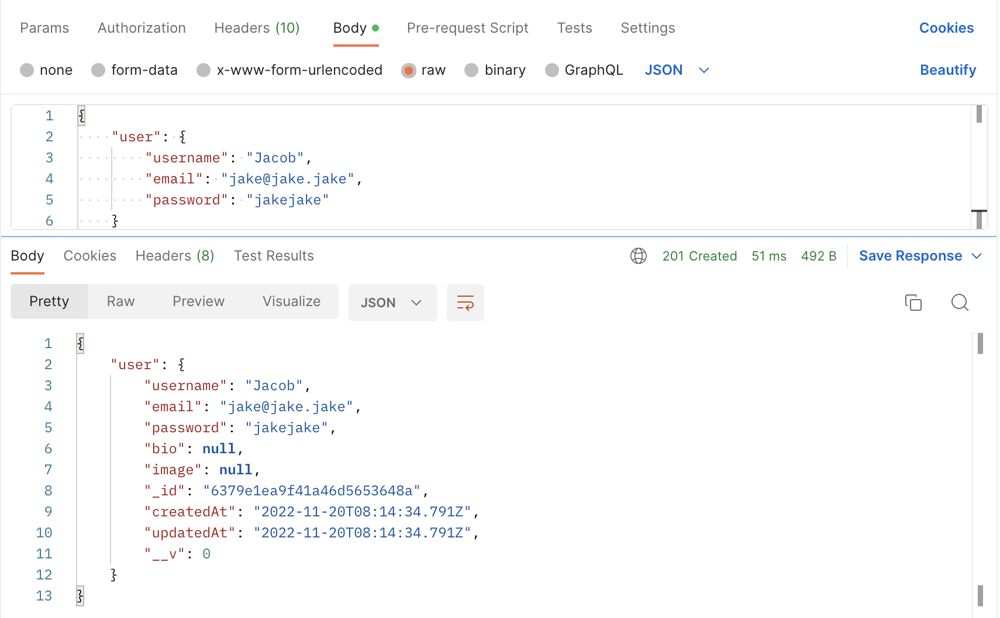
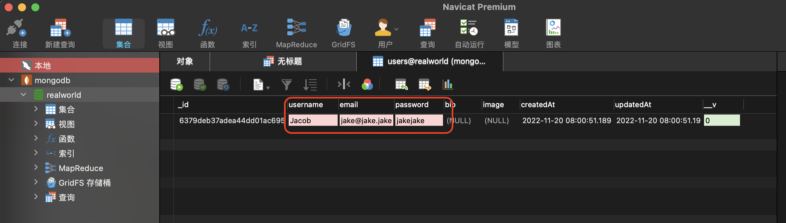
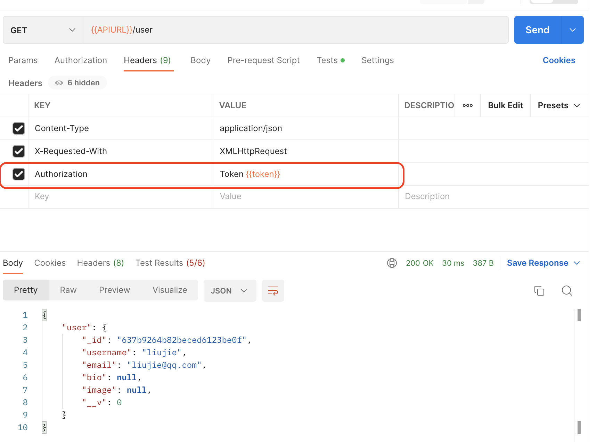
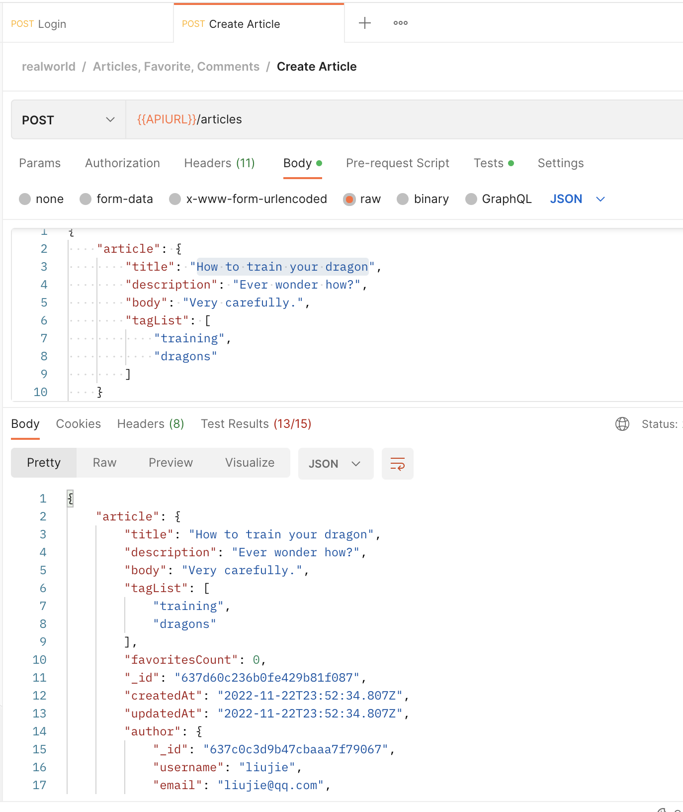

# 使用 Express 开发接口服务

实现 [realword](https://github.com/gothinkster/realworld) 项目后端[接口规范](https://realworld-docs.netlify.app/docs/specs/backend-specs/endpoints)的接口服务。

> realword 是一个示例应用，它演示了如何使用不同的前/后端技术（react，angulare，Node，Django 等）完成示例应用的开发。[有超过 100 中不同语言，框架，库的实现](https://codebase.show/projects/realworld)

## 创建项目

1. 创建项目文件夹

```shell
mkdir realworld-api-express
cd realworld-api-express
npm init -y
yarn add express
```

2. 创建项目目录结构

```shell
├── config	# 项目配置文件
│   └── config.default.js # 项目默认配置
├── controller	# 用于解析用户的输入，处理后返回相应的结果
├── model	# 数据持久层（比如对用户，文章的数据库操作）
├── middleware	# 用于编写中间件（管理项目通用中间件）
├── router	# 用于配置 URL 路由规则
├── util	# 工具模块（封装常用的辅助工具函数）
├── validator	# 验证模块（封装每个路由处理程序的验证函数）
└── app.js	# 用于自定义启动时的初始化工作
```

3. 编写项目启动入口文件 app.js

```js
const express = require("express");

// 从环境变量中读取PORT设置
const PORT = process.env.PORT || 3010;

const app = express();

app.get("/", function (req, res) {
  res.send("hello world");
});

app.listen(PORT, function () {
  console.log(`server start at http://localhost:${PORT}`);
});
```

> linux 设置环境变量并启动该 node 服务： PORT=4010 node app.js
> window 设置环境变量并启动该 node 服务： SET PORT=4010 node app.js

项目创建完毕后启动服务，然后使用 postman 或者 apifox 测试服务启动成功并成功响应。

## 配置常用中间件

1. 配置解析请求体中间件

支持客户端 JSON 数据格式请求体：

```js
app.use(express.json());
```

配置成功后，可以通过`req.body`获取客户端递交的 json 数据

支持客户端表单数据格式请求体：

```js
app.use(express.urlencoded());
```

配置成功后，可以通过`req.body`获取客户端递交的 表单 数据

2. 配置日志输出中间件，输出每个请求基本信息以及响应信息

```js
app.use(morgan("dev"));
```

配置后，控制台将输出类似：

POST / 200 18.183 ms - 17
[请求方法][请求路径][请求响应状态码][请求耗时][请求响应内容长度]

3. 为客户端提供跨域资源请求

```js
app.use(cors());
```

配置成功后，会自动为响应头信息设置`Access-Control-Allow-Origin：*`。

完成以上步骤配置后的入口文件 app.js 代码：

```js
const express = require("express");
const morgan = require("morgan");
const cors = require("cors");

const PORT = process.env.PORT || 3010;

const app = express();

app.use(morgan("dev"));
app.use(cors());
app.use(express.json());
app.use(express.urlencoded());

app.get("/", function (req, res) {
  res.send("hello world");
});

app.post("/", function (req, res) {
  res.send(req.body);
});

app.listen(PORT, function () {
  console.log(`server start at http://localhost:${PORT}`);
});
```

## 路由设计

> 参考官方文档说明: https://realworld-docs.netlify.app/docs/specs/backend-specs/endpoints

为了防止入口文件随着路由功能的添加变得臃肿，以及更加清晰的管理路由功能，我们可以将路由拆分到单独的模块中，每一类相关的功能（用户，文章等）放到一个单独的文件中。文件结构如下：

```shell
├── user.js	# 用户相关模块
├── article.js	# 文章相关模块
├── xxxx.js	# 其它路由文件模块
└── index.js	# 路由入口文件，绑定各个模块路由功能
```

1. 路由功能模块创建

```js
const express = require("express");

const router = express.Router();

// 用户登录功能
router.post("/users/login", async function (req, res, next) {
  try {
    // 登录逻辑处理
  } catch (error) {
    next(error);
  }
});

// ... 其它用户相关接口，参考realworld文档，比如：注册，获取当前用户信息等

module.exports = router;
```

以上为路由功能模块示例代码，其它的路由模块（比如用户资料，文章等）都是类似结构，只需要按照 realworld 接口规范完成功能路由注册。完成后，我们的应该有以下几个路由文件：

**user.js 路由文件：**

```js
const express = require("express");

const router = express.Router();

// 用户登录
router.post("/users/login", async function (req, res, next) {
  try {
    // 登录逻辑处理
    res.send("post /users/login");
  } catch (error) {
    next(error);
  }
});

// 用户注册
router.post("/users", async function (req, res, next) {
  try {
    // 注册逻辑处理
    res.send("post /users");
  } catch (error) {
    next(error);
  }
});

// 获取当前的登录用户
router.get("/user", async function (req, res, next) {
  try {
    // 获取当前的登录用户逻辑处理
    res.send("get /user");
  } catch (error) {
    next(error);
  }
});

// 更新用户
router.put("/user", async function (req, res, next) {
  try {
    // 更新用户逻辑处理
    res.send("put /user");
  } catch (error) {
    next(error);
  }
});

module.exports = router;
```

**profile.js 路由文件：**

```js
const express = require("express");

const router = express.Router();

// 根据用户名获取用户资料
router.get("/:username", async function (req, res, next) {
  try {
    // 逻辑处理
    res.send("get /profiles/:username");
  } catch (error) {
    next(error);
  }
});

// 关注用户
router.post("/:username/follow", async function (req, res, next) {
  try {
    // 逻辑处理
    res.send("get /profiles/:username/follow");
  } catch (error) {
    next(error);
  }
});

// 取消关注
router.delete("/:username", async function (req, res, next) {
  try {
    // 逻辑处理
    res.send("delete /profiles/:username/follow");
  } catch (error) {
    next(error);
  }
});

module.exports = router;
```

2. 将路由功能模块挂载到路由入口`router/index.js`中：

```js
const express = require("express");

const router = express.Router();

// 用户路由相关
router.use(require("./user"));

// 个人信息路由相关
router.use("/profiles", require("./profile"));

module.exports = router;
```

3. 将路由入口挂在到 app 中，删除创建项目时添加的路由功能：

```js
// app.js文件中

// 引入路由入口模块
const router = require("./router");

// 挂在路由中间件，baseUrl为 api
app.use("/api", router);
```

## 路由逻辑处理

当把路由和路由对应的逻辑处理函数放到一起时，会存在两个问题：

1. 当处理逻辑比较多时，路由模块文件变得很大
2. 不能很好的通过中间件来组织路由之间的相同的处理逻辑

所以，当应用如果比较复杂时，推荐将处理代码和路由分开，将处理函数单独封装放到 controller 目录下单独的模块中。文件结构如下：

```shell
├── user.js	# 用户相关处理函数模块
├── articles.js	# 文章相关处理函数模块
├── xxxx.js	# 其它处理函数模块
```

将`router/user.js`文件中的处理函数提取到`controller/user.js`中：

**controller/user.js** 文件内容如下：

```js
// 用户登录
exports.login = async function (req, res, next) {
  try {
    // 登录逻辑处理
    res.send("post /users/login");
  } catch (error) {
    next(error);
  }
};

// 用户注册
exports.register = async function (req, res, next) {
  try {
    // 注册逻辑处理
    res.send("post /users");
  } catch (error) {
    next(error);
  }
};

// 获取当前用户信息
exports.getCurrentUser = async function (req, res, next) {
  try {
    // 获取当前的登录用户逻辑处理
    res.send("get /user");
  } catch (error) {
    next(error);
  }
};

// 更新当前用户信息
exports.updateCurrentUser = async function (req, res, next) {
  try {
    // 更新用户逻辑处理
    res.send("put /user");
  } catch (error) {
    next(error);
  }
};
```

**router/user.js** 文件内容如下：

```js
const express = require("express");
const userCtrl = require("../controller/user");

const router = express.Router();

// 用户登录
router.post("/users/login", userCtrl.login);

// 用户注册
router.post("/users", userCtrl.register);

// 获取当前的登录用户
router.get("/user", userCtrl.getCurrentUser);

// 更新用户
router.put("/user", userCtrl.updateCurrentUser);

module.exports = router;
```

除了 user.js 模块，其它路由模块也同上述一样做相同的处理。

## 配置统一的错误处理中间件

在上面路由处理函数中，通过 try catch 捕获异常后传递给了 next 函数，这里我们可以自定义应用错误处理函数。

在 middleware 目录下新建 error-handle.js 文件：

```js
module.exports = () => {
  return (error, req, res, next) => {
    res.status(500).json({ error: error.toString() });
  };
};
```

注： 直接发送 error 时会出现`{}`，可以通过`error.toString()`或者 `node:util.format()`方法格式化 error，然后再返回给客户端。

在 app.js 中挂载错误处理中间件：

```js
const errorHandler = require("./middleware/error-handle");

app.use(errorHandler());
```

## 接口实现 - 前置准备

### 环境依赖

- 安装[Mongodb](../../../SQL/Mongodb/README.md)数据库
- 安装[Mongoose](../../../SQL/Mongoose/README.md)工具包（以对象模型操作 mongodb 的工具包）

### 数据操作文件初始化

为了方便对每个模型单独管理，可以将模型拆分到单独文件中。

```shell
├── user.js	# 用户
├── articles.js	#
├── xxxx.js	#
├── index.js	# model入口文件，用户连接数据库和导出schema
```

`model/index.js`初始化数据库连接以及导出各个模块 model。

```js
// model/index.js
const mongoose = require("mongoose");

main().catch((err) => console.log("MongoDB数据库错误", err));

async function main() {
  await mongoose.connect("mongodb://localhost:27017/realworld");

  console.log("MongoDB 数据库连接成功");
}

// 组织导出模型类
module.exports = {
  User: mongoose.model("user", require("./user")),
  //...
};
```

### 接口实现思路

实现接口服务一般会有以下几个操作：

1. 获取请求体数据
2. 数据验证
   1. 基本数据验证（例如，是否包含必须字段，字段格式是否正确等）
   2. 业务数据验证（例如，用户名是否重复等）
3. 验证通过后，将数据保存到数据库
4. 发送成功响应

## 实现用户注册

1. 设计 user 数据模型：

```js
const mongoose = require("mongoose");

const userSchema = new mongoose.Schema({
  userName: {
    type: String,
    required: true,
  },
  email: {
    type: String,
    required: true,
  },
  password: {
    type: String,
    required: true,
  },
  // 个人介绍
  bio: {
    type: String,
    default: null,
  },
  image: {
    type: String,
    default: null,
  },
  createdAt: {
    type: Date,
    default: Date.now,
  },
  updatedAt: {
    type: Date,
    default: Date.now,
  },
});

module.exports = userSchema;
```

2. 接收客户端请求数据并验证

日常开发中 mongodb 提供的数据校验是兜底验证，防止脏数据插入到库中，在接口开发时，我们应该对输入的数据进行逻辑验证后再保存到数据库中。

```js
const reqUser = req.body.user;
if (!reqUser.username) {
  return res.status(422).json({
    error: "缺少userName参数",
  });
}
if (!reqUser.email) {
  return res.status(422).json({
    error: "缺少email参数",
  });
}
if (!reqUser.password) {
  return res.status(422).json({
    error: "缺少password参数",
  });
}
// ...
```

3. 插入数据库

```js
const { User } = require("../model");

const user = new User(req.body.user);
// 数据保存到数据库中
await user.save();
```

4. 保存成功后，发送成功响应

```js
res.status(201).json({
  user,
});
```

查看注册成功后响应：


验证数据库插入的数据：


> 这里使用 Navicat Premium 可视化工具查看。

### 验证功能改造

上面验证的方式比较繁琐，可以使用[express-validator](https://www.npmjs.com/package/express-validator)工具包来优化验证功能。

该在 router/user.js 模块中，用户注册路由，在它前面添加验证功能，验证通过后再执行数据库操作逻辑：

```js
const express = require("express");
const { body, validationResult } = require("express-validator");
const userCtrl = require("../controller/user");
const { User } = require("../model");

const router = express.Router();

router.post(
  "/users",
  // 1. 配置验证规则
  [
    body("user.username")
      .notEmpty()
      .withMessage("用户名不能为空")
      .bail() // 如果前面验证失败，则停止运行验证
      // 自定义校验逻辑
      .custom(async (username) => {
        // 判断添加的邮箱是否重复
        const user = await User.findOne({ username });
        if (user) {
          return Promise.reject("用户名已存在");
        }
      }),
    body("user.password").notEmpty().withMessage("密码不能为空"),
    body("user.email")
      .notEmpty() // 不能为空
      .withMessage("邮箱不能为空") // 自定义消息内容
      .bail() // 如果前面验证失败，则停止运行验证
      // 自定义校验逻辑
      .custom(async (email) => {
        // 判断添加的邮箱是否重复
        const user = await User.findOne({ email });
        if (user) {
          return Promise.reject("邮箱已存在");
        }
      }),
  ],
  // 2. 判断验证结果
  (req, res, next) => {
    const errors = validationResult(req);
    if (!errors.isEmpty()) {
      return res.status(400).json({ errors: errors.array() });
    }
    next(); // 没有验证错误，继续后面的处理逻辑
  },
  // 3. 通过验证执行具体的控制器逻辑
  userCtrl.register
);
```

### 提取验证中间件模块

现在所有的验证逻辑都是放到 router 中，更好的方式是将验证逻辑放到单独的模块中，通过中间件的方式组织起来。

1. 封装验证中间件（[来自于官网验证中间件](https://express-validator.github.io/docs/running-imperatively.html)）：

```js
// middleware/validate.js
const express = require("express");
const { validationResult, ValidationChain } = require("express-validator");

const validate = (validations) => {
  return async (req, res, next) => {
    await Promise.all(validations.map((validation) => validation.run(req)));

    const errors = validationResult(req);
    if (errors.isEmpty()) {
      return next();
    }

    res.status(400).json({ errors: errors.array() });
  };
};
```

2. 提取验证逻辑到单独的模块中:

```js
// validator/user.js
const { body } = require("express-validator");
const validate = require("../middleware/validate");
const { User } = require("../model");

exports.register = validate([
  body("user.username")
    .notEmpty()
    .withMessage("用户名不能为空")
    .bail() // 如果前面验证失败，则停止运行验证
    // 自定义校验逻辑
    .custom(async (username) => {
      // 判断添加的邮箱是否重复
      const user = await User.findOne({ username });
      if (user) {
        return Promise.reject("用户名已存在");
      }
    }),
  body("user.password").notEmpty().withMessage("密码不能为空"),
  body("user.email")
    .notEmpty() // 不能为空
    .withMessage("邮箱不能为空") // 自定义消息内容
    .bail() // 如果前面验证失败，则停止运行验证
    // 自定义校验逻辑
    .custom(async (email) => {
      // 判断添加的邮箱是否重复
      const user = await User.findOne({ email });
      if (user) {
        return Promise.reject("邮箱已存在");
      }
    }),
]);
```

3. 路由中添加验证中间件。

```js
// ...
const validator = require("../validator/user");
router.post("/users", validator.register, userCtrl.register);
// ...
```

### 用户注册密码处理

注册时的密码都是明文保存到数据库，为了用户数据的安全，需要将用户密码加密后保存到数据库中。

数据加密的几种方式：

1. 使用 hash（md5）加密
2. 使用 hash（md5）加密 + 盐处理
3. 非对称加密，使用公钥加密传输数据，使用私钥解密数据。
4. bcrypt 库

更多密码加密内容，请阅读[密码加密](../../../密码加密.md)。

这里我们使用 [bcrypt](https://www.npmjs.com/package/bcrypt) 库来完成密码加密。

改造 user scheme，在保存到数据库时使用 bcrypt 加密：

```js
const bcrypt = require("bcrypt");
const userSchema = new mongoose.Schema({
  // ...
  password: {
    type: String,
    required: true,
    select: false, // 查询信息时过滤掉密码
    set(value) {
      return bcrypt.hashSync(value, 10);
    },
  },
  // ...
});
```

上面在 schema 配置中添加了`select:false`来过滤查询到的用户信息中包含的密码字段

## 实现用户登录

1. 编写用户登录验证逻辑

```js
// validator/user.js

// ...
exports.login = [
  validate([
    body("user.email").notEmpty().withMessage("邮箱不能为空"),
    body("user.password").notEmpty().withMessage("密码不能为空"),
  ]),
  //上面非空验证通过后，再确认用户名是否存在
  validate([
    body("user.email").custom(async (email, { req }) => {
      // 因为model中select:false,所以这里需要通过populate把密码填充回来
      const user = await User.findOne({ email }).populate("password");
      if (!user) {
        return Promise.reject("邮箱不存在");
      }
      // 存在则挂载用户信息方便接下来的中间件使用
      req.user = user;
    }),
  ]),
  // 用户名存在后，验证该用户的密码和传递的密码是否一致
  validate([
    body("user.password").custom(async (password, { req }) => {
      if (!bcrypt.compareSync(password, req.user.password)) {
        return Promise.reject("密码不正确");
      }
    }),
  ]),
];
```

2. 路由中添加验证中间件。

```js
// router/user.js

// ...
const validator = require("../validator/user");
router.post("/users/login", validator.login, userCtrl.login);
// ...
```

3. 返回用户信息

```js
// controller/user.js

// 用户登录
exports.login = async function (req, res, next) {
  try {
    // 登录逻辑处理
    // req.user 在验证的时候已经被挂载到 req 了
    res.status(200).json({
      user: {
        email: req.user.email,
        username: req.user.username,
        bio: req.user.bio,
        image: req.user.image,
      },
    });
  } catch (error) {
    next(error);
  }
};
```

### JWT 身份认证

http 是无状态的，为了知道每次请求的发起人是谁，可以在登录后返回一个 token（令牌） 的方式来标识用户，用户在每次请求时携带上这个 token 后，服务器就能知道这个 token 对应的用户信息。

> 关于 JWT 身份认证的使用，请查看[文档](../../../基于JWT的身份认证.md)

1. 封装 JWT 工具函数库：

```js
// util/jwt.js
const jwt = require("jsonwebtoken");
const { promisify } = require("util");

exports.sign = promisify(jwt.sign);

exports.verify = promisify(jwt.verify);
```

2. 使用 [uuid](https://www.uuid.online/) 随机生成一个 secret

```js
// config/config.default.js
module.exports = {
  secret: "3bc28927-1291-4d2d-a934-9c719ed746b8", // 随机生成的秘钥ID
};
```

3. 登录成功后，使用用户 id 生成 token 返回给客户端：

```js
// controller/user.js
const { sign } = require("../util/jwt");
const { secret } = require("../config/config.default");
exports.login = async function (req, res, next) {
  try {
    res.status(200).json({
      user: {
        email: req.user.email,
        username: req.user.username,
        // ... 其它需要返回的用户信息
        token: await sign(
          {
            id: req.user._id,
          },
          secret
        ),
      },
    });
  } catch (error) {
    next(error);
  }
};
```

4. 封装身份认证中间件：

```js
// middleware/auth.js
const { secret } = require("../config/config.default");
const { User } = require("../model");
const { verify } = require("../util/jwt");
module.exports = () =>
  async function (req, res, next) {
    const Authorization = req.get("Authorization");
    const token = Authorization ? Authorization.split(" ")[1] : "";
    if (!token) {
      return res.status(401).end();
    }
    try {
      const decoded = await verify(token, secret);
      // 为当前请求挂载用户信息，后续中间件可以直接使用
      req.user = await User.findById(decoded.id);
      next();
    } catch (error) {
      res.status(401).end();
    }
  };
```

5. 在需要身份认证的接口前添加身份认证中间件

```js
// router/user.js
const auth = require("../middleware/auth");
router.get("/user", auth(), userCtrl.getCurrentUser);
```

6. 在需要认证信息的接口请求 header 中添加`Authorization`头信息



## 实现创建文章

1. 设计 article 数据模型：

```js
const mongoose = require("mongoose");
// 模型公共字段，里面记录了updateTime和createTime的Schema字段配置
const baseModel = require("./base-model");

const articleSchema = new mongoose.Schema({
  ...baseModel,
  // 处理后的文章标题，文章ID
  slug: {
    type: String,
  },
  title: {
    type: String,
    required: true,
  },
  description: {
    type: String,
    required: true,
  },
  body: {
    type: String,
    required: true,
  },
  tagList: {
    type: [String], // 标签为stirng类型的数组
  },
  // 是否收藏
  favorited: {
    type: Boolean,
  },
  // 收藏数量
  favoritesCount: {
    type: Number,
    default: 0,
  },
  // 不能直接存储用户信息，如果用户信息变了，其它使用了地方都得变，不合理
  // 存储用户ID，查询时使用 .populate 填充用户信息
  author: {
    type: mongoose.Schema.Types.ObjectId,
    ref: "user",
    required: true,
  },
});

module.exports = articleSchema;
```

2. 添加创建文章路由:

因为创建文章需要鉴权（用户登录后才能操作），所以需要添加`auth`中间件。

```js
// router/article.js

const express = require("express");
const auth = require("../middleware/auth");
const validator = require("../validator/article");
const articleCtrl = require("../controller/article");

const router = express.Router();

// 创建文章
router.post("/", auth(), validator.createArticle, articleCtrl.createArticle);

module.exports = router;
```

3. 编写验证函数：

```js
// validator/article.js
const { body } = require("express-validator");
const validate = require("../middleware/validate");

exports.createArticle = validate([
  body("article.title").notEmpty().withMessage("文章标题不能为空"),
  body("article.description").notEmpty().withMessage("文章摘要不能为空"),
  body("article.body").notEmpty().withMessage("文章内容不能为空"),
]);
```

4. 编写控制器逻辑处理：

```js
// controller/article.js
const { Article } = require("../model");

// 创建文章
exports.createArticle = async function (req, res, next) {
  try {
    const article = new Article(req.body.article);
    // 设置当前文章作者为当前用户
    article.author = req.user._id;
    // 填充用户信息，返回给客户端
    article.populate("author");
    await article.save();
    res.status(200).json({
      article: article,
    });
  } catch (error) {
    next(error);
  }
};
```

在创建 article model 对象时，存储的是 author 的 id，因为需要返回 author 关联的文档信息，所以这里需要执行`populate`操作，操作后 article model 对象中的 author 数据为 user 表中的用户文档信息。

注：因为创建文章需要鉴权，所以在添加数据时，需要将 login 接口返回的 token 添加到 header 中。



## 实现根据文章 ID 获取文章

1. 添加路由

```js
// router/article.js

// 获取文章
router.get("/:articleId", validator.getArticle, articleCtrl.getArticle);
```

2. 编写验证函数：

传入的文章 ID 可能不是有效的 Mongondb ID 导致查询报错，所以这里添加判断是否是 mongodb objectId 的判断。

```js
// validator/article.js
const mongoose = require("mongoose");
const { param } = require("express-validator");

exports.getArticle = validate([
  param("articleId").custom(async (value) => {
    if (!mongoose.isValidObjectId(value)) {
      return Promise.reject("文章ID类型错误");
    }
  }),
]);
```

3. 添加控制器处理逻辑

```js
// controller/article.js
const { Article } = require("../model");
exports.getArticle = async function (req, res, next) {
  try {
    // 返回文章信息中的user信息依然要使用populate来填充
    const article = await Article.findById(req.params.articleId).populate(
      "author"
    );
    if (article) {
      res.status(200).json({
        article: article,
      });
    } else {
      res.status(404).end();
    }
  } catch (error) {
    next(error);
  }
};
```

## 实现获取所有文章

1. 添加路由

```js
// router/article.js

// 获取所有文章
router.get("/", articleCtrl.getAllArticle);
```

2. 添加控制器处理逻辑

```js
// controller/article.js
const { Article, User } = require("../model");
exports.getAllArticle = async function (req, res, next) {
  try {
    const filter = {};
    const { author, limit = 20, offset = 0, tag } = req.query;
    // 筛选作者相关
    if (author) {
      const user = await User.findOne({ username: author });
      if (user) {
        filter.author = user._id;
      }
    }
    // 筛选分类相关
    if (tag) {
      filter.tagList = tag;
    }
    const [articlesCount, articles] = await Promise.all([
      Article.find(filter).countDocuments(),
      Article.find(filter)
        .populate("author")
        .skip(parseInt(offset)) // 跳过多少条
        .limit(parseInt(limit)) // 取多少条
        .sort({ createdAt: -1 }), // 按降序排序（-1降序，1升序），最新的文章在最前面
    ]);
    res.status(200).json({
      articles,
      articlesCount,
    });
  } catch (error) {
    next(error);
  }
};
```

要点概述：

- 使用 User 模型查询 username 对应的 userId
- 传递的 tag 数据去筛选 tagList 中包含的文章数据
- 使用`offset()`，`skip()`完成分页功能
- 使用`sort()`对查询结果排序

## 实现根据文章 ID 更新文章

1. 添加路由

```js
// router/article.js

router.put(
  "/:articleId",
  auth(),
  validator.updateArticle,
  articleCtrl.updateArticle
);
```

2. 编写验证函数，验证文章 ID 是否是有效的 ObjectId。

因为获取文章的接口中也验证了文章 ID，可以将逻辑封装提取一下：

```js
// util/validate.js

const mongoose = require("mongoose");
const { buildCheckFunction } = require("express-validator");

exports.isValidObjectId = (location, field) => {
  return buildCheckFunction(location)(field).custom(async (value) => {
    if (!mongoose.isValidObjectId(value)) {
      return Promise.reject("ID 不是一个有效的 ObejctId");
    }
  });
};
```

```js
// validator/article.js
exports.updateArticle = validate([
  // 验证文章id的有效性
  validateUtil.isValidObjectId(["params"], "articleId"),
]);
```

3. 编写更新文章控制器逻辑

a. 查询文章 ID 对应文章是否存在，不存在返回 404
b. 查看文章是否是当前登录用户的，不是当前用户的文章返回 403
c. 执行更新操作 & 保存到数据库
d. 返回响应

```js
exports.updateArticle = async function (req, res, next) {
  try {
    // 1. 查看文章是否存在
    const { articleId } = req.params;
    const article = await Article.findById(articleId);
    if (!article) {
      return res.status(404).end();
    }
    // 2. 查看文章是否是当前登录用户的
    if (article.author.toString() !== req.user._id.toString()) {
      return res.status(403).end();
    }
    // 3. 执行更新操作
    const {
      article: { title, body, description },
    } = req.body;
    if (title) {
      article.title = title;
    }
    if (body) {
      article.body = body;
    }
    if (description) {
      article.description = description;
    }
    // 保存到数据库
    article.save();
    // 4. 返回响应
    res.status(200).send({
      article,
    });
  } catch (error) {
    next(error);
  }
};
```

## 实现根据文章 ID 删除文章

删除文章同更新文章一样需要校验文章 ID，文章 ID 对应的文章是否存在，以及文章是否是自己的文章。这里提取对应功能成为独立中间件，方便更新和删除文章时复用。

校验文章是否存在中间件：

```js
async function articleExist(req, res, next) {
  try {
    // 1. 查看文章是否存在
    const { articleId } = req.params;
    const article = await Article.findById(articleId);
    req.article = article;
    if (!article) {
      return res.status(404).end();
    }
    next();
  } catch (error) {
    next(error);
  }
}
```

校验文章是否是自己的中间件：

```js
async function articleOwn(req, res, next) {
  // 2. 查看文章是否是当前登录用户的
  if (req.article.author.toString() !== req.user._id.toString()) {
    return res.status(403).end();
  }
  next();
}
```

组合中间件完成删除逻辑

```js
exports.deleteArticle = [
  articleExist,
  articleOwn,
  async function (req, res) {
    try {
      // 3. 执行删除操作
      await req.article.remove();
      res.status(200).end();
    } catch (error) {
      next(error);
    }
  },
];
```
