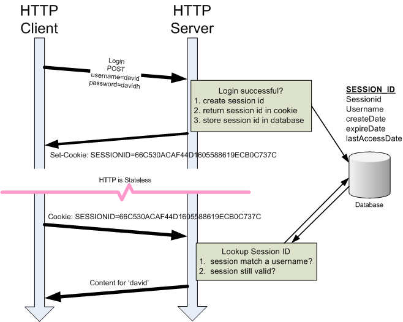

# Express 开发 realword 网站

> realword 是一个示例应用，它演示了如何使用不同的前/后端技术（react，angulare，Node，Django 等）完成示例应用的开发。[有超过 100 中不同语言，框架，库的实现](https://codebase.show/projects/realworld)

## 创建项目

1. 创建项目文件夹

```bash
mkdir realword-backend && cd  realword-backend
npm init -y
npm install express
```

2. 创建项目目录结构

```shell
├── config	# 项目配置文件
│   └── config.default.js # 项目默认配置
├── controller	# 用于解析用户的输入，处理后返回相应的结果
├── model	# 数据持久层（比如对用户，文章的数据库操作）
├── middleware	# 用于编写中间件（管理项目通用中间件）
├── router	# 用于配置 URL 路由规则
├── util	# 工具模块（封装常用的辅助工具函数）
├── validator	# 验证模块（封装每个路由处理程序的验证函数）
└── app.js	# 用于自定义启动时的初始化工作
```

3. 编写项目启动入口文件 app.js

```js
const express = require("express");

// 从环境变量中读取PORT设置
const PORT = process.env.PORT || 3010;

const app = express();

app.get("/", function (req, res) {
  res.send("hello world");
});

app.listen(PORT, function () {
  console.log(`server start at http://localhost:${PORT}`);
});
```

> linux 设置环境变量并启动该 node 服务： PORT=4010 node app.js
> window 设置环境变量并启动该 node 服务： SET PORT=4010 node app.js

## 配置常用中间件

1. 配置解析请求体中间件

支持客户端 JSON 数据格式请求体：

```js
app.use(express.json());
```

配置成功后，可以通过`req.body`获取客户端递交的 json 数据

支持客户端表单数据格式请求体：

```js
app.use(express.urlencoded());
```

配置成功后，可以通过`req.body`获取客户端递交的 表单 数据

2. 配置日志输出中间件，输出每个请求基本信息以及响应信息

```js
app.use(morgan("dev"));
```

配置后，控制台将输出类似：

POST / 200 18.183 ms - 17
[请求方法][请求路径][请求响应状态码][请求耗时][请求响应内容长度]

3. 配置错误处理中间件，在开发时当服务器发生错误后提供的一个友好的错误提示页。

```js
const errorhandler = require("errorhandler");
// 只在开发场景下生效
if (process.env.NODE_ENV === "development") {
  app.use(errorhandler());
}
```

4. 配置模版引擎(这里使用[ejs](https://www.npmjs.com/package/ejs)，也可以选择其它如[art-template](https://www.npmjs.com/package/art-template)，[pug](https://www.npmjs.com/package/pug)等)。

```js
// 设置默认模版引擎
app.set("view engine", "ejs");
// 设置模版页面默认目录
app.set("views", path.join(__dirname, "./views"));
```

完成以上步骤配置后的入口文件 app.js 代码：

```js
const express = require("express");
const morgan = require("morgan");

const PORT = process.env.PORT || 3010;

const app = express();

// 记录请求信息
app.use(morgan("dev"));
// 解析请求参数
app.use(express.json());
app.use(express.urlencoded());

// 错误处理
if (process.env.NODE_ENV === "development") {
  app.use(errorhandler());
}

app.get("/", function (req, res) {
  res.send("hello world");
});

app.listen(PORT, function () {
  console.log(`server start at http://localhost:${PORT}`);
});
```

## 添加页面路由

realword 提供了[路由指南](https://realworld-docs.netlify.app/docs/specs/frontend-specs/routing)，按照指南方式配置页面路由。例如：

用户相关页面路由：

```js
//router/user.js

// 登录页面
router.get("/login", function (req, res) {
  // 因为注册和登录共用一个模版，所以需要传入一个变量在渲染时区分
  res.render("login", { isLogin: true });
});

// 注册页面
router.get("/register", function (req, res) {
  res.render("register");
});
```

文章相关页面路由：

```js
//router/article.js

// 首页
router.get("/", function (req, res) {
  res.render("index");
});
```

添加路由入口页面，统一管理所有的路由：

```js
//router/index.js
const express = require("express");
const router = express.Router();

// 用户页面相关
router.use(require("./user"));

// 文章页面相关
router.use(require("./article"));

module.exports = router;
```

注意，别忘记将路由挂载到 app 实例中

```js
const router = require("./router");
// 挂载路由
app.use(router);
```

## 编写模版页面

realword 提供了[模版片段](https://realworld-docs.netlify.app/docs/specs/frontend-specs/routing)。

### 页面头部

```html
<!-- views/layout/header.ejs -->
<!DOCTYPE html>
<html>
  <head>
    <meta charset="utf-8" />
    <title>Conduit</title>
    <!-- Import Ionicon icons & Google Fonts our Bootstrap theme relies on -->
    <link
      href="//code.ionicframework.com/ionicons/2.0.1/css/ionicons.min.css"
      rel="stylesheet"
      type="text/css"
    />
    <link
      href="//fonts.googleapis.com/css?family=Titillium+Web:700|Source+Serif+Pro:400,700|Merriweather+Sans:400,700|Source+Sans+Pro:400,300,600,700,300italic,400italic,600italic,700italic"
      rel="stylesheet"
      type="text/css"
    />
    <!-- Import the custom Bootstrap 4 theme from our hosted CDN -->
    <link rel="stylesheet" href="//demo.productionready.io/main.css" />
  </head>
  <body>
    <nav class="navbar navbar-light">
      <div class="container">
        <a class="navbar-brand" href="index.html">conduit</a>
        <ul class="nav navbar-nav pull-xs-right">
          <li class="nav-item">
            <!-- Add "active" class when you're on that page" -->
            <a class="nav-link active" href="/">Home</a>
          </li>
          <li class="nav-item">
            <a class="nav-link" href="/editor">
              <i class="ion-compose"></i>&nbsp;New Article
            </a>
          </li>
          <li class="nav-item">
            <a class="nav-link" href="/settings">
              <i class="ion-gear-a"></i>&nbsp;Settings
            </a>
          </li>
          <li class="nav-item">
            <a class="nav-link" href="/login">Sign in</a>
          </li>
          <li class="nav-item">
            <a class="nav-link" href="/register">Sign up</a>
          </li>
        </ul>
      </div>
    </nav>
  </body>
</html>
```

### 页面尾部

```html
<!-- views/layout/footer.ejs -->
<footer>
    <div class="container">
        <a href="/" class="logo-font">conduit</a>
        <span class="attribution">
          An interactive learning project from <a href="https://thinkster.io">Thinkster</a>. Code &amp; design licensed under MIT.
        </span>
    </div>
</footer>

</body>
</html>
```

### 登录注册页

```html
<!-- views/login.ejs -->
<%- include('layout/header') %>
<div class="auth-page">
  <div class="container page">
    <div class="row">
      <div class="col-md-6 offset-md-3 col-xs-12">
        <h1 class="text-xs-center">
          <%= locals.isLogin ? "Sign in" : "Sign up" %>
        </h1>
        <p class="text-xs-center">
          <% if(locals.isLogin) { %>
          <a href="/register">Need an account?</a>
          <% } else { %>
          <a href="/login">Have an account?</a>
          <% } %>
        </p>

        <% if (typeof(errors) !== "undefined" && errors) { %>
        <ul class="error-messages">
          <% errors.forEach(error=>{ %>
          <li><%= error.msg %></li>
          <% }) %>
        </ul>
        <% } %>

        <form action="/register" method="post">
          <% if(!locals.isLogin) { %>
          <fieldset class="form-group">
            <input
              class="form-control form-control-lg"
              type="text"
              name="user[username]"
              placeholder="Your Name"
            />
          </fieldset>
          <% } %>
          <fieldset class="form-group">
            <input
              class="form-control form-control-lg"
              type="text"
              name="user[email]"
              placeholder="Email"
            />
          </fieldset>
          <fieldset class="form-group">
            <input
              class="form-control form-control-lg"
              type="password"
              name="user[password]"
              placeholder="Password"
            />
          </fieldset>
          <button type="submit" class="btn btn-lg btn-primary pull-xs-right">
            <%= locals.isLogin ? "Sign in" : "Sign up" %>
          </button>
        </form>
      </div>
    </div>
  </div>
</div>
<%- include('layout/footer') %>
```

### 首页

```html
<!-- views/index.ejs -->

<%- include('layout/header') %>
<div class="home-page">
  <div class="banner">
    <div class="container">
      <h1 class="logo-font">conduit</h1>
      <p>A place to share your knowledge.</p>
    </div>
  </div>

  <div class="container page">
    <div class="row">
      <div class="col-md-9">
        <div class="feed-toggle">
          <ul class="nav nav-pills outline-active">
            <li class="nav-item">
              <a class="nav-link disabled" href="">Your Feed</a>
            </li>
            <li class="nav-item">
              <a class="nav-link active" href="">Global Feed</a>
            </li>
          </ul>
        </div>

        <div class="article-preview">
          <div class="article-meta">
            <a href="profile.html"
              ></a>
            <div class="info">
              <a href="" class="author">Eric Simons</a>
              <span class="date">January 20th</span>
            </div>
            <button class="btn btn-outline-primary btn-sm pull-xs-right">
              <i class="ion-heart"></i> 29
            </button>
          </div>
          <a href="" class="preview-link">
            <h1>How to build webapps that scale</h1>
            <p>This is the description for the post.</p>
            <span>Read more...</span>
          </a>
        </div>

        <div class="article-preview">
          <div class="article-meta">
            <a href="profile.html"
              ></a>
            <div class="info">
              <a href="" class="author">Albert Pai</a>
              <span class="date">January 20th</span>
            </div>
            <button class="btn btn-outline-primary btn-sm pull-xs-right">
              <i class="ion-heart"></i> 32
            </button>
          </div>
          <a href="" class="preview-link">
            <h1>
              The song you won't ever stop singing. No matter how hard you try.
            </h1>
            <p>This is the description for the post.</p>
            <span>Read more...</span>
          </a>
        </div>
      </div>

      <div class="col-md-3">
        <div class="sidebar">
          <p>Popular Tags</p>

          <div class="tag-list">
            <a href="" class="tag-pill tag-default">programming</a>
            <a href="" class="tag-pill tag-default">javascript</a>
            <a href="" class="tag-pill tag-default">emberjs</a>
            <a href="" class="tag-pill tag-default">angularjs</a>
            <a href="" class="tag-pill tag-default">react</a>
            <a href="" class="tag-pill tag-default">mean</a>
            <a href="" class="tag-pill tag-default">node</a>
            <a href="" class="tag-pill tag-default">rails</a>
          </div>
        </div>
      </div>
    </div>
  </div>
</div>
<%- include('layout/footer') %>
```

其它页面模版前参考 realworld [模版片段](https://realworld-docs.netlify.app/docs/specs/frontend-specs/routing)。

## 提取路由控制器模块

为了保证代码的易读和可维护性，可以将路由对应的实业务逻辑分离到单独的模块中。例如：

用户路由控制器模块：

```js
// controller/user.js
export.showLogin = async function(req,res){
  try {
    res.render("login", { isLogin: true });
  } catch (err) {
    next(err);
  }
}

exports.showRegister = async function (req, res, next) {
  try {
    res.render("login");
  } catch (err) {
    next(err);
  }
};

// ... 其它功能快
```

用户路由模块：

```js
// router/user.js
const userCtrl = require("../controller/user");
router.get("/login", userCtrl.showLogin);
router.get("/register", userCtrl.showRegister);
// ...其它路由
```

## 解决资源加载缓慢问题

模版中提供的外部 css 资源加载缓慢，可以将其下载到本地托管。

1.  新建`/public/css/main.css`文件存放`//demo.productionready.io/main.css`文件
2.  安装 ionicons(`npm install ionicons@2.0.1`)包来替换`//code.ionicframework.com/ionicons/2.0.1/css/ionicons.min.css`文件
3.  配置静态资源加载中间件。

    ```js
    app.use("/public", express.static(path.join(__dirname, "./public")));
    app.use(
      "/node_modules",
      express.static(path.join(__dirname, "./node_modules"))
    );
    ```

4.  修改资源引用链接`//demo.productionready.io/main.css`为`/public/css/main.css`
5.  修改资源饮用链接`//code.ionicframework.com/ionicons/2.0.1/css/ionicons.min.css`为`/node_modules/ionicons/css/ionicons.min.css`

至此，应该得到了一个可以通过 nodejs 驱动的纯静态应用，存在的一下几个路由页面：

1. [首页](http://localhost:3010/)
2. [登录页](http://localhost:3010/login)
3. [注册页](http://localhost:3010/register)
4. [设置页](http://localhost:3010/settings)
5. [添加文章页](http://localhost:3010/editor)
6. [个人简介页](http://localhost:3010/profile/123)

## 功能实现 - 前置准备

### 环境依赖

- 安装[Mongodb](../../../SQL/Mongodb/README.md)数据库
- 安装[Mongoose](../../../SQL/Mongoose/README.md)工具包（以对象模型操作 mongodb 的工具包）

### 数据操作文件初始化

为了方便对每个模型单独管理，可以将模型拆分到单独文件中。

```shell
├── user.js	# 用户
├── articles.js	#
├── xxxx.js	#
├── index.js	# model入口文件，用户连接数据库和导出schema
```

`model/index.js`初始化数据库连接以及导出各个模块 model。

```js
// model/index.js
const mongoose = require("mongoose");

main().catch((err) => console.log("MongoDB数据库错误", err));

async function main() {
  await mongoose.connect("mongodb://localhost:27017/realworld");

  console.log("MongoDB 数据库连接成功");
}
```

## 实现用户注册功能

### 设计 user 数据模型：

```js
// model/user.js
const mongoose = require("mongoose");

const userSchema = new mongoose.Schema({
  userName: {
    type: String,
    required: true,
  },
  email: {
    type: String,
    required: true,
  },
  password: {
    type: String,
    required: true,
  },
  // 个人介绍
  bio: {
    type: String,
    default: null,
  },
  image: {
    type: String,
    default: null,
  },
  createdAt: {
    type: Date,
    default: Date.now,
  },
  updatedAt: {
    type: Date,
    default: Date.now,
  },
});

module.exports = userSchema;
```

这里参考 realworld [用户注册接口](https://realworld-docs.netlify.app/docs/specs/backend-specs/endpoints#registration)设计。

### 导出 User 模型

在 `model/index.js` 入口文件中统一导出所有数据模型

```js
// model/index.js
// 组织导出模型类
module.exports = {
  User: mongoose.model("user", require("./user")),
  //...
};
```

### 用户注册数据提交

提交数据有两种方式：

- 传统应用中 form 表单提交方式
- 使用 ajax 异步提交表单

为了更好的说明传统应用中数据交互的方式，下面会分别介绍这 2 种模式，了解到这两种模式开发时，前后端需要做的具体工作时什么样子的：

#### 方式一：使用 form 表单提交数据完成注册

编写 html 表单模版

```html
<% if (typeof(errors) !== "undefined" && errors) { %>
<ul class="error-messages">
  <% errors.forEach(error=>{ %>
  <li><%= error %></li>
  <% }) %>
</ul>
<% } %>

<form action="/register" method="post">
  <% if(!locals.isLogin) { %>
  <fieldset class="form-group">
    <input
      class="form-control form-control-lg"
      type="text"
      name="user[username]"
      placeholder="Your Name"
    />
  </fieldset>
  <% } %>
  <fieldset class="form-group">
    <input
      class="form-control form-control-lg"
      type="text"
      name="user[email]"
      placeholder="Email"
    />
  </fieldset>
  <fieldset class="form-group">
    <input
      class="form-control form-control-lg"
      type="password"
      name="user[password]"
      placeholder="Password"
    />
  </fieldset>
  <button type="submit" class="btn btn-lg btn-primary pull-xs-right">
    <%= locals.isLogin ? "Sign in" : "Sign up" %>
  </button>
</form>
```

> 💡 提示：
>
> - ejs 模版中的变量必须要在 res.render()中给出，否则会报变量未定义的错误。解决方式有 2 种：a. 使用`typeof(变量名) !== "undefined"`判断后再使用该变量。例如：`if(typeof(errors) !=="undefined" && errors){  //逻辑... }`。b. 使用 express 使用在模版中提供的`locals`对象来访问变量。例如：`if(locals.error){ // 逻辑... }`
>
> - `express.urlencoded()`能够解析 form 表单 name 属性的嵌套语法。例如，表单中的 name 可以这样写 `name="user[username]"`

编写注册路由逻辑：

```js
// router/user.js
const userCtrl = require("../controller/user");

router.get("/register", userCtrl.showRegister);

router.post("/register", userCtrl.register);
```

编写注册控制器逻辑：

```js
// controller/user.js

exports.showRegister = async function (req, res, next) {
  try {
    res.render("login");
  } catch (err) {
    next(err);
  }
};

exports.register = async function (req, res, next) {
  try {
    const { user = {} } = req.body;
    const errors = [];
    if (!user.username) {
      errors.push("用户名不能为空");
    }
    if (!user.email) {
      errors.push("邮箱不能为空");
    }
    if (!user.password) {
      errors.push("密码不能为空");
    }
    if (errors.length > 0) {
      return res.render("login", { errors });
    }
    // 执行数据保存到数据库操作
    const userModel = new User(user);
    // 数据保存到数据库中
    await userModel.save();
    // 注册成功，返回到登陆页，重新登录
    res.redirect("/login");
  } catch (err) {
    next(err);
  }
};
```

#### 方式二：使用 ajax 异步提交表单数据完成注册

为了快速完成开发，这里使用 vue 和 axios 来完成功能。

1. 首先安装 vue， axios:

```bash
npm install vue axios
```

2. 在 footer.ejs 模版中全局引入 vue 和 axios：

```html
<script src="/node_modules/vue/dist/vue.global.prod.js"></script>
<script src="/node_modules/axios/dist/axios.min.js"></script>
```

由于前面已经配置过加载 node_modules 下的静态资源，所以可以直接引入 node_modules 文件下的安装的工具包。

3. 编写 login.ejs 模版：

```html
<ul class="error-messages">
  <li v-for="error in errors">{{ error }}</li>
</ul>

<form @submit.prevent="handleSubmit">
  <% if(!locals.isLogin) { %>
  <fieldset class="form-group">
    <input
      class="form-control form-control-lg"
      type="text"
      placeholder="Your Name"
      v-model="user.username"
    />
  </fieldset>
  <% } %>
  <fieldset class="form-group">
    <input
      class="form-control form-control-lg"
      type="text"
      placeholder="Email"
      v-model="user.email"
    />
  </fieldset>
  <fieldset class="form-group">
    <input
      class="form-control form-control-lg"
      type="password"
      placeholder="Password"
      v-model="user.password"
    />
  </fieldset>
  <button type="submit" class="btn btn-lg btn-primary pull-xs-right">
    <%= locals.isLogin ? "Sign in" : "Sign up" %>
  </button>
</form>
<script>
  Vue.createApp({
    data() {
      return {
        user: {
          username: "",
          email: "",
          password: "",
        },
        errors: [],
      };
    },
    methods: {
      async handleSubmit() {
        // 1. 客户端表单验证
        // 2. 验证通过，提交表单
        try {
          // axios 默认提交的数据格式 application/json
          const url =
            window.location.pathname === "/login" ? "/login" : "/register";

          const { data } = await axios.post(url, {
            user: this.user,
          });

          // 清除错误信息
          this.errors = [];

          // 跳转到首页
          window.location.href = "/";
        } catch (err) {
          if (err.response.status === 400) {
            this.errors = err.response.data.errors;
          }
        }
      },
    },
  }).mount("#login");
</script>
```

4. 编写 node 处理注册数据逻辑

```js
// controller/user.js
exports.register = async function (req, res, next) {
  try {
    const { user = {} } = req.body;
    const errors = [];
    // 1. 数据验证
    if (!user.username) {
      errors.push("用户名不能为空");
    }
    if (!user.email) {
      errors.push("邮箱不能为空");
    }
    if (!user.password) {
      errors.push("密码不能为空");
    }
    if (errors.length > 0) {
      return res.status(400).json({ errors });
    }
    // 2. 验证通过，创建新用户
    // 执行数据保存到数据库操作
    let userModel = new User(user);
    // 数据保存到数据库中
    await userModel.save();
    // 过滤密码字段，不应该返回到客户端
    userModel = user.toJSON();
    delete userModel["password"];
    // 注册成功，返回用户信息
    res.status(201).send({ user: userModel });
  } catch (err) {
    next(err);
  }
};
```

注意，这里在注册成功/失败后就是不直接重新渲染页面了，而是通过返回错误信息，交给前端 vue 去控制页面的渲染。

### 验证逻辑优化

对提交的数据进行验证是在保存数据之前的基本操作，上面的验证方式比较琐碎，可以借助三方工具包如（[validator](https://www.npmjs.com/package/validator),[joi](https://www.npmjs.com/package/joi)）来提高验证效率。

下面我将使用[express-validator](https://www.npmjs.com/package/express-validator)工具来对接受的数据进行验证：

```js
const { body, validationResult } = require("express-validator");
const { User } = require("../model");
router.post(
  "/register",
  body("user.username")
    .notEmpty()
    .withMessage("用户名不能为空")
    .isString()
    .withMessage("用户名必须是字符串")
    .bail() // 如果前面验证失败，则停止运行验证
    // 自定义校验逻辑
    .custom(async (username) => {
      // 判断添加的邮箱是否重复
      const user = await User.findOne({ username });
      if (user) {
        return Promise.reject("用户名已存在");
      }
    }),
  body("user.password").notEmpty().withMessage("密码不能为空"),
  body("user.email")
    .notEmpty() // 不能为空
    .withMessage("邮箱不能为空") // 自定义消息内容
    .isEmail()
    .withMessage("邮箱格式不正确")
    .bail() // 如果前面验证失败，则停止运行验证
    // 自定义校验逻辑
    .custom(async (email) => {
      // 判断添加的邮箱是否重复
      const user = await User.findOne({ email });
      if (user) {
        return Promise.reject("邮箱已存在");
      }
    }),
  async (req, res, next) => {
    const errors = validationResult(req);
    if (!errors.isEmpty()) {
      return res.status(400).json({ errors: errors.array() });
    }
    const { user = {} } = req.body;
    // 2. 验证通过，创建新用户
    // 执行数据保存到数据库操作
    let userModel = new User(user);
    // 数据保存到数据库中
    await userModel.save();
    // 过滤密码字段，不应该返回到客户端
    userModel = user.toJSON();
    delete userModel["password"];

    // 3. 注册成功，返回用户信息
    res.status(201).send({ user: userModel });
  }
);
```

上面的处理逻辑比较冗长，并且将验证逻辑和路由放到一起，为了代码的易读和可维护性，可以将验证器提取到单独的模块中：

```js
// validator/user.js
const { body } = require("express-validator");
const { User } = require("../model");
exports.registerRules = [
  body("user.username")
    .notEmpty()
    .withMessage("用户名不能为空")
    .isString()
    .withMessage("用户名必须是字符串")
    .bail() // 如果前面验证失败，则停止运行验证
    // 自定义校验逻辑
    .custom(async (username) => {
      // 判断添加的邮箱是否重复
      const user = await User.findOne({ username });
      if (user) {
        return Promise.reject("用户名已存在");
      }
    }),
  body("user.password").notEmpty().withMessage("密码不能为空"),
  body("user.email")
    .notEmpty() // 不能为空
    .withMessage("邮箱不能为空") // 自定义消息内容
    .isEmail()
    .withMessage("邮箱格式不正确")
    .bail() // 如果前面验证失败，则停止运行验证
    // 自定义校验逻辑
    .custom(async (email) => {
      // 判断添加的邮箱是否重复
      const user = await User.findOne({ email });
      if (user) {
        return Promise.reject("邮箱已存在");
      }
    }),
];
```

在此基础上可以封装 `express-validator` 错误结果处理中间件，统一处理验证结果：

```js
// middleware/validate.js
const { validationResult } = require("express-validator");

module.exports = (validations) => {
  return async (req, res, next) => {
    await Promise.all(validations.map((validation) => validation.run(req)));

    const errors = validationResult(req);
    if (errors.isEmpty()) {
      return next();
    }

    res.status(400).json({ errors: errors.array() });
  };
};
```

因此，对外就可以提供用户注册验证中间件：

```js
// validator/user.js
const validate = require("../middleware/validate");
exports.register = validate(registerRules);
```

在注册的路由处理中间件中，直接添加上面导出的验证中间件：

```js
// router/user.js
const validator = require("../validator/user");
const userCtrl = require("../controller/user");
router.post("/register", validator.register, userCtrl.register);
```

在控制器中，只用关心验证通过后的处理逻辑：

```js
// controller/user.js
exports.register = async function (req, res, next) {
  try {
    const { user = {} } = req.body;
    // 2. 验证通过，创建新用户
    // 执行数据保存到数据库操作
    let userModel = new User(user);
    // 数据保存到数据库中
    await userModel.save();
    // 过滤密码字段，不应该返回到客户端
    userModel = userModel.toJSON();
    delete userModel["password"];

    // 3. 注册成功，返回用户信息
    res.status(201).send({ user: userModel });
  } catch (err) {
    next(err);
  }
};
```

### 密码加密处理

注册时的密码都是明文保存到数据库，为了用户数据的安全，需要将用户密码加密后保存到数据库中。

数据加密的几种方式：

1. 使用 hash（md5）加密
2. 使用 hash（md5）加密 + 盐处理
3. 非对称加密，使用公钥加密传输数据，使用私钥解密数据。
4. bcrypt 库

更多密码加密内容，请阅读[密码加密](../../../密码加密.md)。

这里我们使用 [bcrypt](https://www.npmjs.com/package/bcrypt) 库来完成密码加密。

改造 user scheme，在保存到数据库时使用 bcrypt 加密：

```js
const bcrypt = require("bcrypt");
const userSchema = new mongoose.Schema({
  // ...
  password: {
    type: String,
    required: true,
    select: false, // 查询信息时过滤掉密码
    set(value) {
      return bcrypt.hashSync(value, 10);
    },
  },
  // ...
});
```

上面在 schema 配置中添加了`select:false`来过滤**查询**到的用户信息中包含的密码字段。

### 登录状态保持 - session 方案

session 是一种将数据存储在服务器（内存，文件，数据库，另一台服务器等）上的方式。它会创建唯一的 session id 来与服务器存储的数据关联，当用户请求时如果请求头中的 cookie 中没有包含 session id 时，它会自动为这一次的请求的响应头中添加 cookie 设置，将创建的 session id 发送给客户端，下次请求客户端会自动携带这个 session id，因此也就能找到与这个 session id 的关联的数据信息了。



#### express-session vs cookie-session

express 官方提供了这两个工具库都是用于存储 session 数据的，主要的区别在于如何保存 session 数据：

express-session 在服务器上存储会话数据; 它只在 cookie 本身中保存会话 ID。默认情况下，它使用内存存储。它不是为生产环境设计的。在生产中，您需要设置一个[可扩展的会话存储](https://www.npmjs.com/package/express-session#compatible-session-stores)；

相比之下，cookie-session 中间件实现了 cookie 支持的存储：它将整个会话序列化到 cookie，而不仅仅是一个会话密钥。仅当会话数据相对较小且易于编码为原始值（而不是对象）时才使用它。同时，因为它将 session 数据存储在客户端，它对可以简化某些负载平衡的场景。此外，请注意 cookie 数据将对客户端可见，因此如果有任何理由使其安全或隐蔽，那么 express-session 可能是更好的选择。

#### express-session 的使用

安装 express-session：

```bash
yarn add express-session
```

在 express 实例的最前面添加该中间件：

```js
// app.js
const session = require("express-session");
app.use(
  session({
    secret: "<这里可以填写随机字符串>", // 签发session id的密钥，可以通过uuid来随机生成
    resave: false,
    saveUninitialized: false,
  })
);
```

保存 session 数据

```js
res.session.user = {
  id: "xxx",
  // ... 其它等需要保存的数据
};
```

访问 session 数据

```js
console.log(res.session.user);
```

更多示例，请查看[官方示例](https://www.npmjs.com/package/express-session#examples)。

### 注册后自动保存注册用户信息

封装 express-session 工具函数，方便通过 promise 来使用：

```js
exports.sessionSave = exports.sessionRegenerate = (req) =>
  new Promise(function (resolve, reject) {
    req.session.save(function (err) {
      if (err) {
        reject(err);
      } else {
        resolve();
      }
    });
  });

exports.sessionRegenerate = (req) =>
  new Promise(function (resolve, reject) {
    req.session.regenerate(function (err) {
      if (err) {
        reject(err);
      } else {
        resolve();
      }
    });
  });
```

下面在完成注册后，保存用户信息到 session 中，方便用户免登录：

```js
// controller/user.js
exports.register = async function (req, res, next) {
  try {
    // ... 数据库等操作逻辑

    // 保存之前先重新生成session id
    await sessionRegenerate(req);
    // 保存用户信息
    req.session.user = userModel;
    // 将新的session 数据保存到存储器（内存，数据库等）中
    await sessionSave(req);

    // ... 返回响应逻辑
  } catch (err) {
    next(err);
  }
};
```

### session 过期

通过设置 session id 的 cookie 的失效时间：

```js
const session = require("express-session");
app.use(
  session({
    // ...
    cookie: {
      maxAge: 1000 * 30, // 过期时间，单位是毫秒
    },
  })
);
```

### session 持久化

session 数据在每次应用重启后会丢失，可以借助[connect-mongo](https://www.npmjs.com/package/connect-mongo)将 session 数据存储在数据库中。

```js
const MongoStore = require("connect-mongo");
app.use(
  session({
    // 持久化session数据
    store: MongoStore.create({
      mongoUrl: "mongodb://localhost:27017/realworld",
    }),
  })
);
```

以上配置后，connect-mongo 会在数据库中自动创建 sessions 集合存储 session 数据。退出应用程序再启动也能还原之前存储的 session 数据。

### 处理头部内容展示

头部导航区域需要在登录和未登录情况下区分展示。

因为我们每个页面模版都使用了头部，在每次渲染模版都需要传递用户信息比较繁琐，express 提供了[locals](http://expressjs.com/en/4x/api.html#app.locals)属性挂载渲染模版用到的成员，而不需要在`res.render`不同页面时手动传递。

```js
app.use(function (req, res, next) {
  app.locals.sessionUser = req.session.user;
  next();
});
```

使用的当前用户信息渲染头部导航区：

```html
<nav class="navbar navbar-light">
  <div class="container">
    <a class="navbar-brand" href="/">conduit</a>
    <ul class="nav navbar-nav pull-xs-right">
      <li class="nav-item">
        <!-- Add "active" class when you're on that page" -->
        <a class="nav-link active" href="/">Home</a>
      </li>
      <% if (sessionUser) { %>
      <li class="nav-item">
        <a class="nav-link" href="/editor">
          <i class="ion-compose"></i>&nbsp;New Article
        </a>
      </li>
      <li class="nav-item">
        <a class="nav-link" href="/settings">
          <i class="ion-gear-a"></i>&nbsp;Settings
        </a>
      </li>
      <li class="nav-item">
        <a
          class="nav-link ng-binding"
          href="/profile/<%= sessionUser.username %>"
        >
          
          <%= sessionUser.username %>
        </a>
      </li>
      <% } else { %>
      <li class="nav-item">
        <a class="nav-link" href="/login">Sign in</a>
      </li>
      <li class="nav-item">
        <a class="nav-link" href="/register">Sign up</a>
      </li>
      <% } %>
    </ul>
  </div>
</nav>
```

### 页面权限访问

添加权限访问中间件，通过判断 session user 是否存在来决定继续执行还是返回到登录页。

```js
// middleware/auth.js
module.exports = () => (req, res, next) => {
  // 检查有没有sessionUser
  if (req.session.user) {
    return next();
  }
  // 没有登录跳转到登录页
  res.redirect("/login");
};
```

在需要权限访问的页面前添加该中间件：

```js
// router/article.js
const auth = require("../middleware/auth");
router.get("/editor", auth(), function (req, res) {
  res.render("editor");
});
```

对于像登录和注册页面，当用户登录后再访问可以要求重定向到首页：

```js
// middleware/no-auth.js
module.exports = () => (req, res, next) => {
  if (req.session.user) {
    return res.redirect("/login");
  }
  next();
};
```

在登录和注册页面前添加该中间件：

```js
// router/user.js
const noAuth = require("../middleware/no-auth");
// 登陆页面
router.get("/login", noAuth(), userCtrl.showLogin);

// 注册页面
router.get("/register", noAuth(), userCtrl.showRegister);
```

## 实现用户退出功能

添加退出按钮：

```html
<!-- views/settings.ejs -->
<a href="/logout">
  <button class="btn btn-outline-danger">Or click here to logout.</button>
</a>
```

添加退出功能路由：

```js
//router/user.js
router.get("/logout", userCtrl.logout);
```

添加退出功能控制器逻辑：

```js
//controller/user.js
exports.logout = function (req, res, next) {
  try {
    // 清除session 用户信息
    req.session.user = null;
    // 保存后重定向，解决页面跳转后还携带着用户数据
    await sessionSave(req);
    // 跳转到首页
    res.redirect("/");
  } catch (error) {
    next(error);
  }
};
```

## 实现用户登录功能

验证用户登录提交的用户名和密码：

```js
// validator/user.js
exports.login = [
  validate([
    body("user.email").notEmpty().withMessage("邮箱不能为空"),
    body("user.password").notEmpty().withMessage("密码不能为空"),
  ]),
  //上面非空验证通过后，再确认用户名是否存在
  validate([
    body("user.email").custom(async (email, { req }) => {
      // 因为model中select:false,所以这里需要通过populate把密码填充回来
      const user = await User.findOne({ email }).populate("password");
      if (!user) {
        return Promise.reject("邮箱不存在");
      }
      // 存在则挂载用户信息方便接下来的中间件使用
      req.user = user;
    }),
  ]),
  // 用户名存在后，验证该用户的密码和传递的密码是否一致
  validate([
    body("user.password").custom(async (password, { req }) => {
      if (!bcrypt.compareSync(password, req.user.password)) {
        return Promise.reject("密码不正确");
      }
    }),
  ]),
];
```

添加登录功能路由：

```js
//router/user.js
const validator = require("../validator/user");
router.post("/login", validator.login, userCtrl.login);
```

添加登录控制器逻辑：

```js
// controller/user.js
exports.login = function (req, res, next) {
  try {
    // 保存用户数据到session中
    // req.user在前面验证器中设置了
    req.session.user = req.user;
    // 返回用户信息
    res.status(200).json({ user: req.user });
  } catch (error) {
    next(error);
  }
};
```

前台 ajax 接受到成功响应后跳转到首页：

```js
// views/login.ejs

const url = window.location.pathname === "/login" ? "/login" : "/register";

const { data } = await axios.post(url, {
  user: this.user,
});

// 清除错误信息
this.errors = [];

// 跳转到首页
window.location.href = "/";
```

## 实现添加文章功能

1. 设计 article 数据模型([查看官方文档](https://realworld-docs.netlify.app/docs/specs/backend-specs/api-response-format#single-article))：

```js
// model/article.js
const mongoose = require("mongoose");
const baseModel = require("./base-model");

const articleSchema = new mongoose.Schema({
  // 处理后的文章标题，文章ID
  slug: {
    type: String,
  },
  title: {
    type: String,
    required: true,
  },
  description: {
    type: String,
    required: true,
  },
  body: {
    type: String,
    required: true,
  },
  tagList: {
    type: [String],
  },
  // 是否收藏
  favorited: {
    type: Boolean,
  },
  // 收藏数量
  favoritesCount: {
    type: Number,
    default: 0,
  },
  // 不能直接存储用户信息，如果用户信息变了，其它使用了地方都得变，不合理
  // 存储用户ID，查询时使用 .populate 填充用户信息
  author: {
    type: mongoose.Schema.Types.ObjectId,
    ref: "user",
    required: true,
  },
  createdAt: {
    type: Date,
    default: Date.now,
  },
  updatedAt: {
    type: Date,
    default: Date.now,
  },
});

module.exports = articleSchema;
```

注意： author 字段是存储的用户的 id，然后通过`ref`指向 user 模型，这样就与 user 表建立关联。

2. 验证用户提交的文章数据:

```js
// validator/article.js
exports.createArticle = validate([
  body("article.title").notEmpty().withMessage("文章标题不能为空"),
  body("article.description").notEmpty().withMessage("文章摘要不能为空"),
  body("article.body").notEmpty().withMessage("文章内容不能为空"),
]);
```

3. 添加路由

```js
// router/article.js
const auth = require("../middleware/auth");
const validator = require("../validator/article");
const articleCtrl = require("../controller/article");
router.post("/", auth(), validator.createArticle, articleCtrl.createArticle);
```

4. 添加对应控制器处理逻辑

```js
// controller/article.js
exports.createArticle = async function (req, res, next) {
  try {
    const article = new Article(req.body.article);
    // 设置当前文章作者为当前用户
    article.author = req.user._id;
    // 填充用户信息，返回给客户端
    article.populate("author");
    await article.save();
    res.status(200).json({
      article: article,
    });
  } catch (error) {
    next(error);
  }
};
```

5. 前端 ajax 提交创建文章数据

```html
<!-- views/editor.ejs -->
<form>
  <fieldset>
    <fieldset class="form-group">
      <input
        type="text"
        class="form-control form-control-lg"
        placeholder="Article Title"
        v-model="article.title"
      />
    </fieldset>
    <fieldset class="form-group">
      <input
        type="text"
        class="form-control"
        placeholder="What's this article about?"
        v-model="article.description"
      />
    </fieldset>
    <fieldset class="form-group">
      <textarea
        class="form-control"
        rows="8"
        placeholder="Write your article (in markdown)"
        v-model="article.body"
      ></textarea>
    </fieldset>
    <fieldset class="form-group">
      <input
        type="text"
        class="form-control"
        placeholder="Enter tags"
        @keyup.enter="handleAddTag"
      />
      <div class="tag-list">
        <span
          class="tag-default tag-pill"
          v-for="tag in article.tagList"
          :key="tag"
        >
          <i class="ion-close-round"></i>
          {{ tag }}
        </span>
      </div>
    </fieldset>
    <button
      class="btn btn-lg pull-xs-right btn-primary"
      type="button"
      @click.prevent="handleSubmit"
    >
      Publish Article
    </button>
  </fieldset>
</form>
<script>
  Vue.createApp({
    data() {
      return {
        article: {
          title: "",
          description: "",
          body: "",
          tagList: [],
        },
      };
    },
    methods: {
      async handleSubmit() {
        try {
          const { data } = await axios.post("/createArticle", {
            article: this.article,
          });
          window.location.href = "/article/" + data.article._id;
        } catch (err) {
          window.alert("发布失败");
        }
      },
      handleAddTag(e) {
        if (!e.target.value) return;
        this.article.tagList = [
          ...new Set([...this.article.tagList, e.target.value]),
        ];
        e.target.value = "";
      },
    },
  }).mount("#editor");
</script>
```

## 实现展示文章功能

1. 添加路由

```js
router.get(
  "/article/:articleId",
  validator.getArticle,
  articleCtrl.showArticle
);
```

2. 添加验证器，验证路由参数

验证 mongodb ObjectID 是一个常用操作，这里封装到一个方法中。

```js
// util/validate.js
const mongoose = require("mongoose");
const { buildCheckFunction } = require("express-validator");

exports.isValidObjectId = (location, field) => {
  return buildCheckFunction(location)(field).custom(async (value) => {
    if (!mongoose.isValidObjectId(value)) {
      return Promise.reject("ID 不是一个有效的 ObejctId");
    }
  });
};
```

```js
// validator/article.js
const validateUtil = require("../util/validate");
exports.getArticle = validate([
  validateUtil.isValidObjectId(["params"], "articleId"),
]);
```

3. 实现控制器逻辑：

```js
exports.showArticle = async function (req, res, next) {
  try {
    const { articleId } = req.params;
    const article = await Article.findById(articleId).populate("author");
    res.render("article", { article });
  } catch (error) {
    next(error);
  }
};
```

## 实现展示文章列表功能
