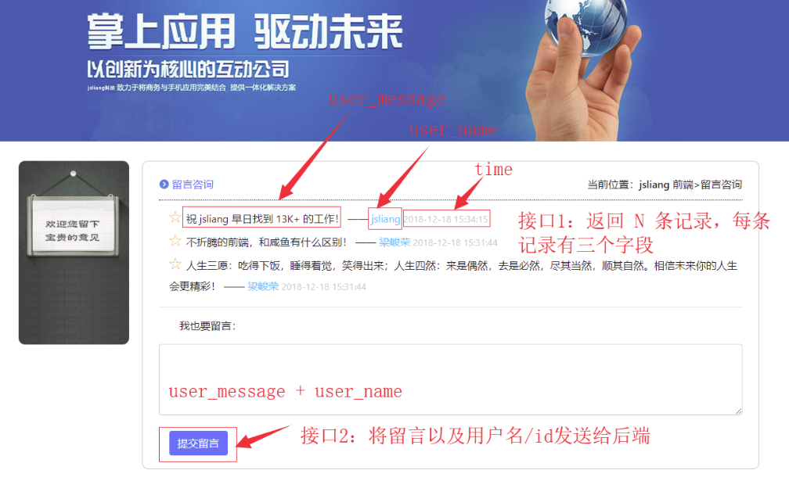

# 使用原生 node 开发企业官网

## 项目初始化

企业官网静态文件存放在`web`目录中（html，css 不是文章重点，这里直接下载的模版）。
服务端文件存放在`server`目录中。项目结构采用`todolist/refactor`的结构示例。

```
|- server
|-- controller // 控制器文件夹，实现路由具体功能
|---- login.js // 实现登录功能
|---- register.js // 实现注册功能
|---- index.js // 控制器入口
|-- midderware // 中间件文件夹
|---- cors.js // 跨域中间件
|---- index.js // 中间件入口
|-- config.js  // 服务配置文件，端口号，BaseName，...
|-- index.js // 服务入口
|-- routers // 路由列表
```

## 登录

调用`login`接口，提交用户填写的用户名和密码。

数据库设计`user`表：

| 名            | 类型     | 长度 | 键   |
| ------------- | -------- | ---- | ---- |
| id            | int      | 11   | 主键 |
| user_name     | varchar  | 255  |      |
| user_password | varchar  | 255  |      |
| create_time   | datetime |      |      |

### 实现

### 问题

1. 登录时，前端如何加密密码提交给后台

## 注册

## 留言板

用户点击留言板时，如果用户已经登录则显示留言版页面，否则跳转到登录页。

留言板功能项：

1. 获取留言内容：调用`getMessage`接口，分页返回留言信息。
2. 提交留言内容：调用`sendMessage`接口，将用户名，用户 ID，留言内容发送给后端。



数据库设计`message`表

| 名          | 类型     | 长度 | 键   |
| ----------- | -------- | ---- | ---- |
| id          | int      | 11   | 主键 |
| message     | varchar  | 255  |
| user_id     | varchar  | 255  | 外键 |
| user_name   | varchar  | 255  |
| create_time | datetime |

### 功能实现
