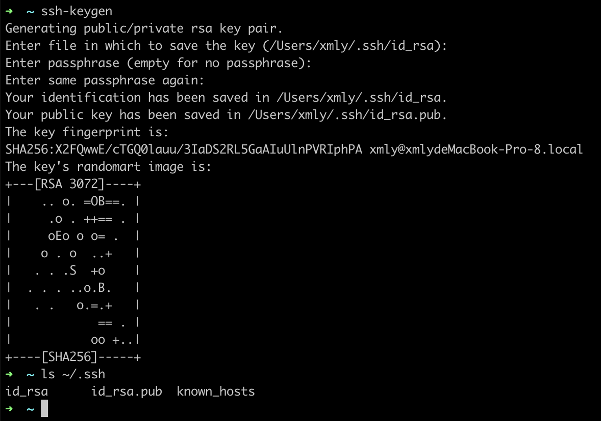
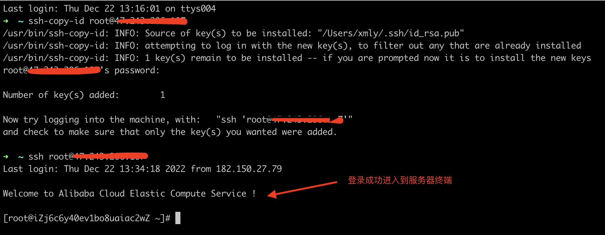
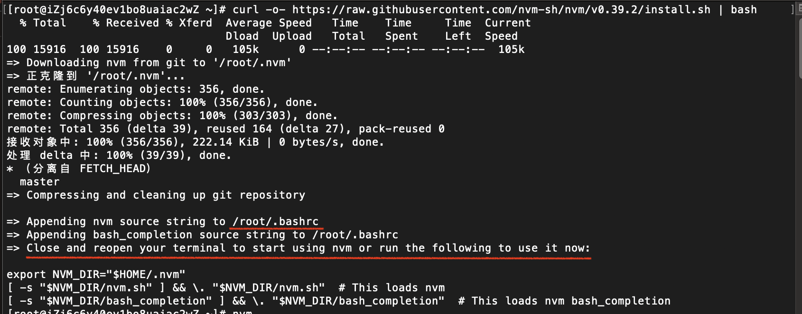
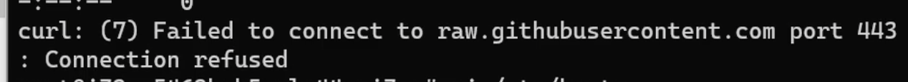
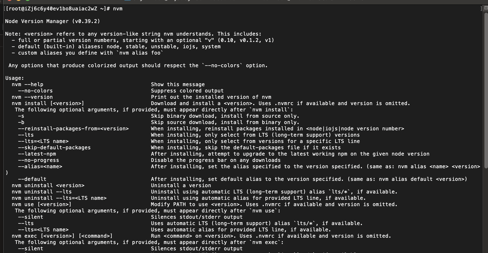
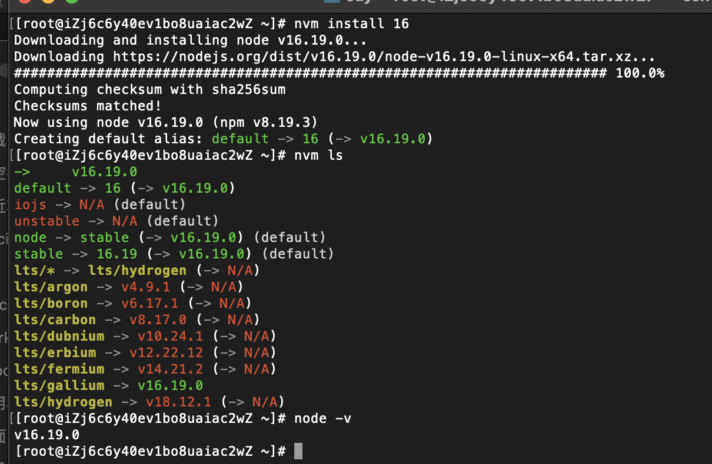

# Node 应用部署

## 购买服务器

### 云服务器

云服务器厂商有阿里云，腾讯云，华为云，百度云，Vultr 等。下面以阿里云来说：

购买服务器提供的付费模式有：

- 包年包月
- 按量付费（根据自己的需要开关服务器，停机后部分资源不收费）

一般选择包年包月，比较省心。

服务器配置，一般的个人网站选择 1 核 2G 内存就够了，如果网站用户较多可以根据实际情况增加配置。

服务器操作系统一般选择 CentOS，版本选择最高版本。

服务器分类（共享型，计算型，突发性能等），存储等可以根据对应描述选择，个人开发选择便宜点的就好。

### 轻量应用服务器

云服务器的最大特点就是可以实时缩放，任意扩容和缩容，没有资源限制。所以我们在购买时它的每一个参数都是单独配置、单独收费：CPU、内存、硬盘、带宽、IP 地址、快照、安全策略...。这么多配置项，虽然很灵活，但对于新手，就有点太复杂了。

轻量应用服务器可以理解为云服务器简化版，它是对云服务器底层资源的一种包装，尽量隐藏复杂性，使其变得简单易用，对新手友好，性价比高。

更多关于轻量应用服务器内容，可参考阮一峰大神文章【[轻量应用服务器体验](http://www.ruanyifeng.com/blog/2022/06/cloud-server-getting-started-tutorial.html)】。

### 参考资料

- [node 开发和部署，从零到用域名访问系列教程](https://www.bilibili.com/video/BV1TE411E7uD?p=2&vd_source=7b645b98515ccbf1eb6818e68d373871)
- [从 0 到 1 实现记账本](https://juejin.cn/book/6966551262766563328/section/6967229569954742285)

## 服务器远程连接

- SSH 连接
- 云服务器网站提供的远程连接
- FTP 工具连接

常用的方式是通过 SSH 连接：

```bash
ssh root@<你服务器的IP地址>
```

输入密码后，登录服务器。

### 实现 SSH 免密登录：

首先查看本机`~/.ssh`目录下是否存在`id_rsa.pub`文件。没有的需要先生成：

```bash
ssh-keygen
```

根据提示一路回车确认（不用输入密码，否则在发起连接时需要输入创建 ssh 时填写的密码），会自动创建公钥`id_rsa.pub`和私钥`id_rsa`文件。



然后将上面生成的公钥文件(`id_rsa.pub`)内容追加到服务器`~/.ssh/authorized_keys`文件中。或者使用 `ssh-copy-id` 命令完成追加:

```bash
ssh-copy-id root@<你服务器的IP地址>
```

完成后，再次使用 ssh 测试登录：



### 参考资料

- [阮一峰 SSH 远程登录](https://www.ruanyifeng.com/blog/2011/12/ssh_remote_login.html)
- [阮一峰 Linux 服务器的初步配置流程](http://www.ruanyifeng.com/blog/2014/03/server_setup.html)
- [从 0 到 1 实现记账本](https://juejin.cn/book/6966551262766563328/section/6967229569954742285)

## 环境安装

- Nodejs
- MongoDB
- Nginx

### Node 环境安装

#### 安装 NVM

[nvm](https://github.com/nvm-sh/nvm#installing-and-updating) 是一个 nodejs 版本管理工具，可以方便快速切换和安装不同版本的 nodejs。

bash 安装脚本：

```bash
curl -o- https://raw.githubusercontent.com/nvm-sh/nvm/v0.39.2/install.sh | bash
```

安装成功后的截图：



根据提示安装成功后需要重启终端或者手动执行以下脚本：

```bash
export NVM_DIR="$HOME/.nvm"
[ -s "$NVM_DIR/nvm.sh" ] && \. "$NVM_DIR/nvm.sh"  # This loads nvm
[ -s "$NVM_DIR/bash_completion" ] && \. "$NVM_DIR/bash_completion"  # This loads nvm bash_completion
```

> 也可以执行 `source /root/.bashrc` 让安装 nvm 时自动写入到 /root/.bashrc 文件中的脚本生效。

> 如果出现一下错误：
>
> 
> 可以在[域名查询 IP](https://site.ip138.com/raw.githubusercontent.com/)的网站中查询域名对应的 ip 地址，然后添加到服务器的 hosts（/etc/hosts）文件中。

上面的操作执行完后，可以在命令行输入`nvm`查看帮助文档：



使用 nvm 安装 nodejs：

```bash
## 安装nodejs 16的最新版本
nvm install 16
## 安装nodejs 最新的LTS版本
nvm install --lts
## 切换使用版本node 16版本
nvm use 16
```

执行`node -v` 验证 node 是否安装成功。



> 如果安装 node 比较慢，可以切换 node 镜像。[中国镜像站](https://npmmirror.com/)。
>
> 终端执行：NVM_NODEJS_ORG_MIRROR=https://npmmirror.com/mirrors/node/ nvm install 16

#### nrm 安装

[nrm](https://github.com/Pana/nrm) 是一个便捷切换 npm 镜像源的工具。支持了 `npm`,`cnpm`,`taobao` 等镜像源。

```bash
# 全局安装nrm工具
npm instal -g nrm

# 查看nrm提供的镜像源
nrm ls

# 切换使用淘宝镜像源
nrm use taobao
```

#### pm2 安装

[pm2](https://github.com/Unitech/pm2)是一个带有负载均衡功能的 Node 应用的进程管理器。它能充分利用服务器多核性能，并能后台运行 nodejs 服务，当程序发生错误崩溃时，可以自动重启服务。

```bash
# 全局安装pm2工具
npm install -g pm2

# 安装完成后，检查是否安装成功
pm2 -v
```

用 pm2 启动 node 服务

```bash
pm2 start <入口文件>  -n <项目名称>
```

### 安装 MongoDB

参考[官方文档](https://www.mongodb.com/docs/manual/tutorial/install-mongodb-on-red-hat/)安装指南：

1.  配置包管理系统 ( yum)：创建一个`/etc/yum.repos.d/mongodb-org-6.0.repo`文件。

```text
[mongodb-org-6.0]
name=MongoDB Repository
baseurl=https://repo.mongodb.org/yum/redhat/$releasever/mongodb-org/6.0/x86_64/
gpgcheck=1
enabled=1
gpgkey=https://www.mongodb.org/static/pgp/server-6.0.asc
```

2. 安装 MongoDB 包：`sudo yum install -y mongodb-org`
3. 启动 Mongodb：`sudo systemctl start mongod`

更多控制命令：

```bash
# 验证MongoDb是否已成功启动
sudo systemctl status mongod
# 确保mongodb在系统重启后启用
sudo systemctl enable mongod
# 停止mongodb
sudo systemctl stop mongod
# 重启mongodb
sudo systemctl restart mongod
# 开始使用mongodb
mongosh
```

### 安装 Nginx

```bash
yum install nginx
```

> 如果安装时报错“无可用的包”，可以尝试以下解决方案：
>
> - https://blog.csdn.net/weixin_45861372/article/details/115724151
> - https://www.cnblogs.com/bretzhao/p/16229883.html

检查是否安装成功：

```bash
# 安装成功，会打印出 nginx 版本号。
nginx -v
```

## 代码上传

代码上传有以下几种方式：

- git（推荐方式，结合 CI/CD 能够做到自动化构建和部署）
- ftp （可以在服务器和本地电脑之间可视化上传和下载文件，操作简单）
- scp 命令（以命令行的方式上传文件，使用方便）

这里就直接使用之前开发的 [realword-express](https://github.com/liujie2288/node) 来演示。

## 手动部署

## 自动部署

## 配置 HTTPS
