# Node 应用部署

## 购买服务器

- 云服务器
- 轻量应用服务器

### 云服务器

云服务器厂商有阿里云，腾讯云，华为云，百度云，Vultr 等。下面以阿里云来说：

购买服务器提供的付费模式有：

- 包年包月
- 按量付费（根据自己的需要开关服务器，停机后部分资源不收费）

一般选择包年包月，比较省心。

服务器配置，一般的个人网站选择 1 核 2G 内存就够了，如果网站用户较多可以根据实际情况增加配置。

服务器操作系统一般选择 CentOS，版本选择最高版本。

服务器分类（共享型，计算型，突发性能等），存储等可以根据对应描述选择，个人开发选择便宜点的就好。

### 轻量应用服务器

云服务器的最大特点就是可以实时缩放，任意扩容和缩容，没有资源限制。所以我们在购买时它的每一个参数都是单独配置、单独收费：CPU、内存、硬盘、带宽、IP 地址、快照、安全策略...。这么多配置项，虽然很灵活，但对于新手，就有点太复杂了。

轻量应用服务器可以理解为云服务器简化版，它是对云服务器底层资源的一种包装，尽量隐藏复杂性，使其变得简单易用，对新手友好，性价比高。

更多关于轻量应用服务器内容，可参考阮一峰大神文章【[轻量应用服务器体验](http://www.ruanyifeng.com/blog/2022/06/cloud-server-getting-started-tutorial.html)】。

### 参考资料

- [node 开发和部署，从零到用域名访问系列教程](https://www.bilibili.com/video/BV1TE411E7uD?p=2&vd_source=7b645b98515ccbf1eb6818e68d373871)
- [从 0 到 1 实现记账本](https://juejin.cn/book/6966551262766563328/section/6967229569954742285)

## 服务器远程连接

- SSH 连接
- 云服务器网站提供的远程连接
- FTP 工具连接

常用的方式是通过 SSH 连接：

```bash
ssh root@<你服务器的IP地址>
```

输入密码后，登录服务器。

### 实现 SSH 免密登录：

首先查看本机`~/.ssh`目录下是否存在`id_rsa.pub`文件。没有的需要先生成：

```bash
ssh-keygen
```

根据提示一路回车确认（不用输入密码，否则在发起连接时需要输入创建 ssh 时填写的密码），会自动创建公钥`id_rsa.pub`和私钥`id_rsa`文件。

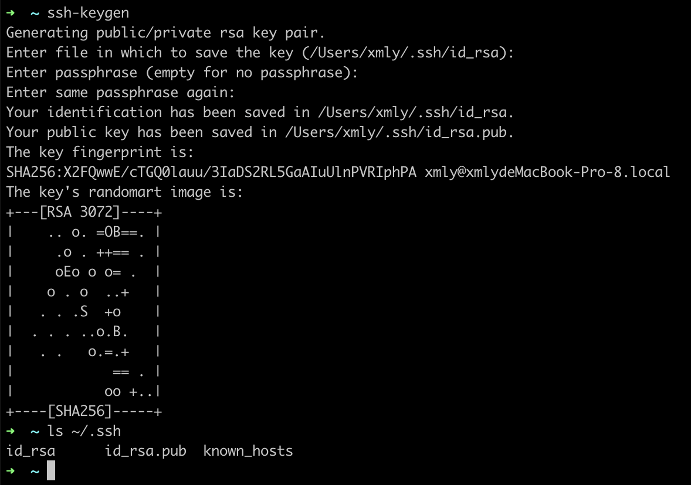

然后将上面生成的公钥文件(`id_rsa.pub`)内容追加到服务器`~/.ssh/authorized_keys`文件中。或者使用 `ssh-copy-id` 命令完成追加:

```bash
ssh-copy-id root@<你服务器的IP地址>
```

完成后，再次使用 ssh 测试登录：

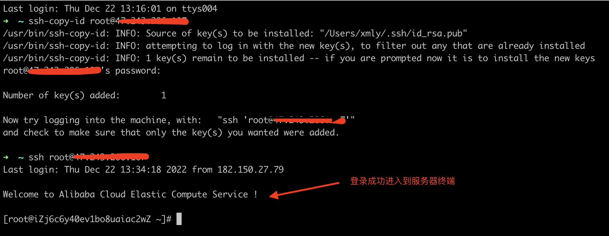

### 参考资料

- [阮一峰 SSH 远程登录](https://www.ruanyifeng.com/blog/2011/12/ssh_remote_login.html)
- [阮一峰 Linux 服务器的初步配置流程](http://www.ruanyifeng.com/blog/2014/03/server_setup.html)

## 环境安装

- Nodejs
- MongoDB
- Nginx

### Node 环境安装

#### 安装 NVM

[nvm](https://github.com/nvm-sh/nvm#installing-and-updating) 是一个 nodejs 版本管理工具，可以方便快速切换和安装不同版本的 nodejs。

bash 安装脚本：

```bash
curl -o- https://raw.githubusercontent.com/nvm-sh/nvm/v0.39.2/install.sh | bash
```

安装成功后的截图：

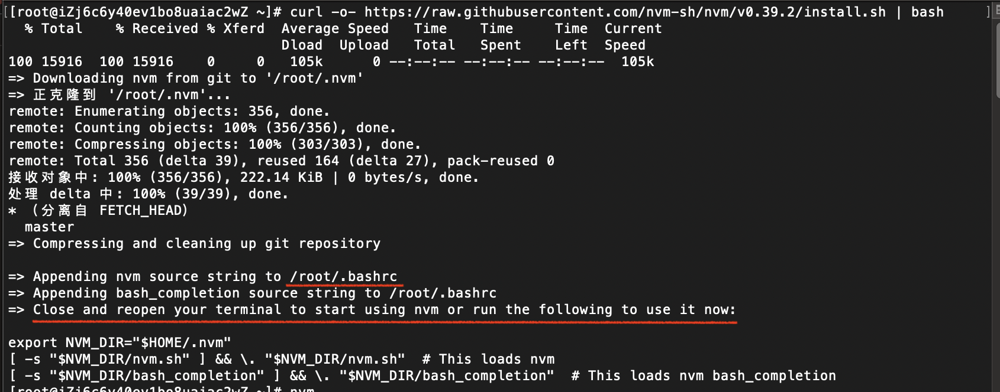

根据提示安装成功后需要重启终端或者手动执行以下脚本：

```bash
export NVM_DIR="$HOME/.nvm"
[ -s "$NVM_DIR/nvm.sh" ] && \. "$NVM_DIR/nvm.sh"  # This loads nvm
[ -s "$NVM_DIR/bash_completion" ] && \. "$NVM_DIR/bash_completion"  # This loads nvm bash_completion
```

> 也可以执行 `source /root/.bashrc` 让安装 nvm 时自动写入到 /root/.bashrc 文件中的脚本生效。

> 如果出现一下错误：
>
> 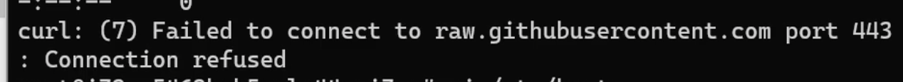
> 可以在[域名查询 IP](https://site.ip138.com/raw.githubusercontent.com/)的网站中查询域名对应的 ip 地址，然后添加到服务器的 hosts（/etc/hosts）文件中。

上面的操作执行完后，可以在命令行输入`nvm`查看帮助文档：

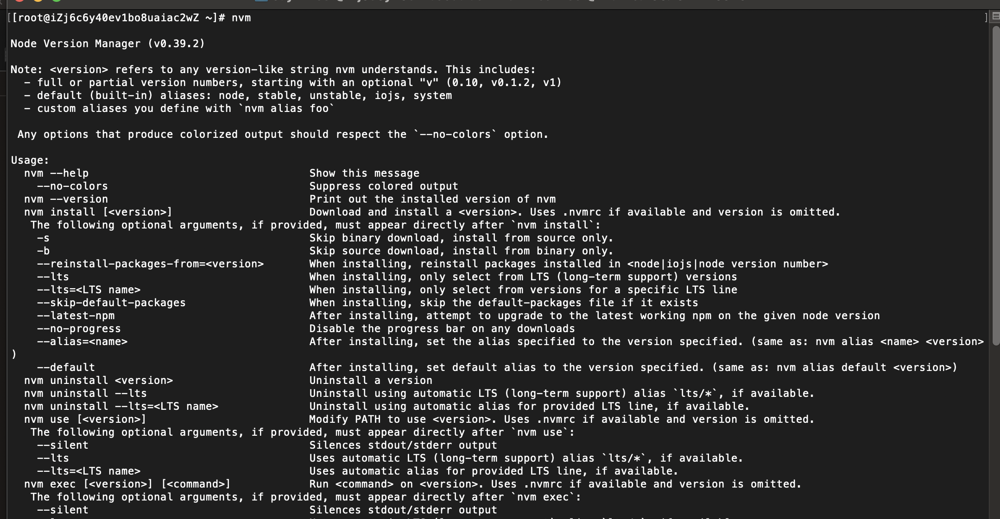

使用 nvm 安装 nodejs：

```bash
## 安装nodejs 16的最新版本
nvm install 16
## 安装nodejs 最新的LTS版本
nvm install --lts
## 切换使用版本node 16版本
nvm use 16
```

执行`node -v` 验证 node 是否安装成功。

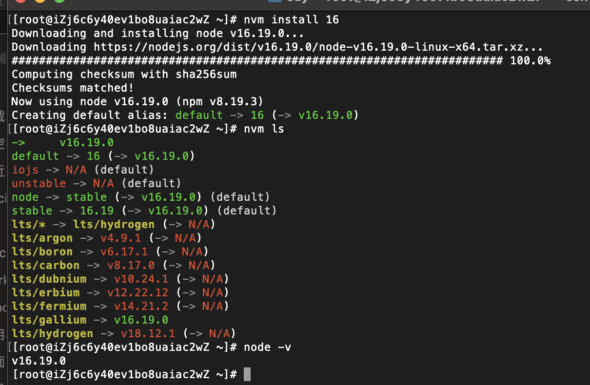

> 如果安装 node 比较慢，可以切换 node 镜像。[中国镜像站](https://npmmirror.com/)。
>
> 终端执行：NVM_NODEJS_ORG_MIRROR=https://npmmirror.com/mirrors/node/ nvm install 16

#### nrm 安装

[nrm](https://github.com/Pana/nrm) 是一个便捷切换 npm 镜像源的工具。支持了 `npm`,`cnpm`,`taobao` 等镜像源。

```bash
# 全局安装nrm工具
npm instal -g nrm

# 查看nrm提供的镜像源
nrm ls

# 切换使用淘宝镜像源
nrm use taobao
```

#### pm2 安装

[pm2](https://github.com/Unitech/pm2)是一个带有负载均衡功能的 Node 应用的进程管理器。它能充分利用服务器多核性能，并能后台运行 nodejs 服务，当程序发生错误崩溃时，可以自动重启服务。

```bash
# 全局安装pm2工具
npm install -g pm2

# 安装完成后，检查是否安装成功
pm2 -v
```

用 pm2 启动 node 服务

```bash
pm2 start <入口文件>  -n <项目名称>
```

其它常用命令：

```bash
pm2 list 查看启动的应用
pm2 logs 查看当前信息
pm2 stop <app_name> 停止<app_name>进程
pm2 delete <app_name> 删除<app_name>进程
```

更多 PM2 介绍，请查看[这里](../PM2/README.md)

### 安装 MongoDB

参考[官方文档](https://www.mongodb.com/docs/manual/tutorial/install-mongodb-on-red-hat/)安装指南：

1.  配置包管理系统 ( yum)：创建一个`/etc/yum.repos.d/mongodb-org-6.0.repo`文件。

```text
[mongodb-org-6.0]
name=MongoDB Repository
baseurl=https://repo.mongodb.org/yum/redhat/$releasever/mongodb-org/6.0/x86_64/
gpgcheck=1
enabled=1
gpgkey=https://www.mongodb.org/static/pgp/server-6.0.asc
```

2. 安装 MongoDB 包：`sudo yum install -y mongodb-org`
3. 启动 Mongodb：`sudo systemctl start mongod`

更多控制命令：

```bash
# 验证MongoDb是否已成功启动
sudo systemctl status mongod
# 确保mongodb在系统重启后启用
sudo systemctl enable mongod
# 停止mongodb
sudo systemctl stop mongod
# 重启mongodb
sudo systemctl restart mongod
# 开始使用mongodb
mongosh
```

### 安装 Nginx

```bash
yum install nginx
```

> 如果安装时报错“无可用的包”，可以尝试以下解决方案：
>
> - https://blog.csdn.net/weixin_45861372/article/details/115724151
> - https://www.cnblogs.com/bretzhao/p/16229883.html

检查是否安装成功：

```bash
# 安装成功，会打印出 nginx 版本号。
nginx -v
```

## 代码上传并部署

代码上传有以下几种方式：

- git（推荐方式，结合 CI/CD 能够做到自动化构建和部署）
- ftp （可以在服务器和本地电脑之间可视化上传和下载文件，操作简单）
- scp 命令（以命令行的方式上传文件，使用方便）

下面使用 git 来部署，没有安装 git 需要先安装 git:

```bash
# 安装前先检查一下git是否安装
git --version
# 安装git
yum install git
```

这里就直接使用之前开发的 [realword-express](https://github.com/liujie2288/node) 来演示。首先克隆项目：

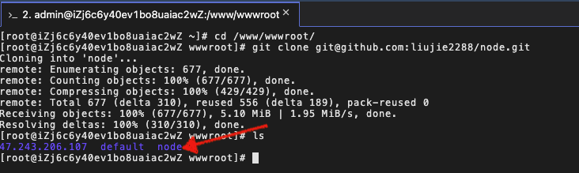

因为项目代码存放到一个大的仓库中，这里就将它直接拷贝出来：

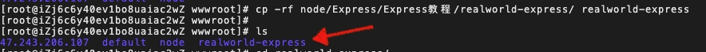

然后安装项目依赖：

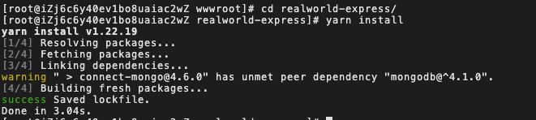

安装完成后，我们使用 pm2 运行程序：

```base
pm2 start app.js -i max -n realworld-express
```

这里因为我的服务器是双核的，所以启动了 2 个实例：

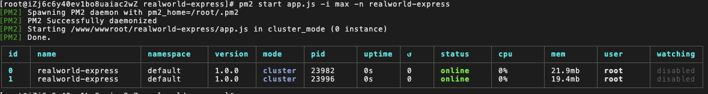

然后本地访问一下，程序是否可以正常访问到(这里我的程序是启动的在 3010 端口上的)：

```bash
curl http://localhost:3010
```

如果想要在本地浏览器访问程序，需要在服务器防火墙（云服务器则是安全组）中放开 3010 端口：

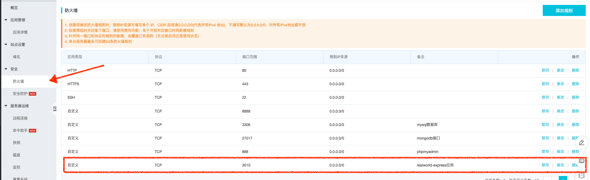

> 如果你的轻量服务器安装了宝塔面板，则需要去到宝塔面板安全- > 防火墙。放行端口 3010

成功访问：

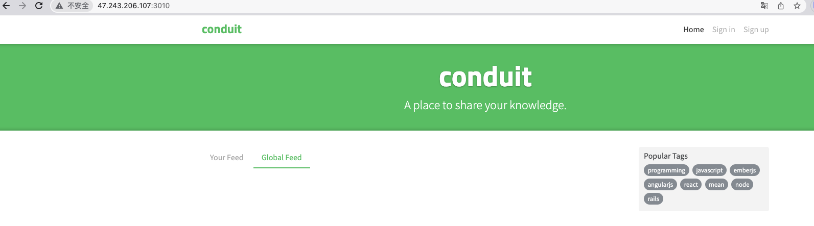

## 前端静态资源服务部署

现在的大多数前端应用都是通过 vue，react 等开发的单页，部署时需要部署构建好的静态资源。可以使用以下方式部署这些静态资源：

- ngnix
- node
- apache
- iis
- 更多部署实例可参考[文档](https://github.com/vuejs/router/blob/main/packages/docs/zh/guide/essentials/history-mode.md#%E6%9C%8D%E5%8A%A1%E5%99%A8%E9%85%8D%E7%BD%AE%E7%A4%BA%E4%BE%8B)

这里使用 node 的[connect-history-api-fallback](https://www.npmjs.com/package/connect-history-api-fallback)工具包。

首先安装：

```bash
yarn add connect-history-api-fallback
```

使用：

```js
var history = require("connect-history-api-fallback");
var connect = require("connect");

var app = connect().use(history()).listen(3000);
```

或者在 express 使用使用：

```js
var express = require("express");

var app = express();
app.use(history());
```

更多配置项参考官方[文档](https://github.com/bripkens/connect-history-api-fallback#options)

> 使用纯 nodejs 部署可以参考[这篇文章](https://segmentfault.com/a/1190000010205995)

## 域名解析 & nginx 代理转发

上面的部署的代码可以通过 ip 的方式访问，要想通过域名访问项目需要先购买域名，然后配置域名解析后，才能问访问。

### 购买域名

购买域名许多云服务厂商都有提供，[阿里云](https://wanwang.aliyun.com/?spm=5176.13830350.J_3207526240.34.12595aef07pNXk)，[腾讯云](https://dnspod.cloud.tencent.com/)等，可以自由选择。

### 域名解析

域名购买成功后，就需要把域名解析到你之前购买的服务器 ip 地址。

下面以我在阿里云购买的域名：`www.liujie2288.com`，服务器地址：`47.243.206.10`演示。

进入域名控制台 -> 域名列表：

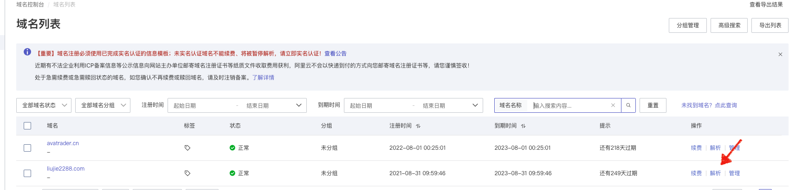

进入解析设置，添加一条解析记录：

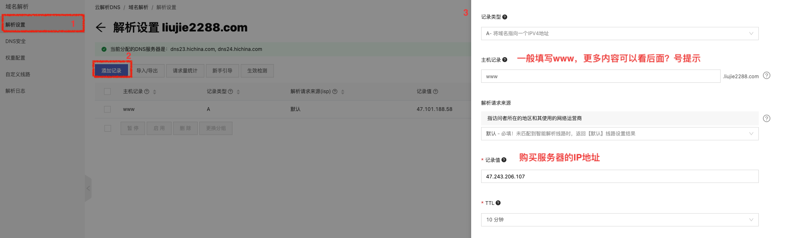

解析成功后，我们就可以通过域名访问：[http://www.liujie2288.com:3010](http://www.liujie2288.com:3010)

> 域名解析到国内的服务器，域名需要备案才能正常访问，我的服务器因为是在香港，所以无需域名无需备案就可以访问。

### 消除端口号

现在的访问路径中还存在端口号，可以使用 nginx 反向代理去除 url 中的端口号。

找到 nginx 配置文件(`nginx -t`)，添加以下配置：

> 通过 ps aux | grep nginx 可以查看 nginx 配置文件目录地址
>
> 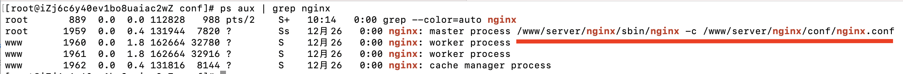

```nginx
# nginx.conf
server {
    listen 80;
    server_name www.liujie2288.com;
    location / {
        proxy_pass http://127.0.0.1:3010; # 设置反向代理，消除端口号
    }
}
```

> 备注：这里是直接添加到 nginx.conf 配置文件中，更好的方式是创建一个 www.liujie2288.com 的文件放到在 nginx.conf 中 include 语句包含的 conf 目录中。

检查配置文件是否正确：

```bash
nginx -t
```

重启 nginx 服务：

```bash
nginx -s reload
```

## 使用 pm2 自动部署

### 前提

- 需要本地电脑配置[服务器免密登录](#实现-ssh-免密登录)
- 需要将服务器的 ssh 公钥添加到 github/gitlab 仓库中
- 需要远程服务器安装了 pm2

### 部署配置

```js
// ecosystem.config.js
module.exports = {
  // pm2 服务启动配置
  apps: [
    {
      name: "realworld-express",
      script: "app.js",
      instances: "max",
    },
  ],
  // pm2 部署配置
  deploy: {
    // 正是环境部署配置
    prod: {
      user: "root",
      host: "47.243.206.107",
      repo: "git@github.com:liujie2288/node.git",
      ref: "origin/main",
      path: "/www/wwwroot",
      "post-deploy":
        "git reset --hard && git checkout main && git pull && rm -rf ../realworld-express &&   cp -rf ./Express/Express教程/realworld-express  ../realworld-express && cd ../realworld-express && npm install --omit=dev && pm2 startOrReload ecosystem.config.js",
      env: {
        NODE_ENV: "production",
      },
    },
  },
};
```

- `user`: 远程服务器登录用户名
- `host`: 远程服务器 IP 地址
- `repo`: 代码仓库地址
- `ref`: 代码仓库分支
- `path`: 远程服务器拉取代码仓库存放在服务器中的地址
- `post-deploy`: pm2 部署完成后执行的脚本
- `env`: 部署脚本执行时的环境变量

### 部署应用

应用首次部署之前需要先初始化项目：

```bash
pm2 deploy prod setup
```

开始部署：

```bash
p2m deploy prod
```

### 部署回滚

如果需要回滚到以前的部署，您可以使用以下 revert 选项：

```bash
pm2 deploy production revert 1
```

更多细节参考[官方文档](https://pm2.keymetrics.io/docs/usage/deployment/)

## 配置 HTTPS

### 申请 SSL 证书

申请免费证书的地方有很多，阿里云，腾讯云等，这里使用阿里云演示。

1. 首先来到[阿里云数字证书管理服务](https://www.aliyun.com/product/cas?spm=5176.19720258.J_3207526240.53.413976f4mMxSkn)进入[控制台](https://yundun.console.aliyun.com/?spm=5176.7968328.J_8413632810.4.364865c3mFH3Lr&p=cas#/overview)
2. 选择 SSL 证书
3. 进入免费证书选项卡
4. 立即购买证书（没有证书的需要先购买，现在阿里云 20 个免费证书是不收取费用的）
5. 创建证书，点击证书申请填写申请信息
6. 进入下一步验证（阿里云购买的域名，系统会自动添加解析记录到域名的解析设置中，其它平台购买的域名需要手动添加一条解析记录）
7. 提交申请，等待平台签发

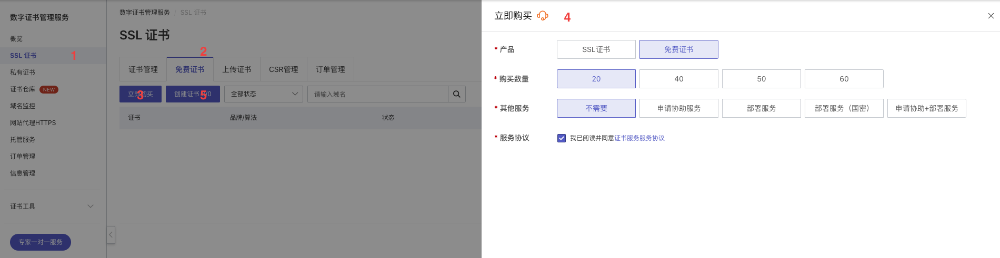
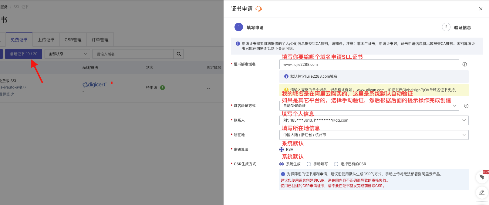
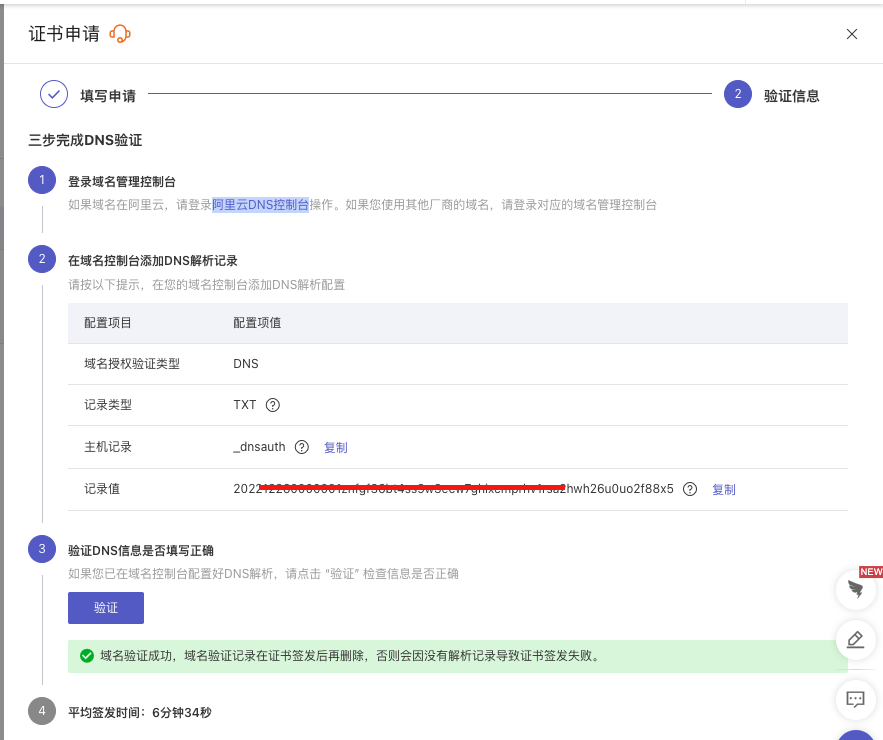

### 下载 SSL 证书

点击 下载 按钮，选择对应服务器证书（这里我选择的 nginx）,同时阿里云提供了服务器安装 ssl 的详细[帮助文档](https://help.aliyun.com/document_detail/98728.html?spm=0.2020520163.help.dexternal.74a6Z0XQZ0XQ7f)。

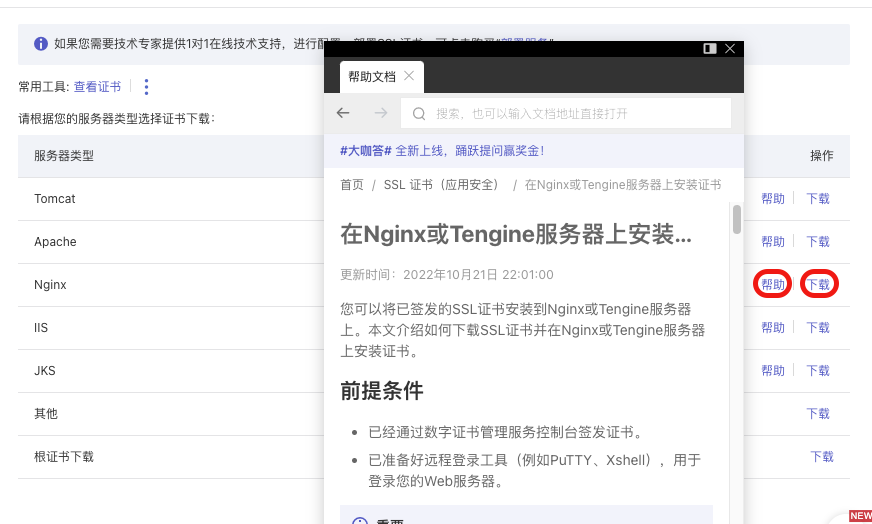

下载后的文件包含了一个 key 和一个 pem 文件。

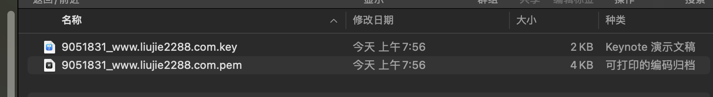

### 在 Ngnix 服务器上安装 SSL 证书

1. 在服务器 nginx 的 conf 目录下创建一个用于存放证书的文件夹`cert`：

> 通过 ps aux | grep nginx 可以查看 nginx 配置文件目录地址
>
> 

```bash
# 进入nginx配置文件目录
cd /www/server/nginx/conf
# 创建cert文件夹
mkdir cert
```

2. 使用 scp 命令上传下载的 ssl 证书文件

```bash
 # 使用scp上传
 # -r 表示递归上传
 # /Users/xmly/Downloads/9051831_www.liujie2288.com_nginx/* 表示我本地电脑的ssl证书文件夹
 # root@47.243.206.107 表示我服务器地址，用户名为root
 # :/www/server/nginx/conf/cert 表示上传到服务器的路径地址
 scp -r /Users/xmly/Downloads/9051831_www.liujie2288.com_nginx/* root@47.243.206.107:/www/server/nginx/conf/cert
```

3. 编辑配置文件(nginx.conf)，添加以下配置：

```nginx
#以下属性中，以ssl开头的属性表示与证书配置有关。
server {
    listen 443 ssl;
    #配置HTTPS的默认访问端口为443。
    #如果未在此处配置HTTPS的默认访问端口，可能会造成Nginx无法启动。
    #如果您使用Nginx 1.15.0及以上版本，请使用listen 443 ssl代替listen 443和ssl on。
    server_name yourdomain;
    root html;
    index index.html index.htm;
    ssl_certificate cert/cert-file-name.pem;
    ssl_certificate_key cert/cert-file-name.key;
    ssl_session_timeout 5m;
    ssl_ciphers ECDHE-RSA-AES128-GCM-SHA256:ECDHE:ECDH:AES:HIGH:!NULL:!aNULL:!MD5:!ADH:!RC4;
    #表示使用的加密套件的类型。
    ssl_protocols TLSv1.1 TLSv1.2 TLSv1.3; #表示使用的TLS协议的类型，您需要自行评估是否配置TLSv1.1协议。
    ssl_prefer_server_ciphers on;
    # location / {
    #     root html;  #Web网站程序存放目录。
    #     index index.html index.htm;
    # }
    location / {
      proxy_pass http://127.0.0.1:3010/;
    }
}
```

修改配置中的值：

- `yourdomain`：替换成证书绑定的域名。
- `cert/cert-file-name.pem`：替换成上传的证书文件的文件路径。
- `cert/cert-file-name.key`：替换成上传的证书私钥文件的文件路径。

4. 【可选】设置 http 请求自动跳转到 https

```nginx
server {
    listen 80;
    server_name yourdomain; #需要将yourdomain替换成证书绑定的域名。
    rewrite ^(.*)$ https://$host$1; #将所有HTTP请求通过rewrite指令重定向到HTTPS。
    #location / {
    #    index index.html index.htm;
    #}
}
```

> 注意，配置后如果无法访问，请检查安全组或者其它工具（例如，宝塔面板）是否打开 443 端口

5. 重启 Nginx 服务，验证网站 https 访问。

```bash
nginx -s reload
```

## 参考链接

- [nodejs 服务器部署教程](https://segmentfault.com/a/1190000010098126)
- [web-deploy](https://github.com/wmui/web-deploy)
- [node 服务开发和服务器部署（node.js+koa2+pm2+nginx）教程](https://juejin.cn/post/6844904080414867469)
- [node 开发和部署，从零到用域名访问系列教程](https://www.bilibili.com/video/BV1TE411E7uD?p=2&vd_source=7b645b98515ccbf1eb6818e68d373871)
- [从 0 到 1 实现记账本](https://juejin.cn/book/6966551262766563328/section/6967229569954742285)
